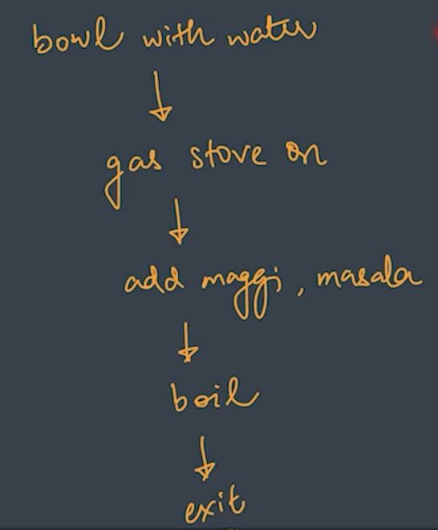

# Flowcharts
Flowcharts are the diagrams to represent solution of a problem.

Lets say we are given a problem. So the approach of our solving the problem should be
- By breaking them into smaller sub-problems.
- And the second part is logically arranging those parts.There are few steps which we need to ensure.

**Trying to understanding it by solving a simple problem of making Maggi.**
