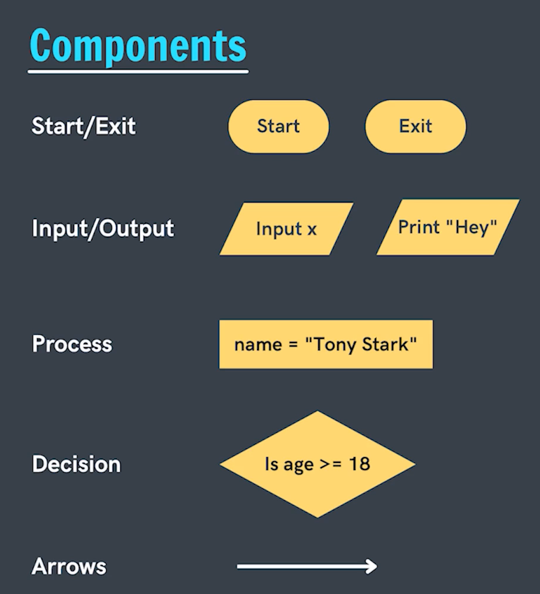
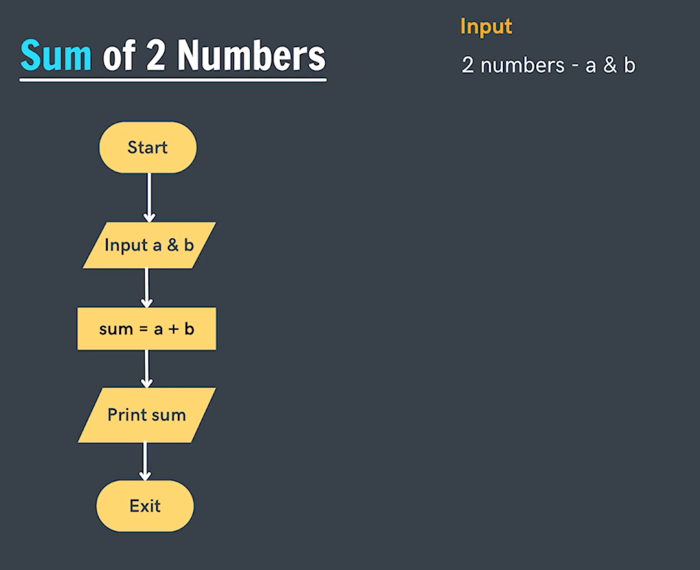

# Componets of Flowchart

**Question-1 Write/Draw a flowchart for adding two numbers.**

# Pseudocode
- They are the fake code.
- Usually independent of any programming languages.
- The steps to be preformed in the flowchart are written inside the pseudocode in simple english statements.