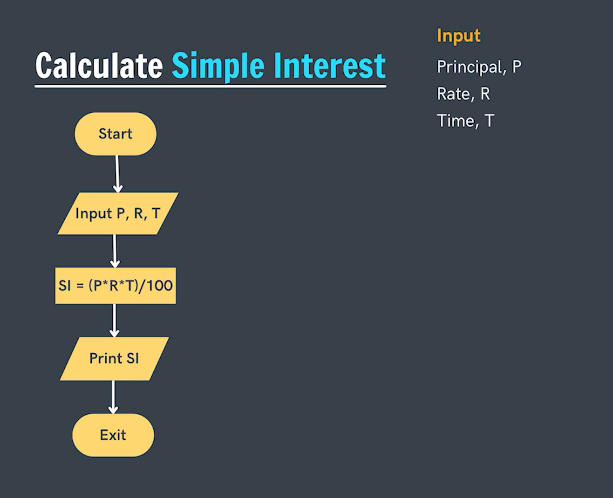
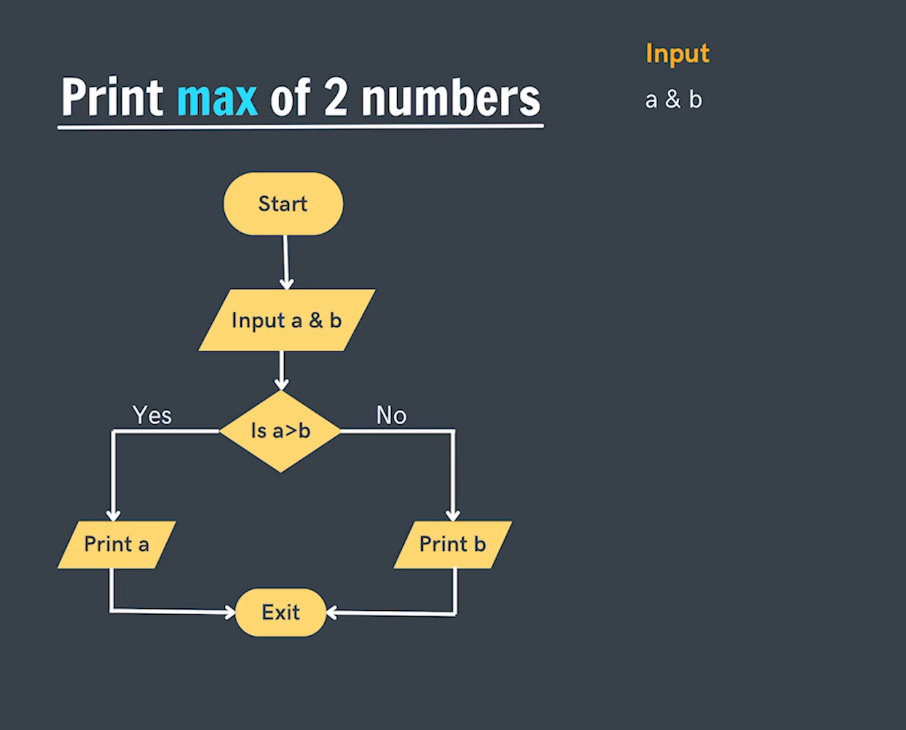
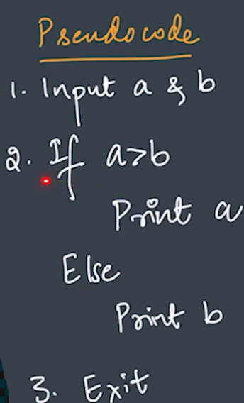
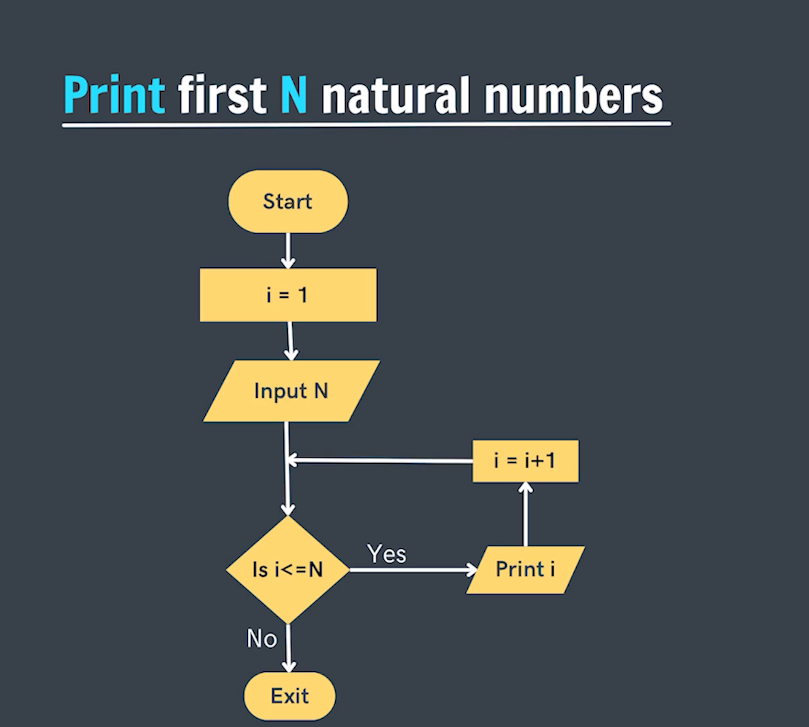
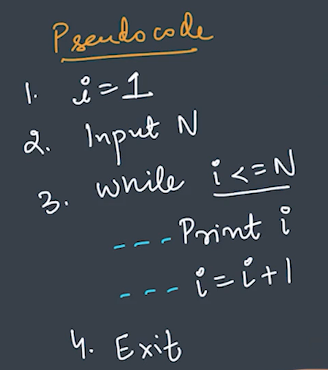
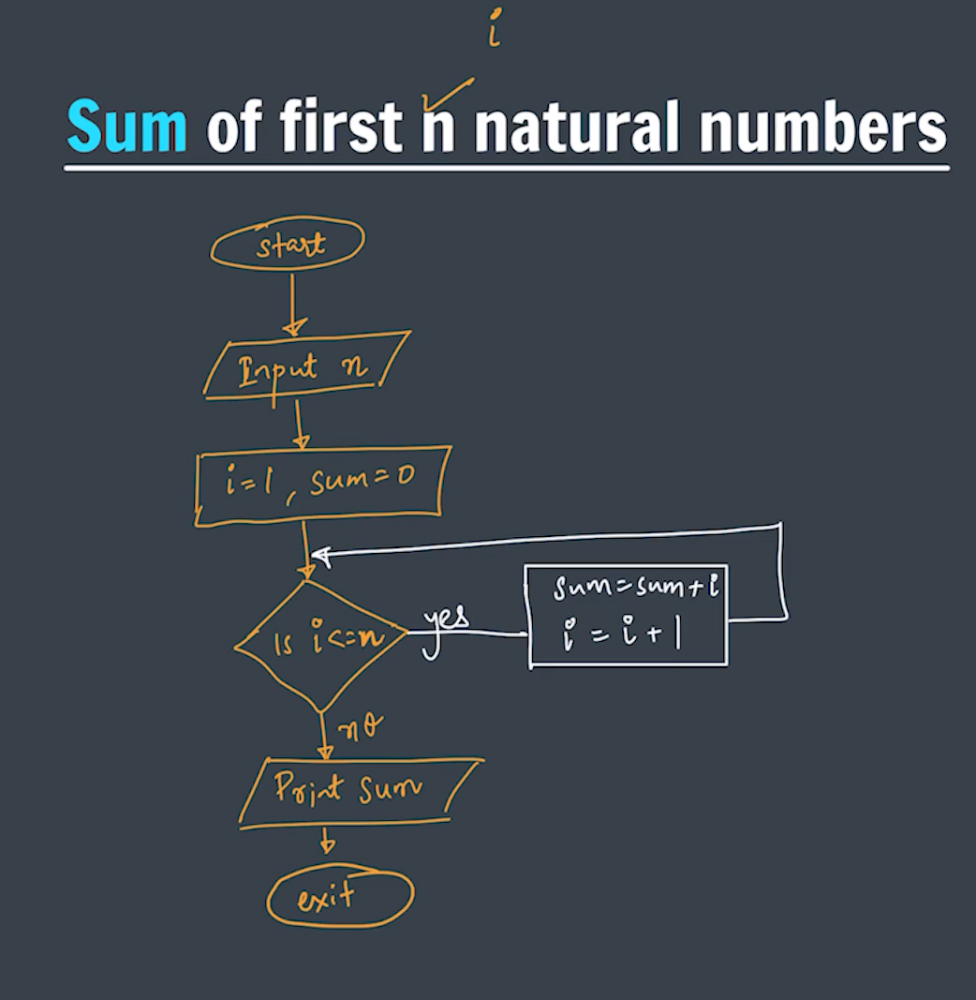
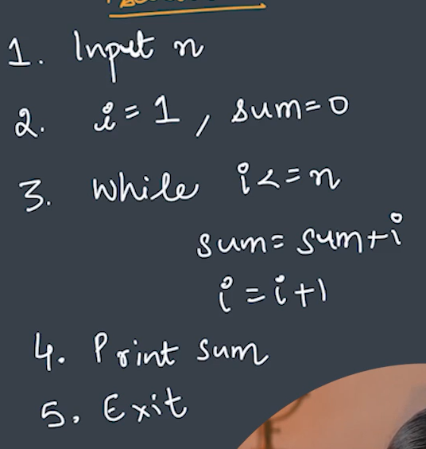

**Question-2.) Write a FLowchart for calculating Simple Interest. (S.I = P x R xT).**

   

**Question-3.) Write a FLowchart for finding the largest value among the two numbers ?**

   

**Question-4.) Write a FLowchart for printing first n Natural numbers.**

   

**Question-5.) Write a FLowchart for suming first n Natural numbers.**

   