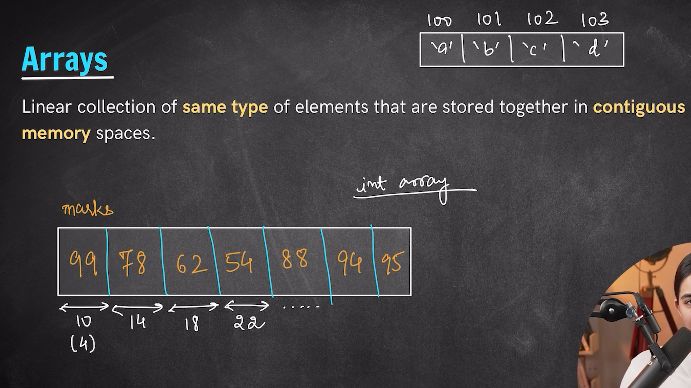
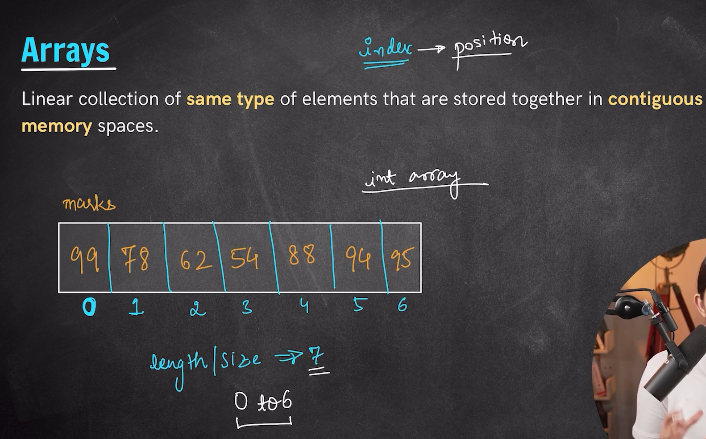
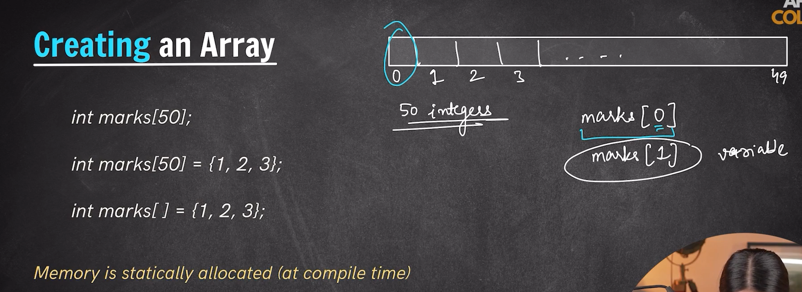
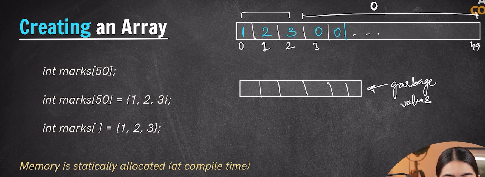
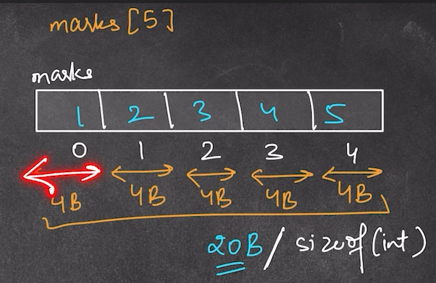
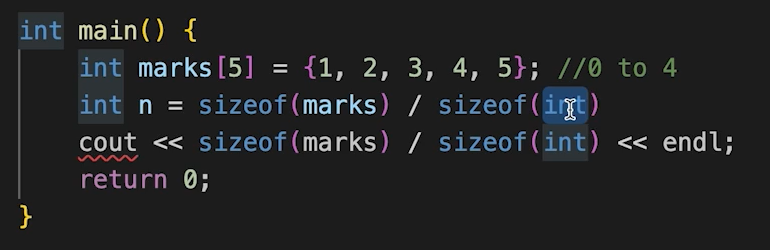

# *Array's*
- Array is a data structure i.e used for storing `Linear` data within in it.
- Therefore we can say array is a linear data structure.
- Array's are used for storing similar data type elements in it. That is they accomodate only homogenous data type items in it.
- Array's store the elements in the contiguous fashion.

### *Index in the Array's*
- The elements inside the array are positioned with the help of index value.
- Each element within the array gets a unique index.
- Array's have 0 based indexing in them.
- Index tells the position of the element inside the array.

---
 

## *Array Creation*
- Now there are multiple ways in which we can create our array's

        Syntax for array creation-
            <data type> name_of_the_array [Size_of_the_array]; -> This type of array declaration only holds garbage value in it.

- We can access any element of the array by its index value. We just need to provide the array name and its index -> the value present at the index will be printed then.

        Syntax for array creation-
            array_name[index] -> will return the element present at that index.

- array_name[index] is just like a variable name holding some value in it.

- If we just try to access an index position which doesn't exists in the array in that case it will give us a warning or will throw us an error of index out of range.

- The valid index value which we get is from 0 to the size_of_array - 1.

- In the second way of array creation the array index gets the element at resprctive position in the order they are passed from 0 and so on... Whereas the rest of the other values gets 0 in the first case they were getting garbage value but here they are given value 0 at other index position whose values aren't provided.

- Whenever we create a array the memory is statically allocated (i.e they are provided at the compile time) i.e if one's we have declared a size of the array then its been declared now dynamically we cann't do this. This is allowed only in the case of Vectors.

### *Array's size*

