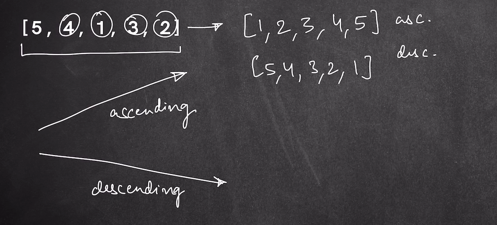
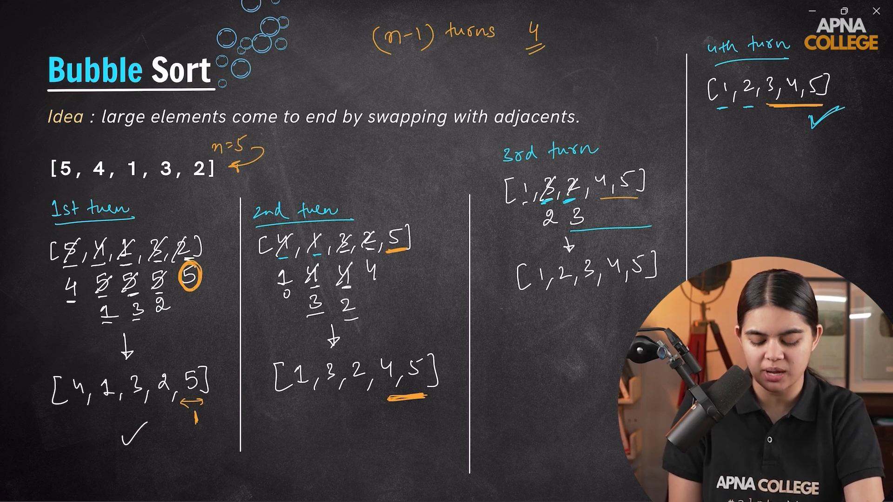
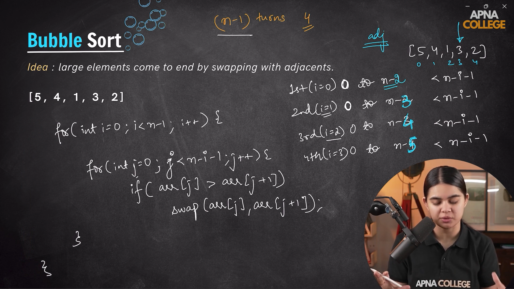
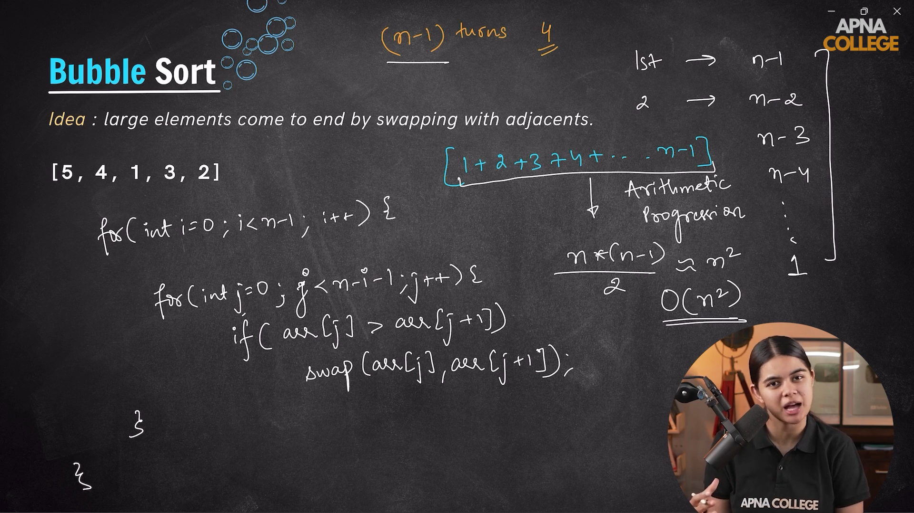
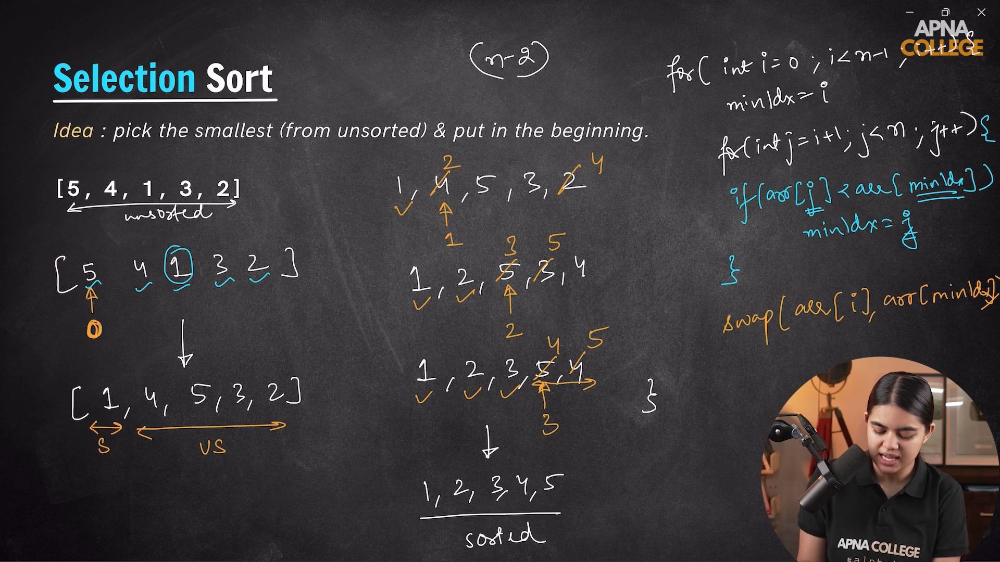
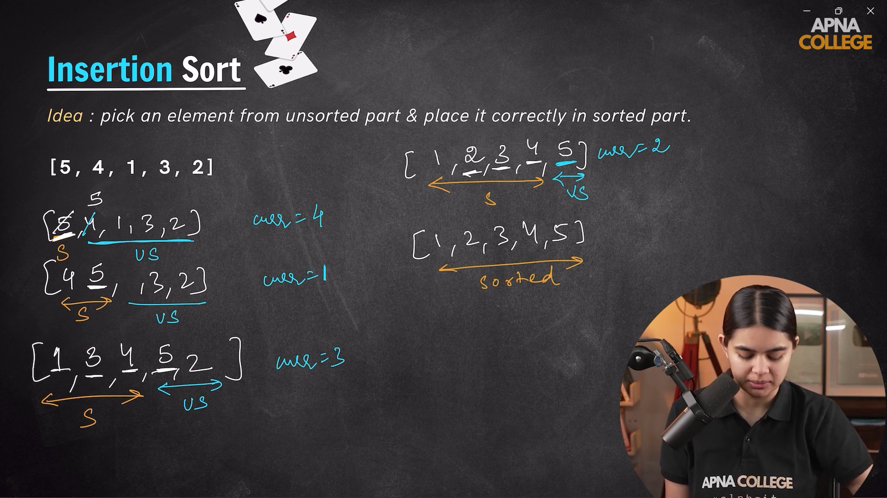
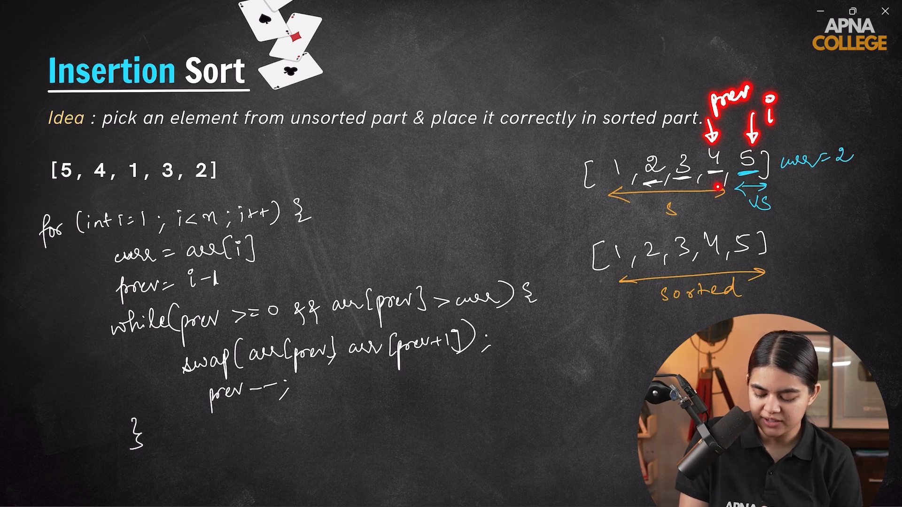
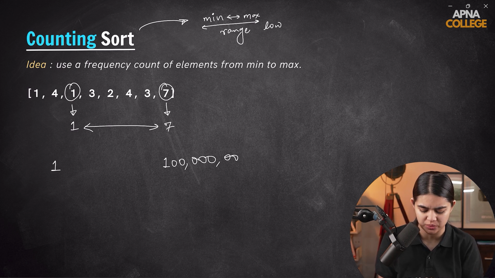
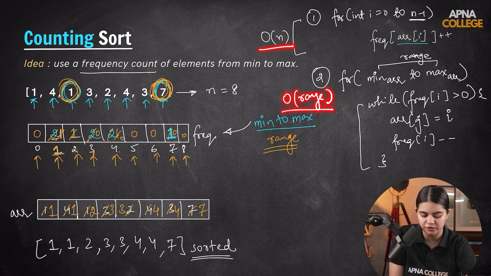
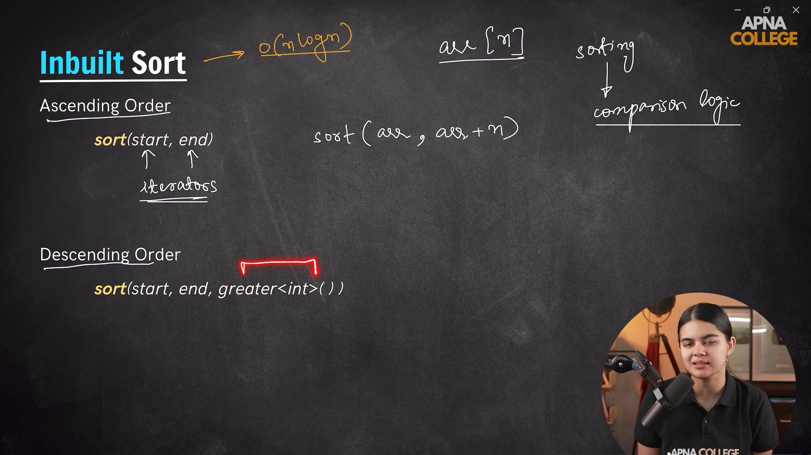

# *Sorting Algorithm*
- It is a technique of arranging the elements either in the ascending (smaller to bigger) fashion or in the descending (larger to smaller) manner.
- Now the sorting tecniques we are going to see like the `Bubble Sort`, `Insertion Sort`, `Selection Sort` or `Count Sort` there aren't used much in solving Problems because of their high time complexity.
- By default the sorting when we say means we are trying to sort the things in ascending fashion.

---
 

## *1.) Bubble Sort Algorithm*
- The technique of Bubble sort is we try to compare the adjacent element if the element first element is larger then other then swap otherwise don't do anything and move forward like this we try to push the greatest element towards the end side in our each swap and when one complete loop is done one of the greatest element is at the end of the list or array.

- `Magic line ->` **Comapre each of the adajcent element if its largers swap otherwise move to next element.**

- Inside the Bubble sort we use Two for loops hence its time complexity comes out to be O(n^2).

### Pseudocode Explanation of Bubble Sort
- The first loop we run till size-1.
- Whereas in the second loop we go on decreasing the loop running time because at each end of the loop we would be placing the largerst element at its correct position. Hence in the second loop we run from `(size-1)-i` times.

---

### Optimization on the Bubble Sort
**code ->**

    void optimizedBubbleSort(int nums[], int size){
    //This is to provide an optimization that if the array is alreadt sorted or we haven't done as such swapping in the
    //array in that case we use this check method.
    for(int i=0; i<(size-1); i++){
        bool flag = false;
        for(int j=0; j<(size-1)-i; j++){
            if(nums[j] > nums[j+1]){
                flag = true;
                swap(nums[j], nums[j+1]);
            }
        }
        if(!flag) break; //If no swap was there then just break the loop as we have recieved our sorted array.
    }

    //Time complexity is O(1,1) where our first outer loop runs one time and the inner loop is too running just one complete iteration for the outer loop.
---
  
---

## *2.) Selection Sort*
- In the selection sort we try to place one of the elment from the array at its correct position in each iteration.

- We pick the smallest element from the array (from the unsorted portion) and tries to put it in the beginning of the unsorted array. This same process can be done with the help of largest element only difference would be instead of placing the element at the first we would need to place it at the end.

- Magic line to remember is that `we need to find the smallest elemenet from the array and swap it with the beignning element of the unsorted portion of the array`.

- Time complexity of Selection Sort is - O(n^2). The first outer loop is to find out the minimum element(smallest element) from the array and the second inner loop ensures that the element gets swapped with the right element.

- We can memorize it like selecting either the smallest element or the greatest element palcing it either at the beginning or ending of the unsorted array respectively.

---
**Code ->**

    void selectionSort(int nums[], int size){
        for(int i=0; i<size-1; i++){
            int minIdx = i;
            for(int j=i+1; j<size; j++){
                if(nums[minIdx]>nums[j])    minIdx = j;
            }

            if(minIdx != i) swap(nums[minIdx], nums[i]);
        }

        return;

        //It has a time complexity of O(n^2).
    }
---
  
---

## *3.) Insertion Sort*
- In insertion sort we break our array into two parts as the sorted part and other as the unsorted part. Array with its first element is considered as the sorted portion and the rest of the array is unsorted. Having Just a single element indicates that its a sorted array only. We just have assumed that the element present at the 0th position as the sorted array.

- Then we just pick one element from the unsorted portion and try to put it at its correct position in the sorted array.

- Magic line is `To pick up an element from the unsorted portion compare it with the sorted element and place it at its correct position`.

- Time complexity of Insertion Sort is O(n^2).

---
**code->**

    void insertionSort(int nums[], int size){
        for(int i=1; i<size; i++){
            int curr_ele = nums[i];
            int previous_idx = i-1;
            //Backward loop for checking in the sorted position
            while(previous_idx >= 0 && nums[previous_idx]>curr_ele){
                swap(nums[previous_idx], nums[previous_idx+1]);
                previous_idx--;
            }
                nums[previous_idx+1] = curr_ele; //At the end loop will end one position before the correct position that's why previous_idx + 1 done.
        }

        //Time complexity of the Insertion sort is O(n^2) as we are running the loop only once.

        return;
    }
---
  
---

## *4.) Counting Sort*
- The counting Sort we generally try to apply at the situations where the range of elements we get are very low i.e the elements lie between the maximum element - minimum element and that too the range is less.

- Counting Sort is a non-comparison-based sorting algorithm that works well when there is limited range of input values. It is particularly efficient when the range of input values is small compared to the number of elements to be sorted. The basic idea behind Counting Sort is to count the frequency of each distinct element in the input array and use that information to place the elements in their correct sorted positions.

- Time Complexity of Counting Sort is O(n + range). And sometime this range value is such small that it seems like just O(n).

### Working of the counting sort
- **STEP-1 ->** Create a frequency array and store the count/frequency of element at the index position in the frequency array. While traversing the original array.

- **STEP-2 ->** Now You can traverse the frequency array and untill the count of the frequency array's index becomes zero just update that index value in the original array.

- **STEP-3 ->** Other option could be finding the cumalitive sum or the prefix sum by doing something like `freq[i] = freq[i-1] + freq[i]`. while traversing the frequency array even we can just create an another cumulative frequency array.

- **STEP-4 ->** If we have cumulative sum then we can traverse the original array from backward and then check the cumalative sum at that index . one minus the cumalative sum Just place the element at that position.

---
**Code ->**

    void countingSort(int nums[], int size){
        //Finding the max_ele - Because the size of the frequency array depends on the size of the maximum element. Thisis for finding the range.
        int max_ele = nums[0];
        for(int i=1; i<size; i++)   if(max_ele<nums[i]) max_ele = nums[i];

        int freq[max_ele+1] ;
        //Storing zero in the frequency array.
        for(int i=0; i<max_ele+1; i++){
            freq[i] = 0;
        }
        //Updating the count of each element in the frequency array.
        for(int i=0; i<size; i++){
            freq[nums[i]]++;
        }

        //Now updating the original array accordingly untill the count of an index is not zero in the freq array.
        int j = 0;
        for(int i=0; i<max_ele+1; i++){
            while(freq[i]>0){
                nums[j++] = i;
                freq[i]--;
            }   
        }

        //Time Complexity for this is O(n+range) which is sometime O(n+n) ~ O(n) only.
        //Space Complexity is O(max_ele+1) - Because created a frequency array of the max_ele+1 size.

        return;
    }

**Method - 2 ->**

    void countingSortMethod2(int nums[], int size){
        //Finding the max_ele - Because the size of the frequency array depends on the size of the maximum element. Thisis for finding the range.
        int max_ele = nums[0];
        for(int i=1; i<size; i++)   max_ele = max(max_ele, nums[i]);

        int freq[max_ele+1] = {0}; //Storing zero in the frequency array.
        //Updating the count of each element in the frequency array.
        for(int i=0; i<size; i++){
            freq[nums[i]]++;
        }

        //Calculating the cumulative or can say prefix sum for the frequency array. We could have stored it in any other cumulative frequency array too.
        for(int i=1; i<max_ele+1; i++){
            freq[i] = freq[i-1] + freq[i];
        }

        //Now we have to place the element at its correct position since we need to traverse the orginal array for updating the position therefore we cann't update the orginal array at its own place.
        int ans[size]; //Creates an extra ans array
        for(int i=size-1; i>=0; i--){
            ans[--freq[nums[i]]] = nums[i]; //Placing the element at correct position in the ans array.
        }

        //At last just copied the ans array as the nums array.
        for(int i=0; i<size; i++)   nums[i] = ans[i]; 

        //Time Complexity for this is O(n+range) which is sometime O(n+n) ~ O(n) only.
        //Space Complexity is O(max_ele+1) - Because created a frequency array of the max_ele+1 size.
        //And one ans array of size - n (i.e number of elements in the array).

        return;
    }
---
  
---

## *In-Built Sort in C++*
- We have some in built sorting functions as sort() - Which sorts the array in both ascending and descending order.

- They are used for sorting the array in place within the array and don't return any value.

- In-built sorting algorithms have a time complexity of O(n*log n).

- In these sorting functions we need to pass the starting and positions. These are starting and ending iterators. (we can just imagine the iterators as pointers).

- We can too just sort the part of the array with these sorting functions.

