# *Multi-Dimensional Array (2-D Array)*
- Till now what we have seen was the 1-D array which are always linear and we have only 1-axis in it. That is we can access the elements in one direction either going forward or going backward. They are always in the linear fashion.

- Whereas on the other hand 2-D arrays are those which have more than one array dimensions and usually they are represented in the form of a table or a matrix.

- We can too have 3-D arrays where we have 3 dimensions which can be shown as cubes.

- Not only 3-D we can go with n number of Dimension in the array acccording to the Question.

- In the normal array declaration we were just providing a single Dimension but this is not so in the case of n-D array. In multi-dimensional array we just give those n dimensions.

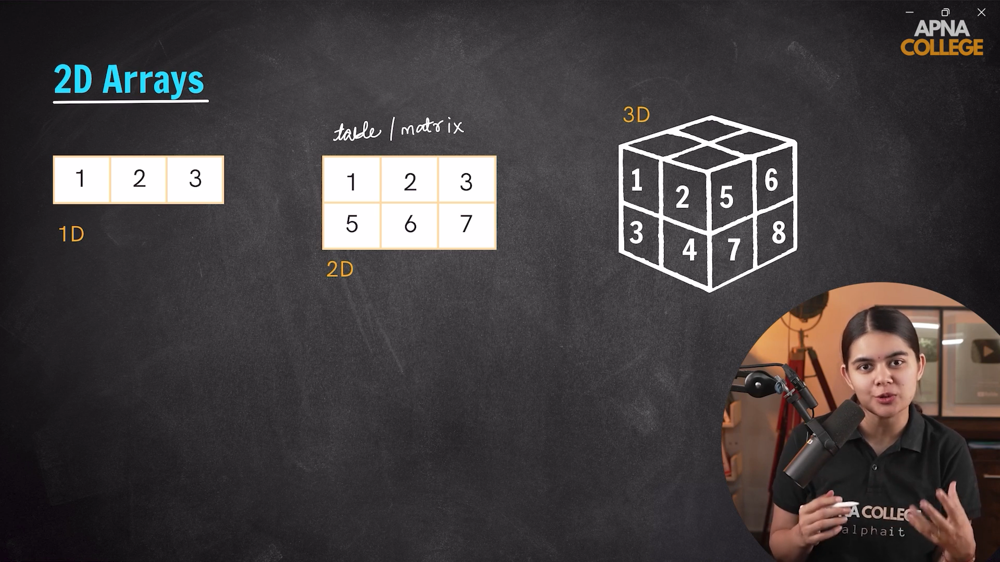
---

### Creation and Access of 2-D arrays.
- Let's say we are given two friends and we have to store Marks obtain by these 2 friends in 3 subjects for such a Scence we will be using Our 2-D array.

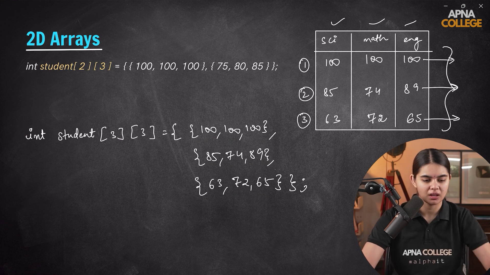

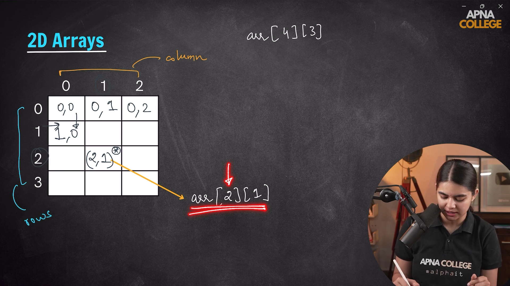

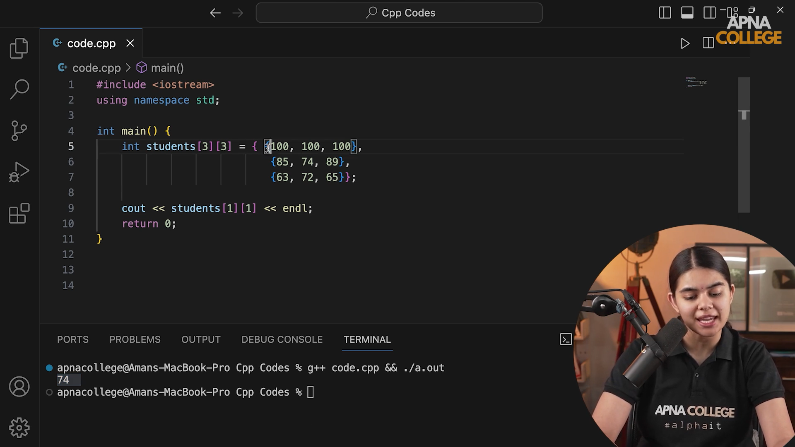
---
  
---

## *Input and Output in 2-D Array*

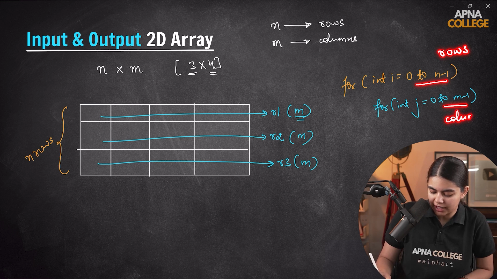

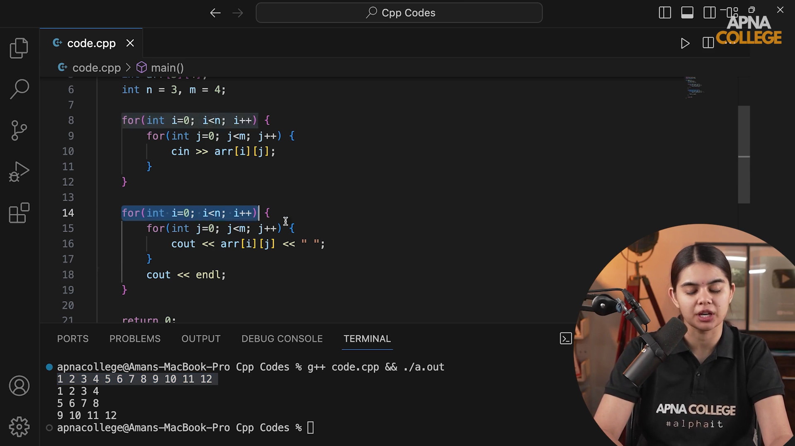

---
  
---

## *Memory Allocation of 2-D Array*

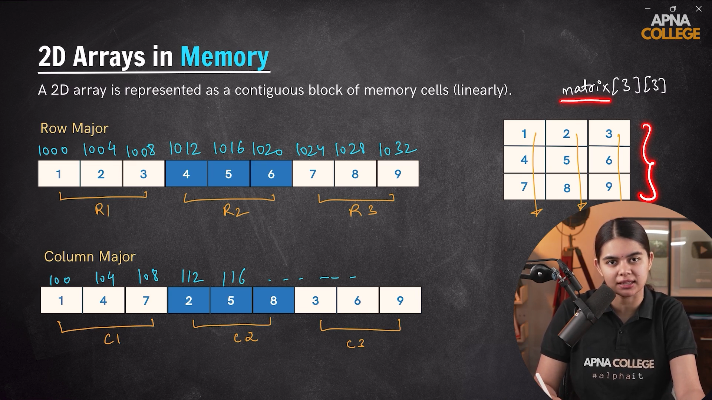

---
  
---

### Question 1.) Spiral Matrix

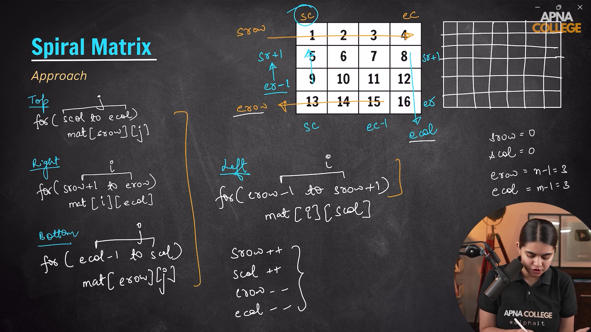

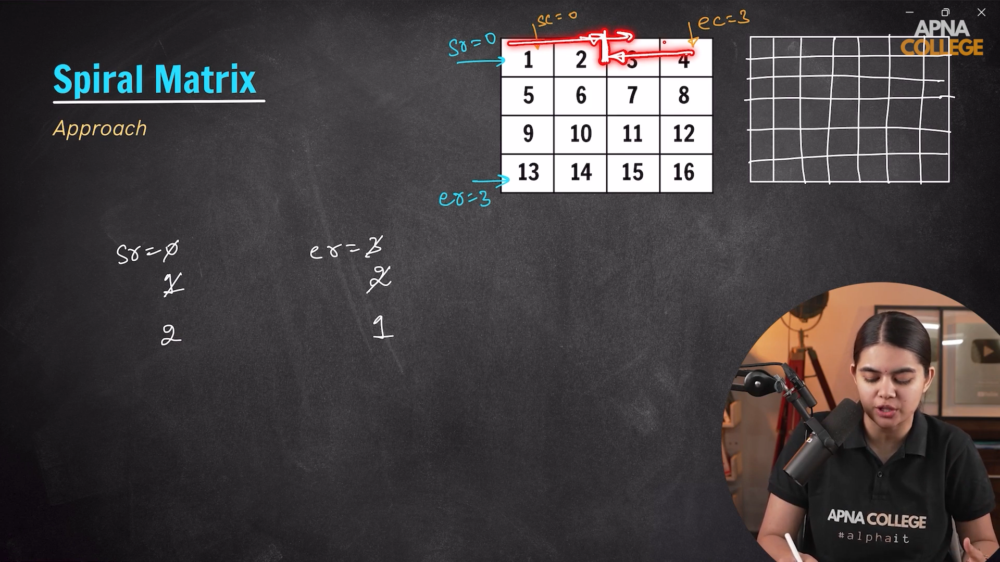

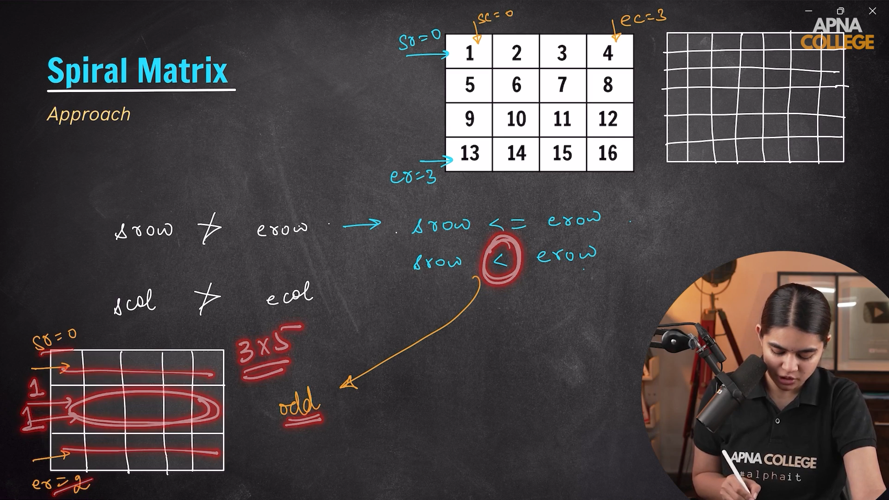
---
 

### Question 2.) Diagonal Sum

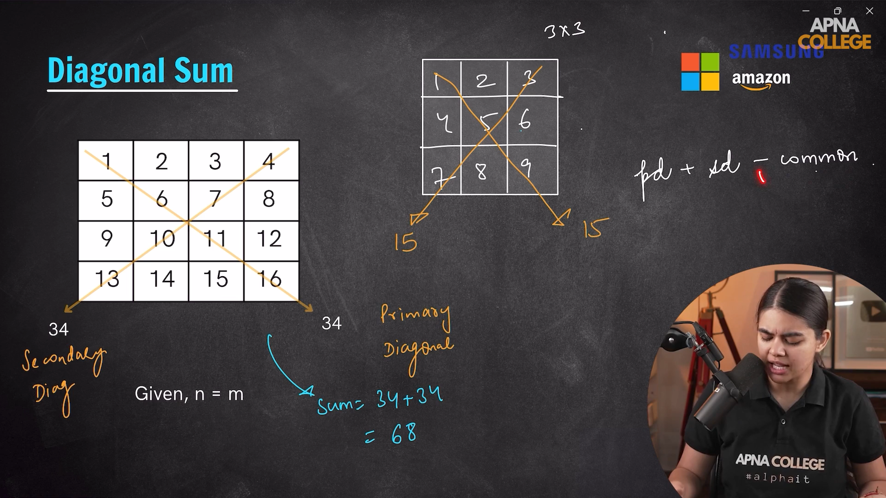

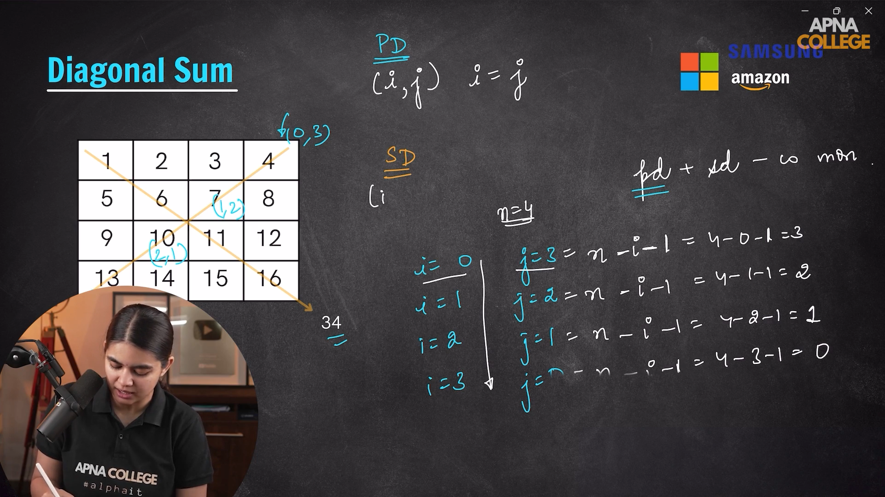

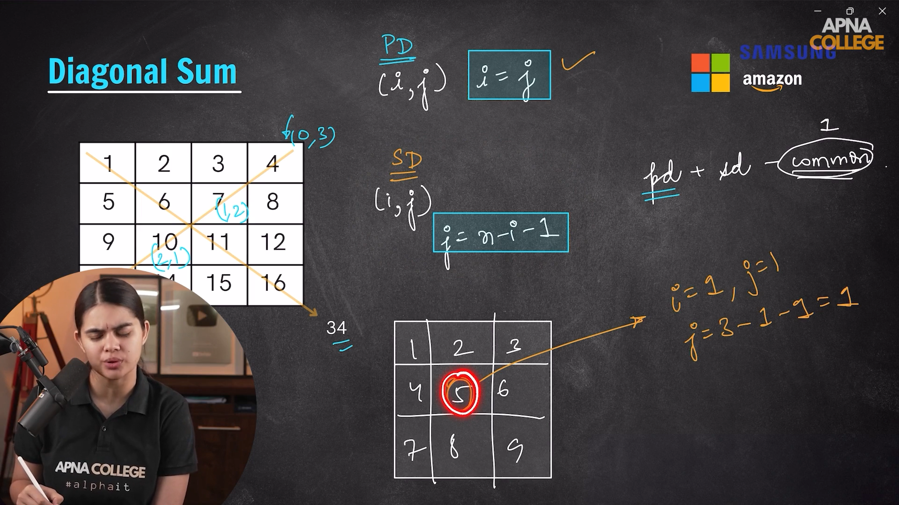

---
 

### Question 3.) Search in a Sorted Matrix

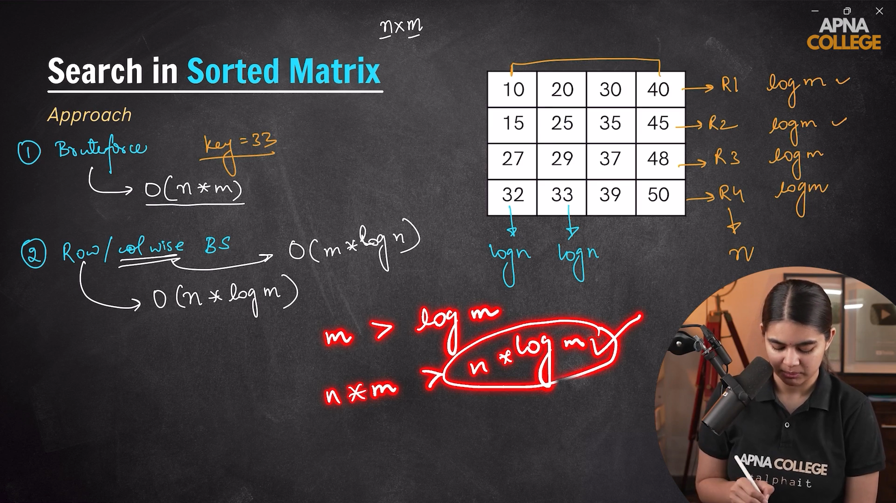

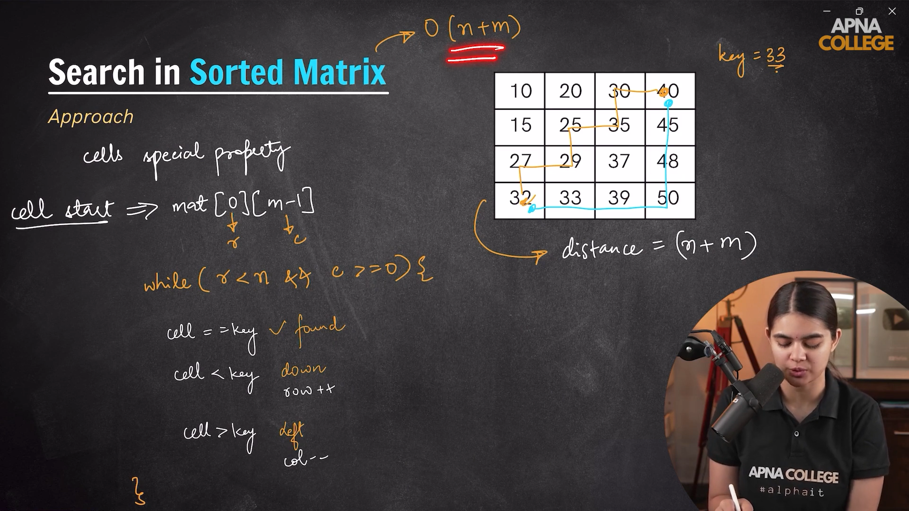

---
  
---

## *Matrix Pointers*

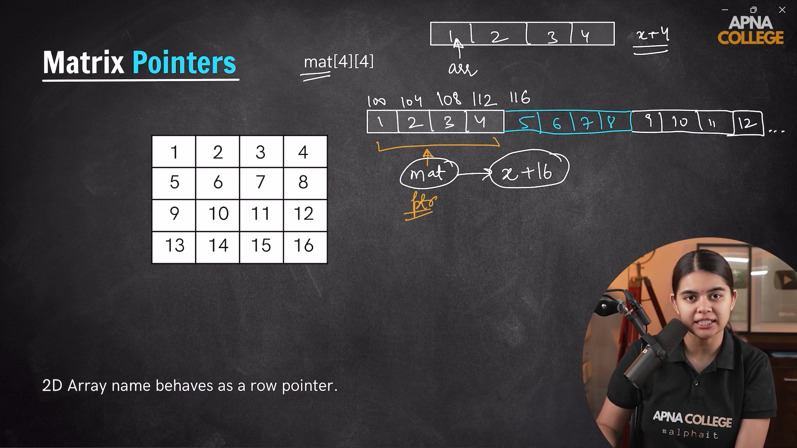

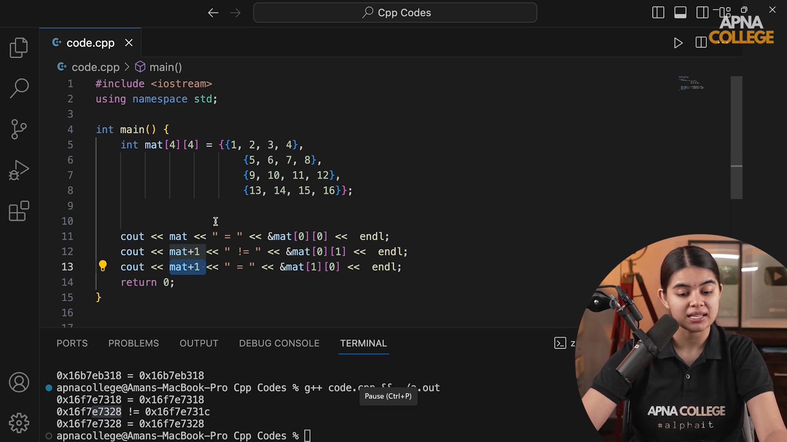

### Matrix Pointers in Function

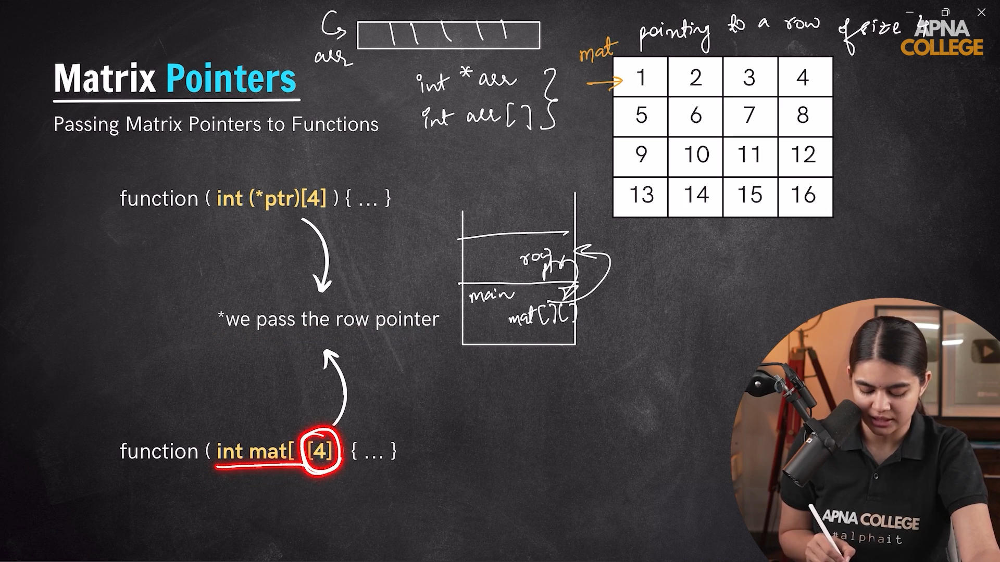