# *Char Data type*

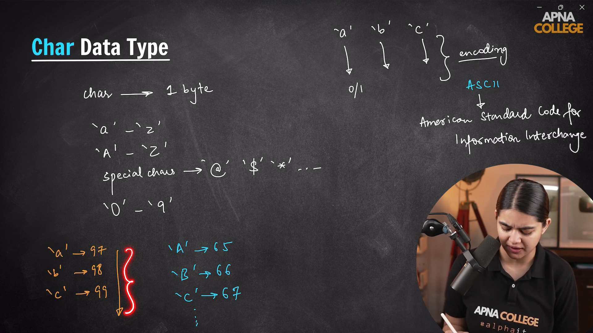

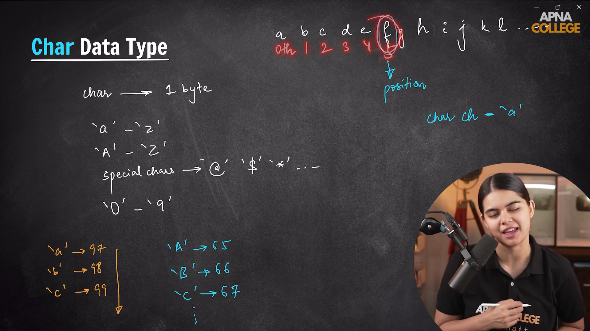

---
  
---

# *Char Array*

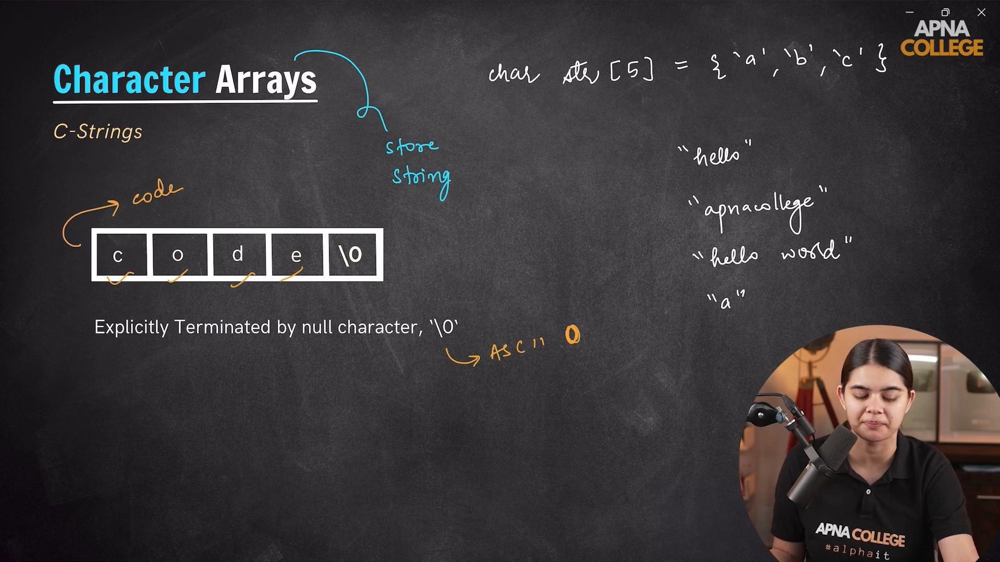

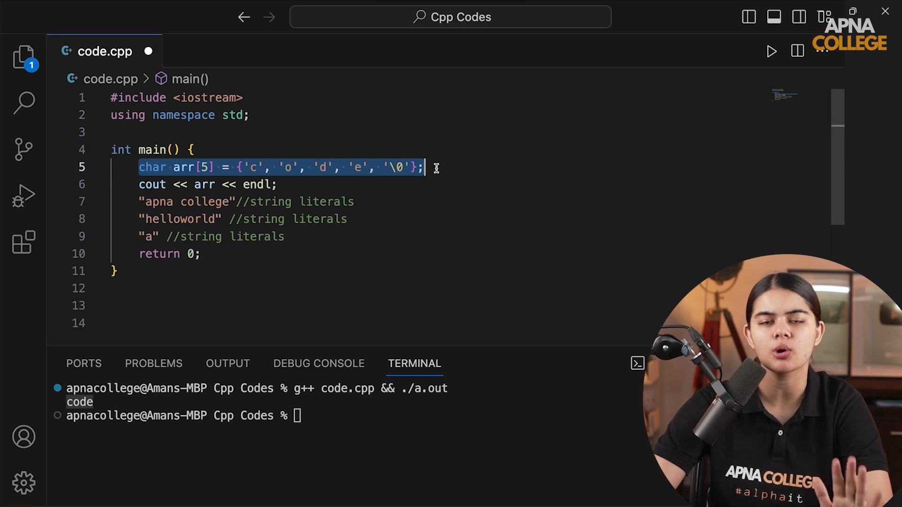

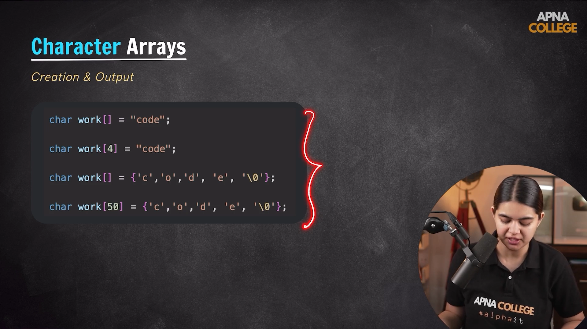

## Input a string in the char array with the help of cin.getline() function

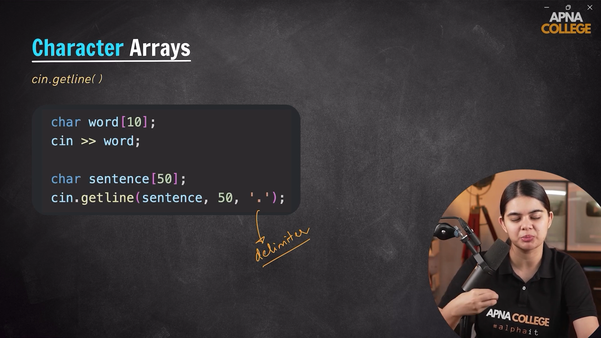

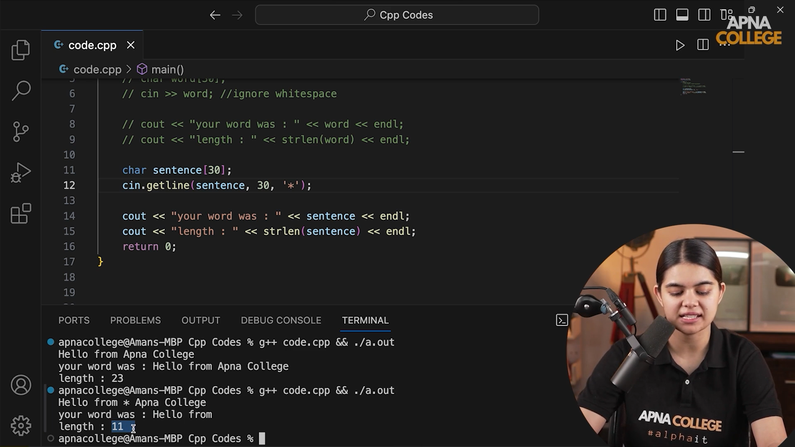

---
  
---

# *`<cstring>` header file*

- There are some inbuilt functions provided to us that we can use of the char array which are included inside the `<cstring>` header file.

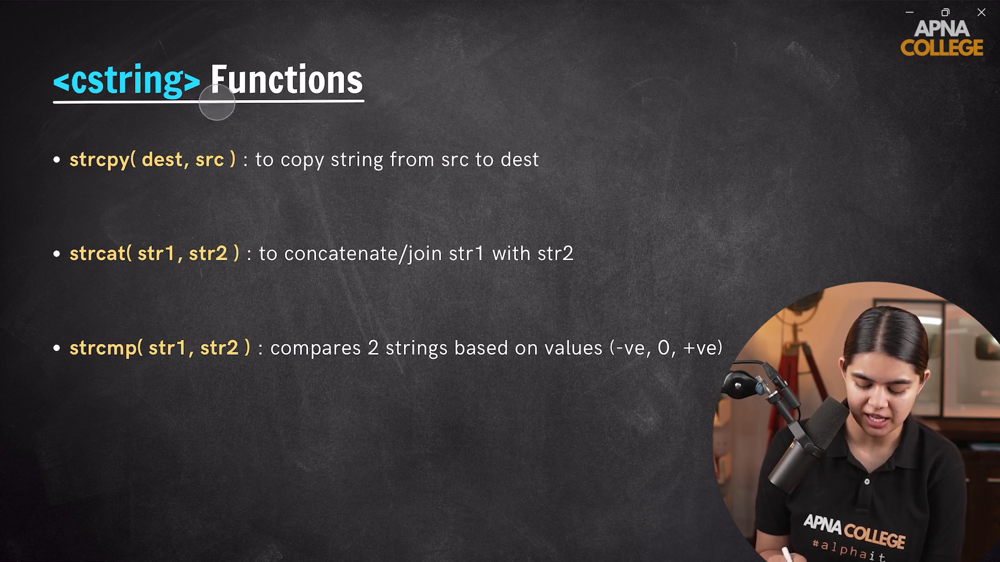

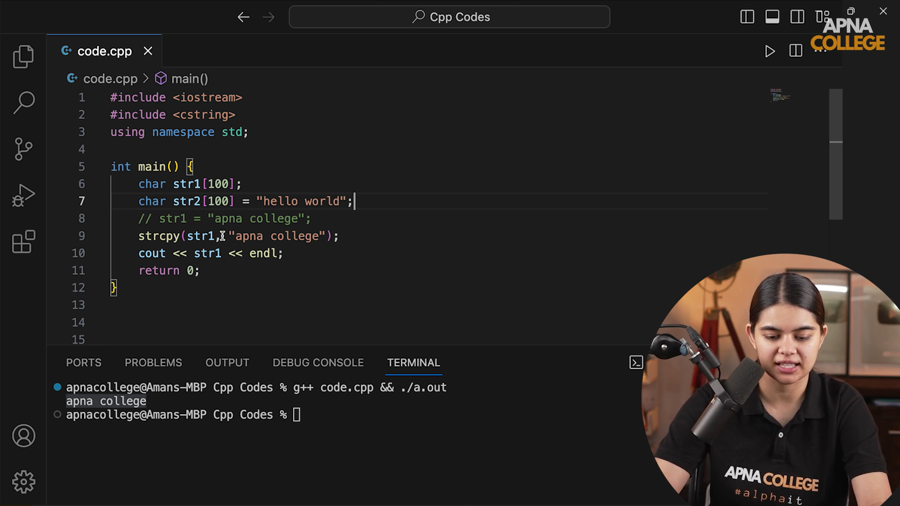

# *C++ Strings*

- C++ strings are classes which are defined inside the `<string>` header.

- They have few of the member function defined inside them as the length() function.

- One point to note is that char str[] is a character array named with str, whereas the string str is an object of string class present in STL.

- One major difference between the character array and string are character array is static whereas string is dynamic.

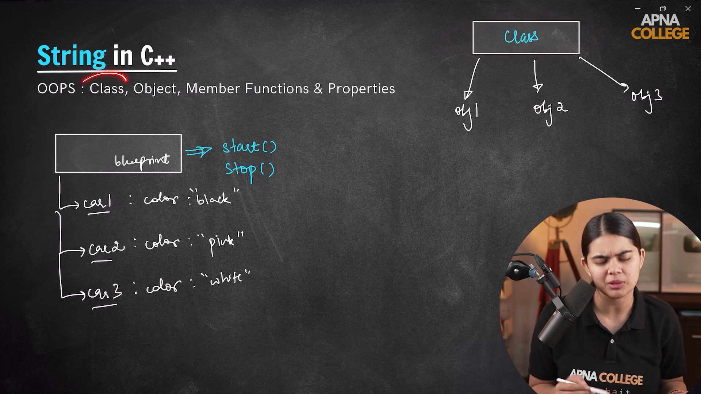

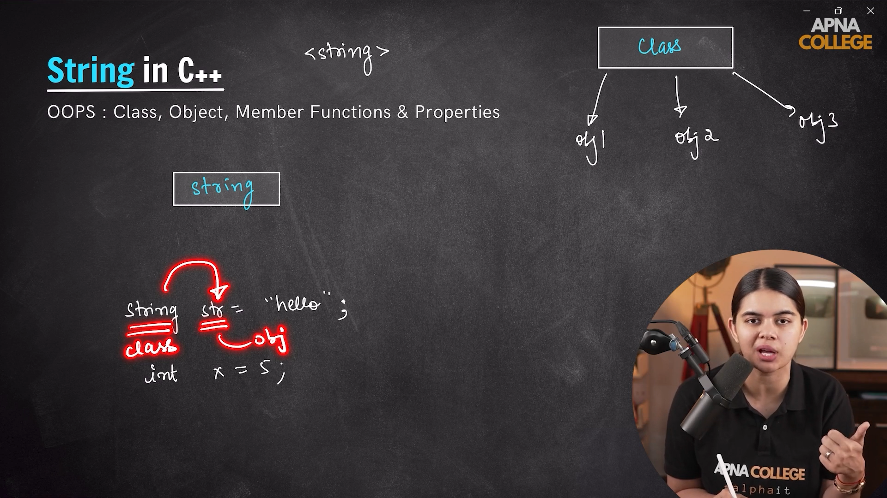

## Important points on c++ string are as follow:-

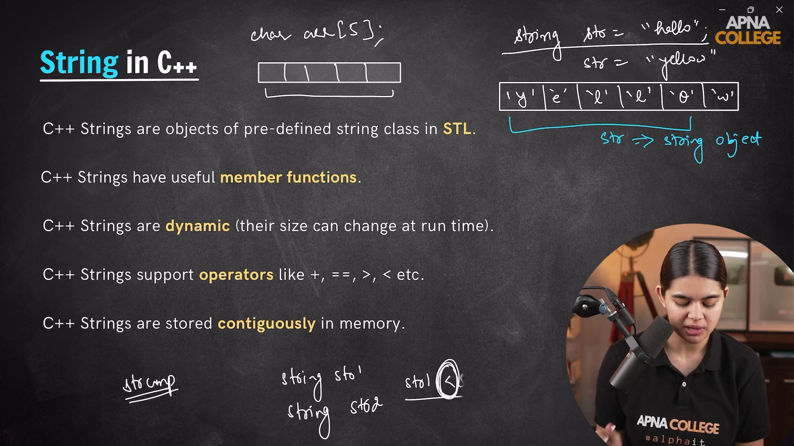

---
# How we can take an string input.

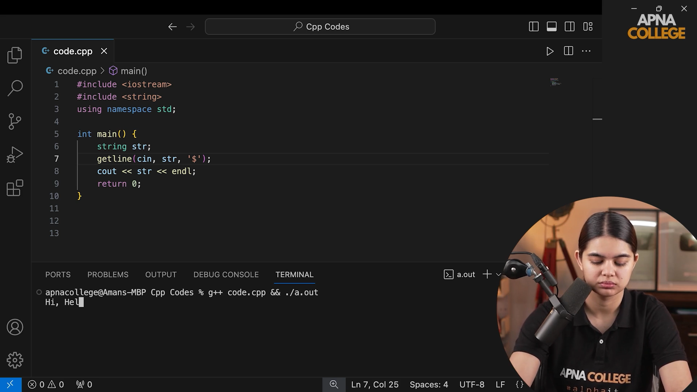

# String Member functions

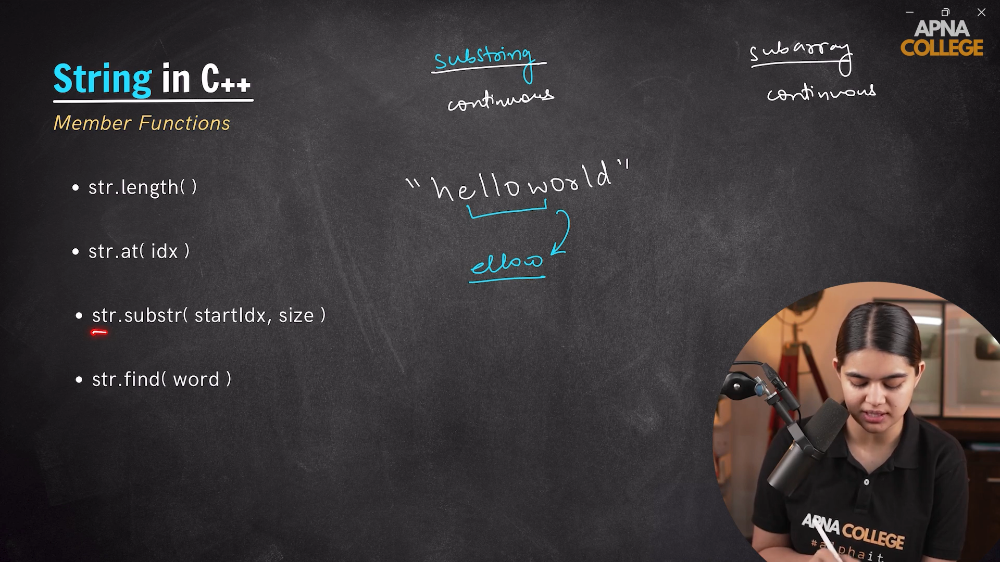

---
  
---

# *Demonstration of for each loop*

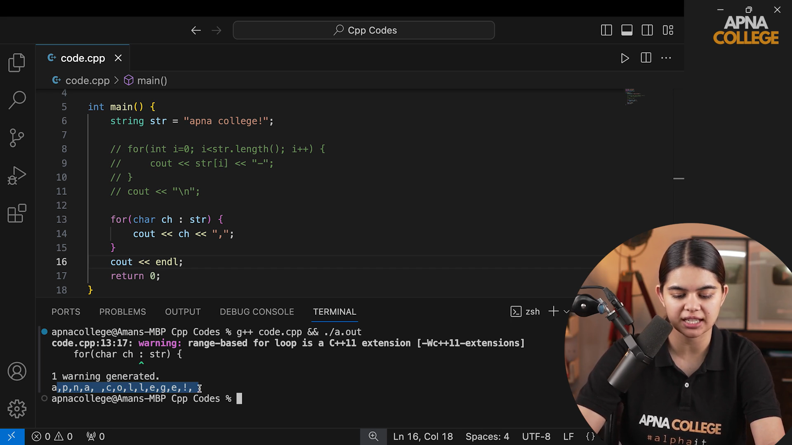