# *Dynamic Memory Allocation*

## Starting with the explanation of *Static memory allocation*
- When we do something like.

        int arr[100] = {1,2,3,4,5};

- In this situation one array of contiguous memory location of size 100 (i.e can have 100 elments in it) and a memory size of 400 Bytes will be allocated to it.

- Where arr is a pointer pointing to the arr[0].

- arr is the name of the array.

- This is Static memory allocation that we are telling at the compile time that how much memory we need and how we will be utilising it.
---

## Now in C++ we can too have a *Dynamic memory allocation*

- In this we don't have to pass the size of the array being created at the compile time we can dynamically provide this size during the runtime of program.

- We can create the new dynamic array with the help of new keyword.

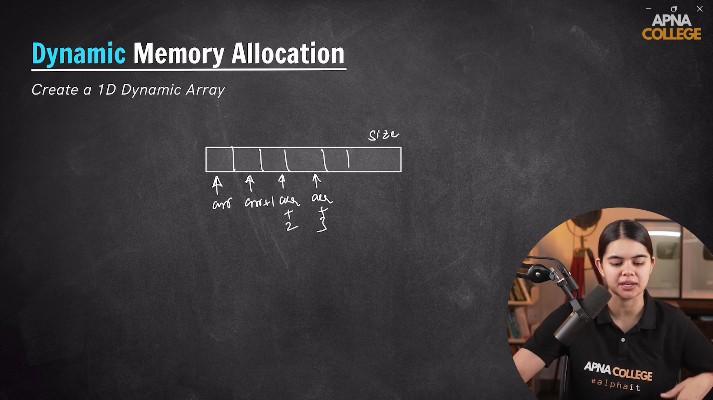

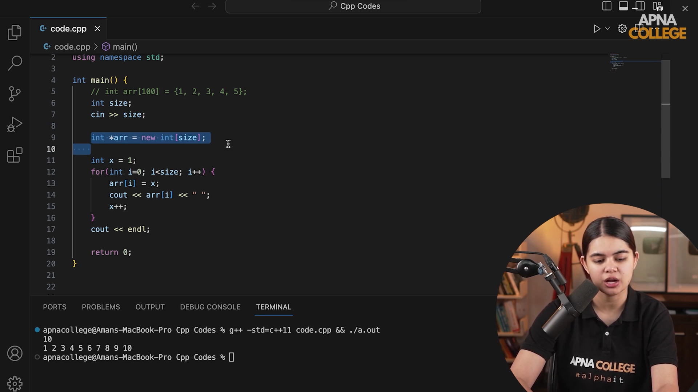
---
 
 

---

# Actual Understanding

- We have two different type of memory allocation as-
    1. Static Memory Allocation
    2. Dynamic Memoru Allocation

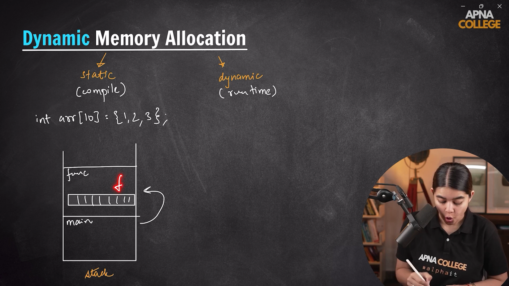

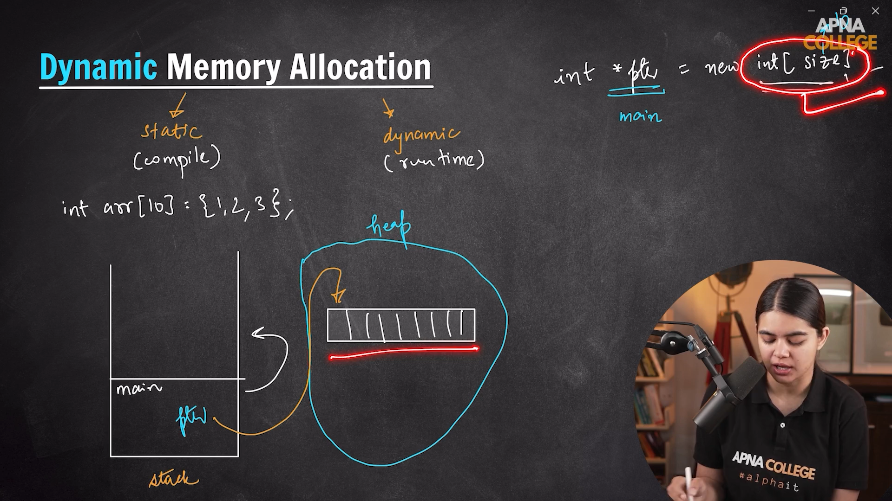

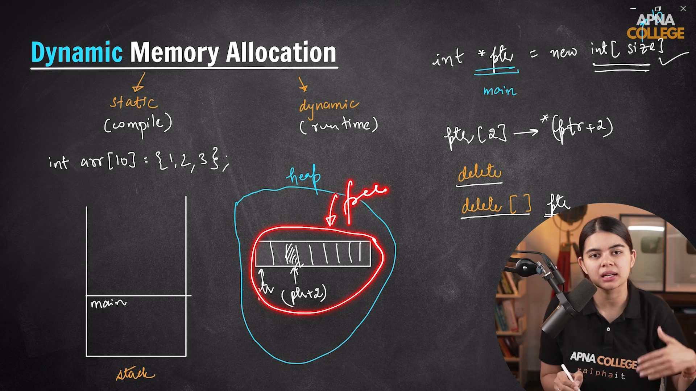

### Difference Between Static Vs Dynamic Memory Allocation

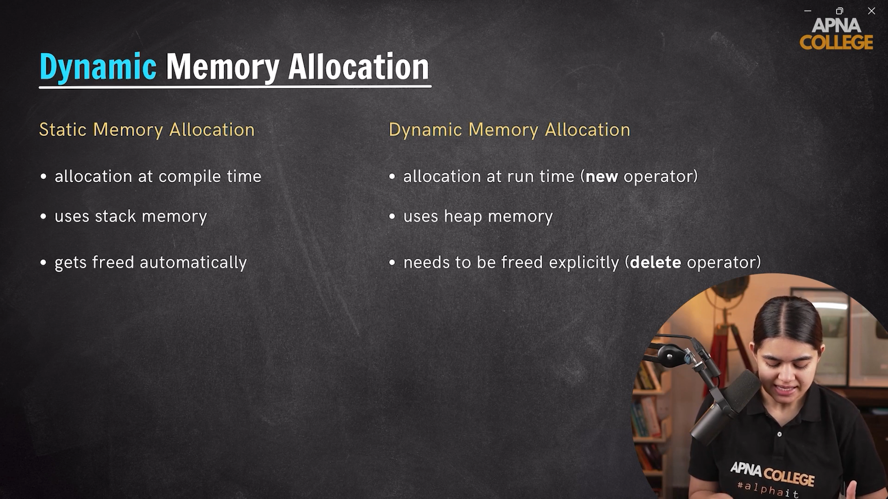
---
 
 

---

# *Memory Leak*

- Here the Heap memory gets freed up when our main function gets removed from the stack that is our whole program has now stopped working in that situation the heap memory gets freed up there is no stack frames in the stack.

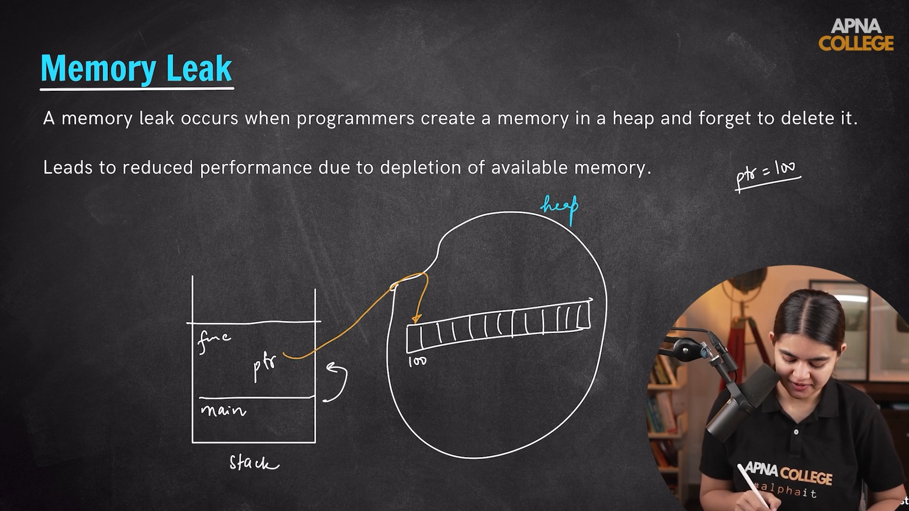

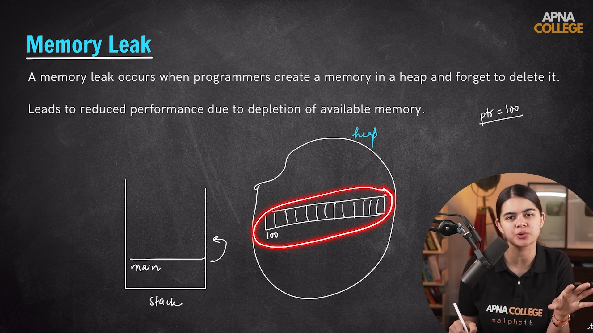
---
 
 

---

# *2-D Array dynamic memory allocation*

- It is quite different from 1-D dynamic memory allocation in this we createrow times 1-d array of column size and then club all those into one matrix pointer.

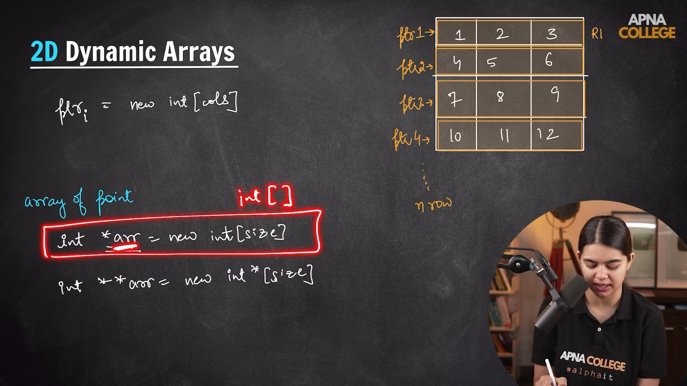

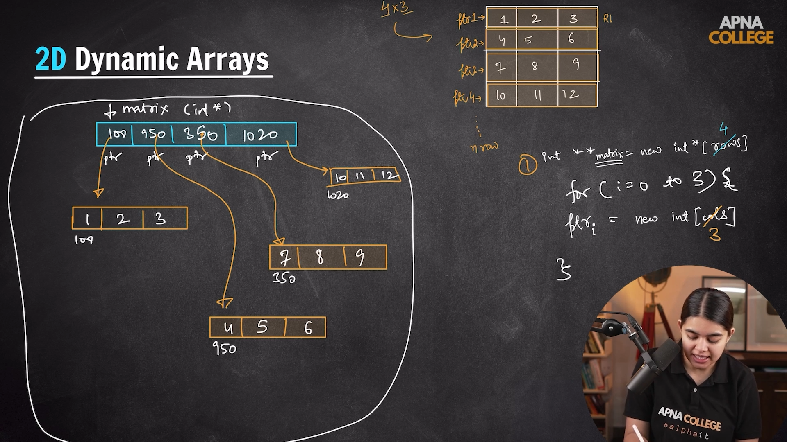

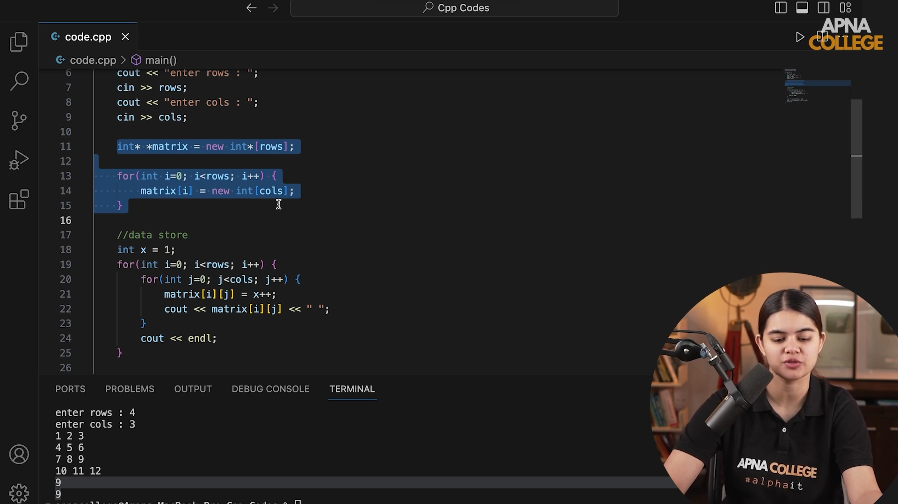
---
 
 

---

# *STL (Standard Template Library)*

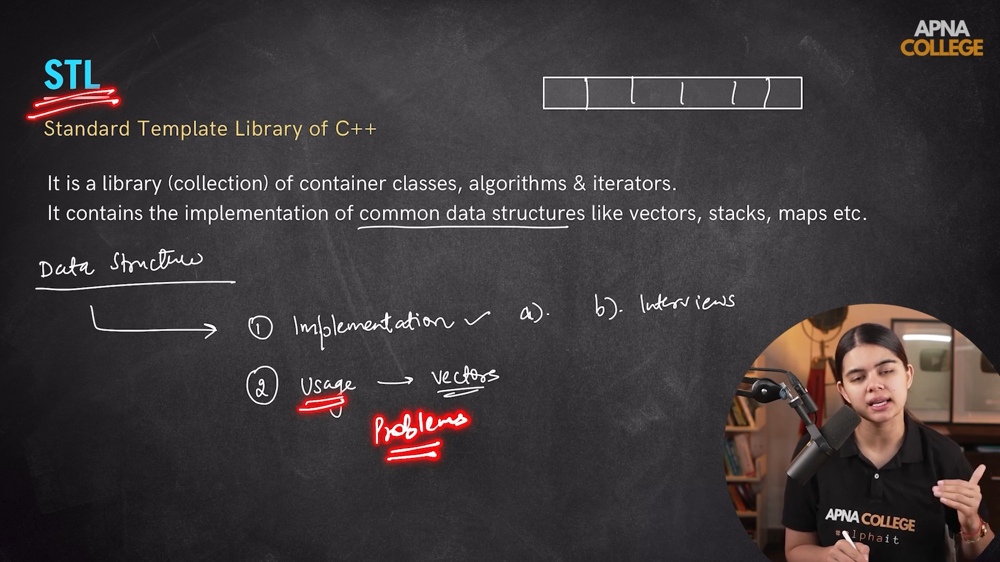