# Object Oriented Programming

- Oops is one of the Paradigm Programming language. Different types of Paradigm are as follow:- Functional Paradigm, Procedural Paradigm, Object Oriented Paradigm.

- Basically when we talk about the Oops concept then its a goody approach or style of writing a code.

- Till now what we were doing was Functional Programming we were using different functions for completeing a task. And if want to perform another task will create a new function.

- But this is not so in the case of Object oriented programming here we will use Classes and Objects to solve the problem.

- With the help of these classes and objects, we can make real world entites present in our code.

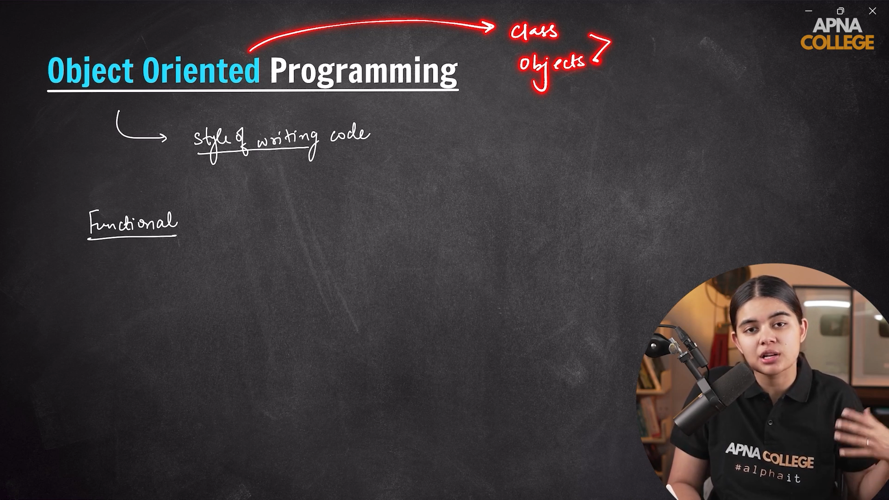

---
  
---

## Classes and Objects

- `Class ->` Class is like a blueprint for the Objects. All the objects are made from the classes they are just the group of the entites or objects.

- `Objects ->` Objects are real-world entites. The actual thing which is present in this world like Aman. Objects have some properties(Attributes) and functions(Method/Member-functions) associated with them.

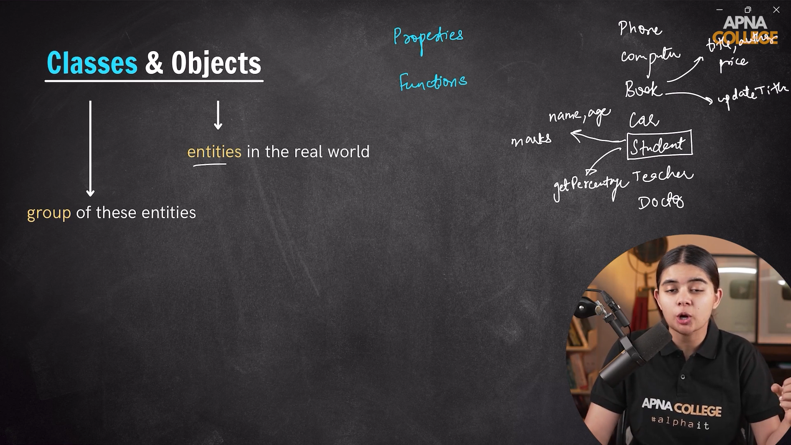

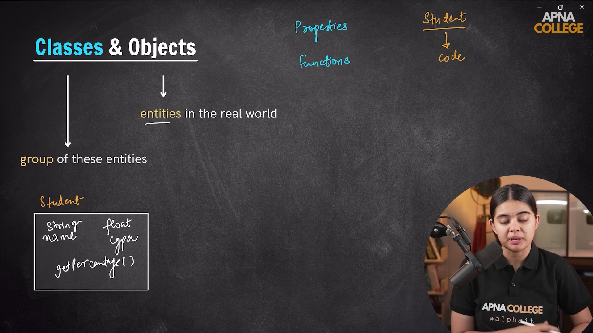

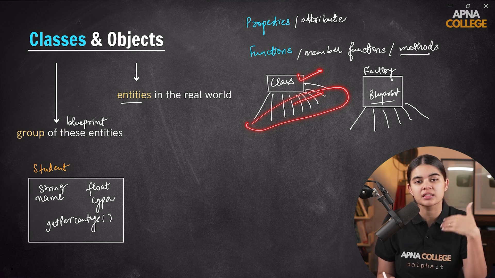

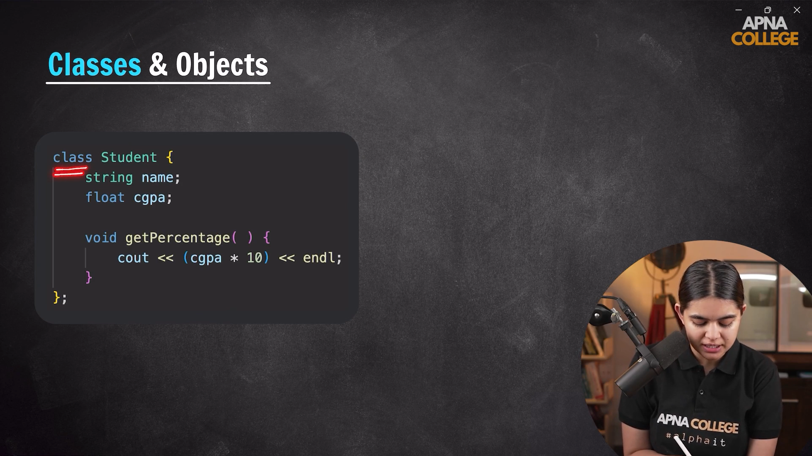

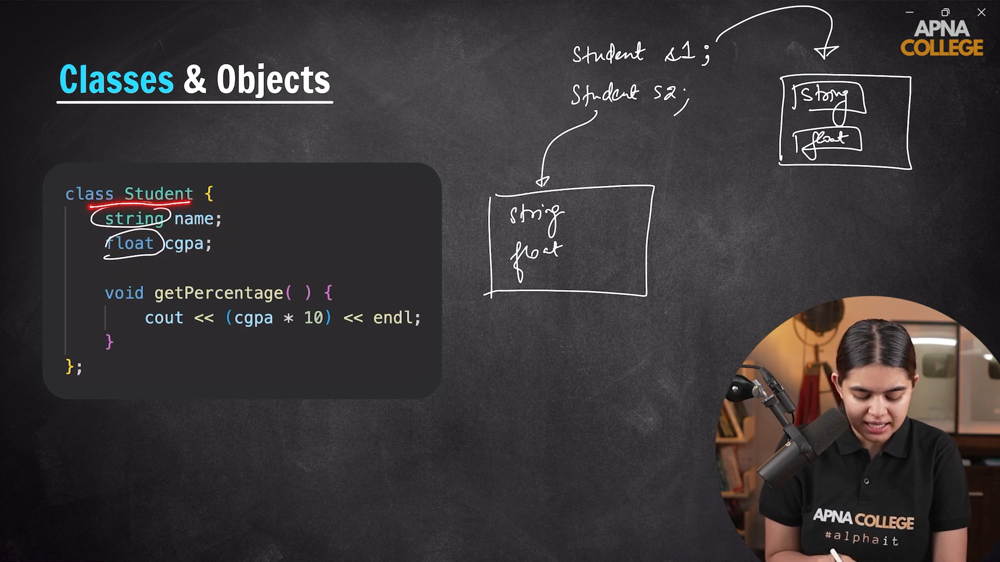

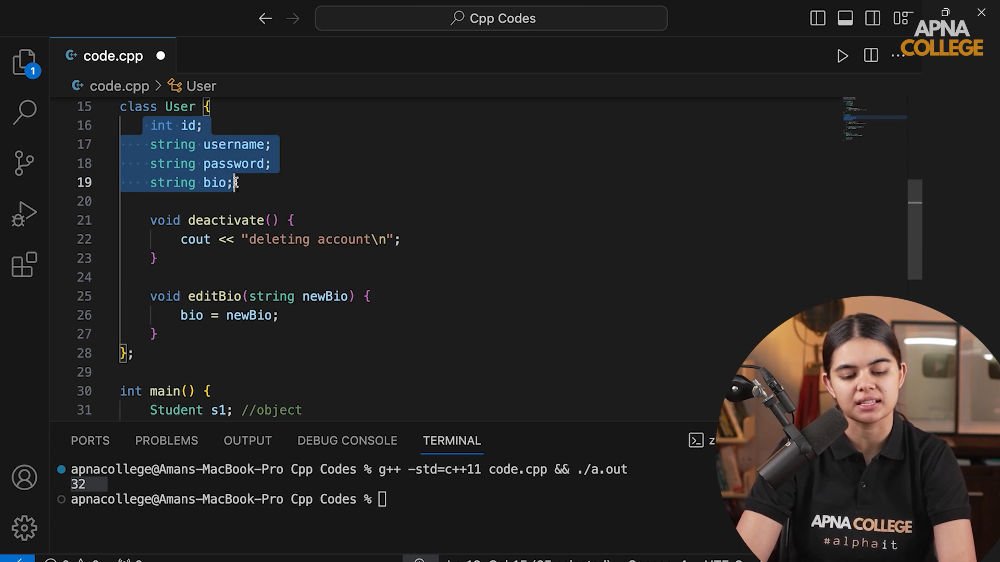

---
  
---

## Access Modifier

- Access Modifer helps us to tell that where we can use these properties and functions of the classes.

- We have three different types of Access Modifier they are as follow:- Private, Public, Protected.

- Protected access modifiers are used mostly in the cases of Inheritance and they are accessible inside the class and inside the friend functions.

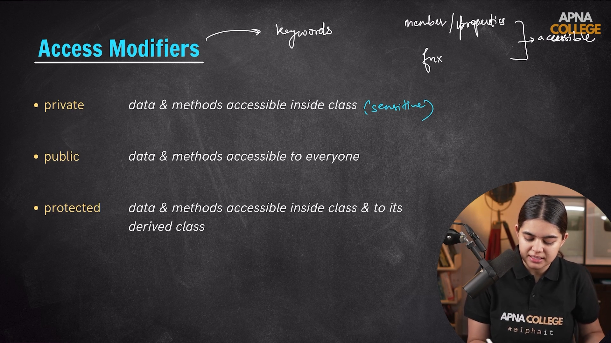

---
  
---

## Getters and Setters

- They are basically a normal functions which are used for assigning and accessing the values of the Private or Protected modifier which are not accessible outside the class but due to this extra function we indirectly take the access of these not accessible properties.

- They getters and setters are under the Public access modifier.

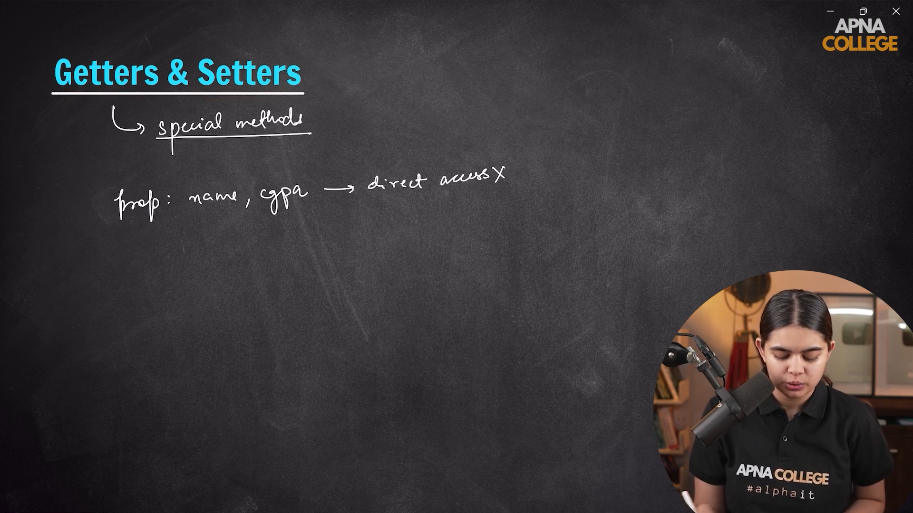

---
  
---

## Encapsulation

- Its a method of wrapping up the data member or member function inside one single unit.

- So the classes which we were making our a type of Encapsulation where we wrap our data-members and data-function under the same class.

- All the class creation follows the Encapsulation Property.

- One more major property of encapsulation is Data Hiding. The data is hided in the class with the help of Access modifiers.

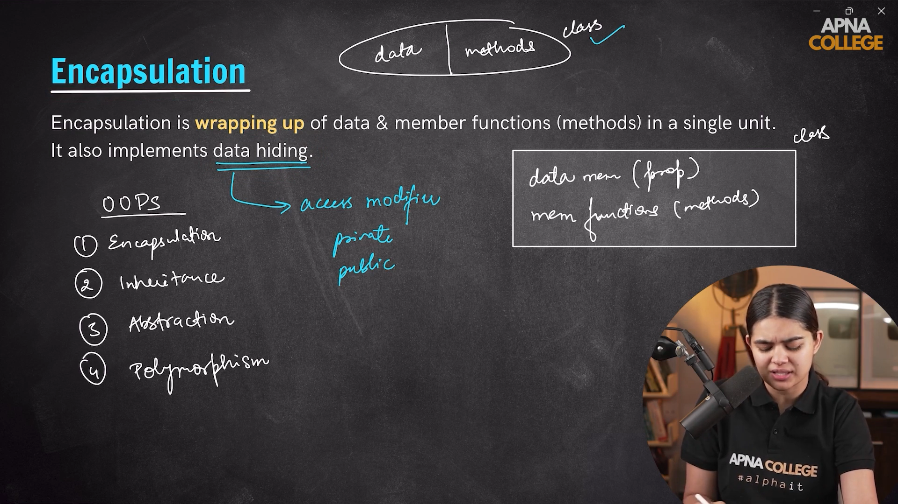

---
  
---

## Constructor

- Constructors are just special type of functions which are called only once at the time of Object creation.

- We personally don't need to call the constructor it is automatically called at the time of creation of object i.e at the time of object declaration.

- If we don't create any constructor in that case compiler will itself create a constructor and calls it but let say we have created one in that case our constructor will be called.

- Objects memory is allocated at the time of constructor invoke.

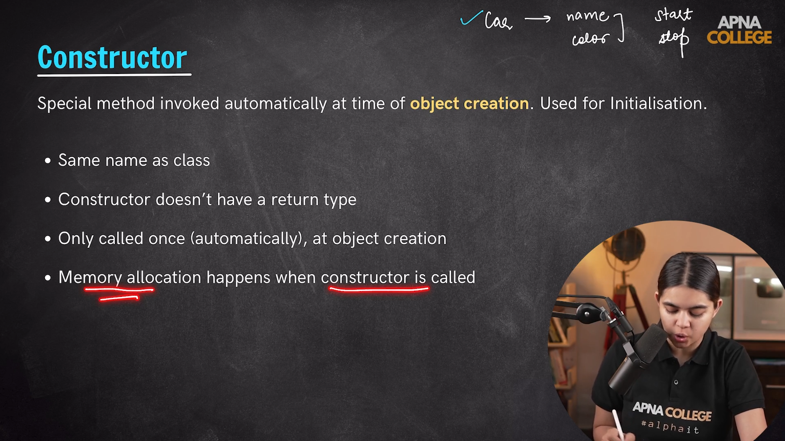

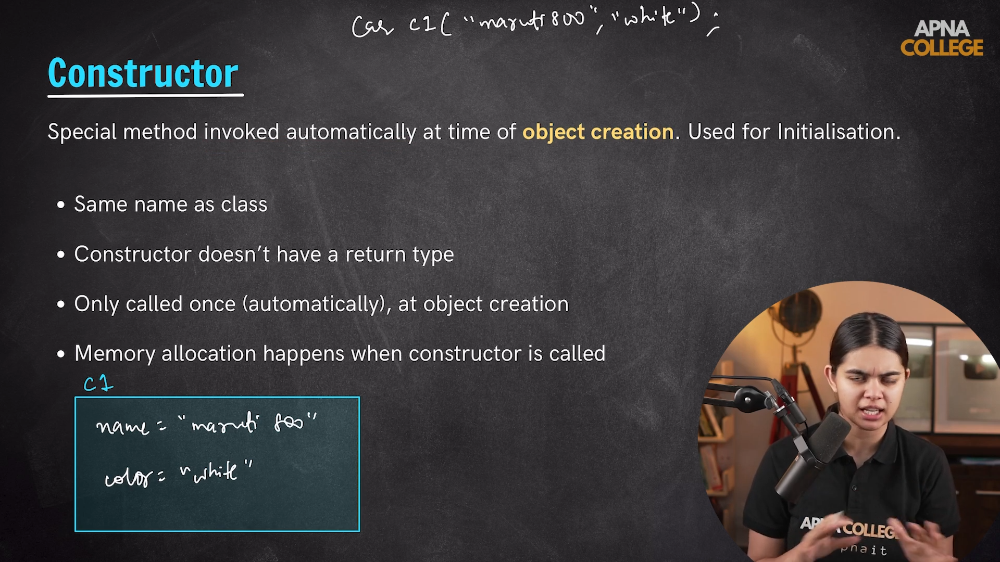

---
  
---

## this

- The this pointer points to the Object of the class.

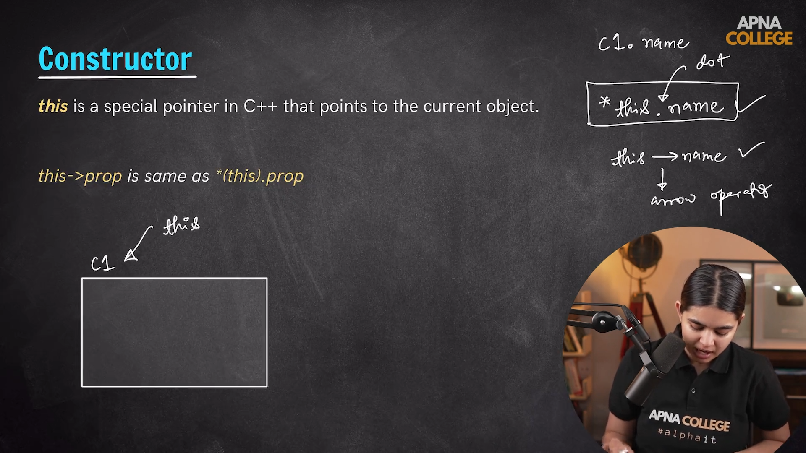

---
  
---

## Types of Constructor

- We can write more than One constructor for our Class.

- There are different type of constructors. They are as follow:-

1.) `Non-parametrized Constructor ->` By `default` if we don't create a constructor then compiler creates a non-parametrized constructor. In which no parameter is passed.

2.) `Parametrized Constructor ->` Helps for Initalisation the properties i.e Data Members.

3.) `Copy Constructor ->` Its a Special type of Constructor which used for copying the properties of one Object into the other. It is By `Default` created for us in java it is not created by default but in C++ it is automatically created for us.

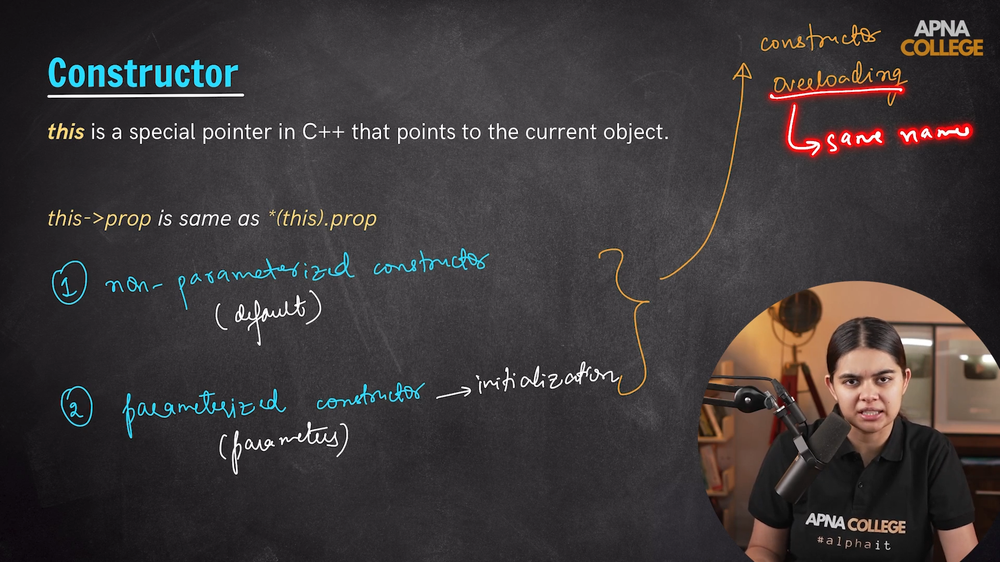

---

## Shallow Copy and Deep Copy

- This concept of shallow and deep copy work when we have data member(i.e properties) of Dynamically allocated memory.

- By default when we create our own copy constructor or the copy constructor which we get from the c++ compiler forms a shallow copy for the properties.

- Like the static variables gets created a new copy for the variables they work normally and creates a normal proper copy variable.

- But the problem araises for the heap memory variables or for the dynamically allocated variables like - pointers or array. where there address get stored when the copy constructor because if which they get a new alias object pointing to the same memory location.

- We need to create our own copy constructor for having deep copy where these dynamic variables too have different memory allocations.

        #include<iostream>
        using namespace std;

        class Car{
        public:
            string name;
            string color;
            int* milege;

            Car(string name, string color, int* milege){
                this->name = name;
                this->color = color;
                this->milege = new int; //Dynamic allocation
                this->milege = milege;
            }

            Car(Car &obj){ //Copy constructor
                this->name = obj.name;
                this->color = obj.color;
                this->milege = new int; //Inside the copy constructor too we have first tried to provide it different memory location.
                *(this->milege) = *(obj.milege); //And then stored a value in it.
            }
        };

        int main(){
            int milege = 12;
            Car c1("Scorpio S12", "White", &milege);
            Car c2(c1);

            cout<<*(c2.milege)<<endl;
            cout<<*(c1.milege)<<endl;
            *(c2.milege) = 10;
            cout<<*(c2.milege)<<endl;
            cout<<*(c1.milege)<<endl;

            return 0;
        }

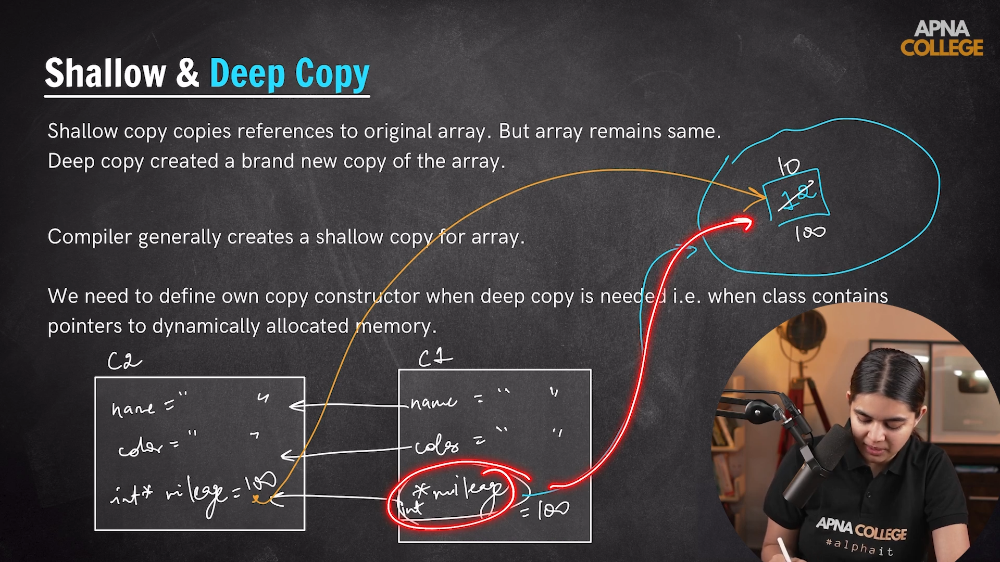

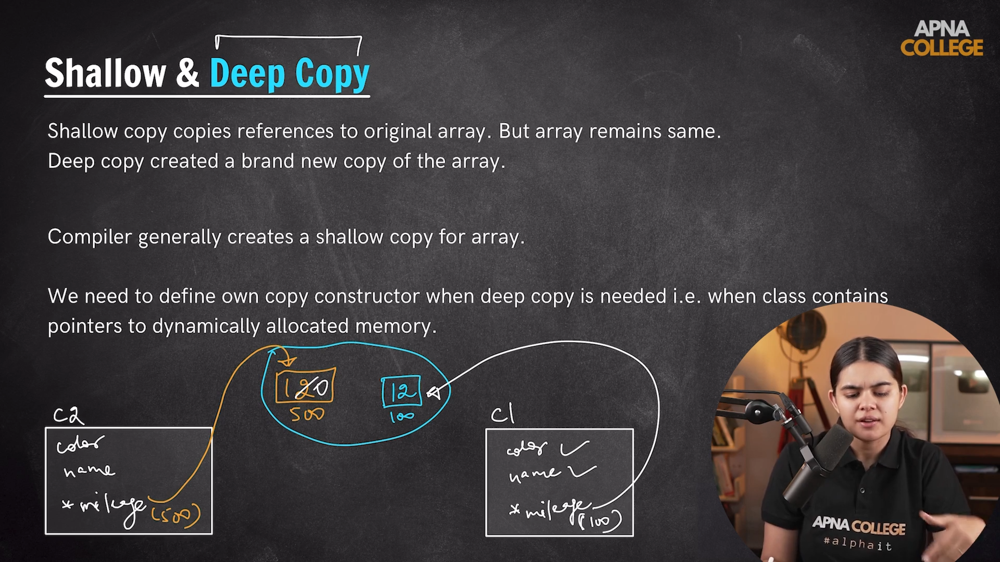

---
  
---

## Destructor

- Destructor's are complete Opposite of the constructor. Constructors are used for allocating the memory to the object at the time of creation whereas the work of Destructor is too deallocate the memory given to the object.

- They are too called automatically at the end of the scope like if we have declared an Object inside the main then at the end of the main function it will get deallocated.

- But this works fine with the static memory allocation Once we have dynamic memory allocation in the heap through Pointers or array's or through any dynamic means by the new keyword in that case we manually have to dellocate the memoey once its work is done. Otherwise it can lead to the situation of the memory leak.

- So Destructor's are mainly used for the Dynamic memory deallocation.

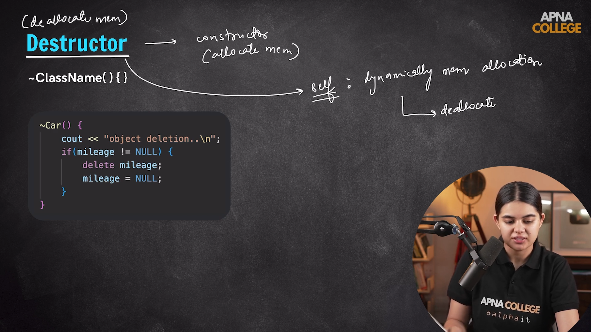

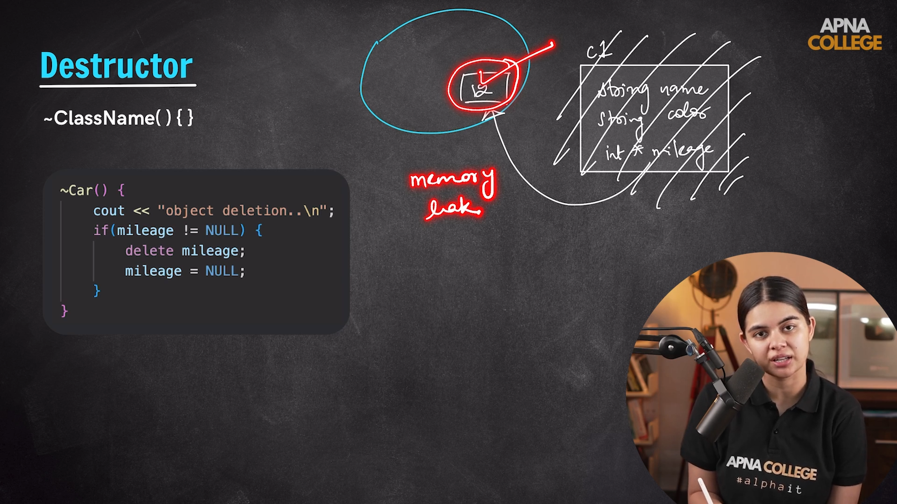

---
  
---

## Inheritance

- Inheritance can be understood with the help of a family tree where the properties of parents are passed onto the child.

- The Child inherits few of the properties and features of the parent.

- In Inhertiance the Child class(or we can say Derived/Sub-class) inherits few of the properties from the Parent class(or we can say Super/Base class).

- We have this Inheritance Concept in Classes and Object for the code reuseability.

- If we don't pass any access modifier while inherting an class in that case it will inherit the properties privately.

- Private data of the class our never inherited in their derived/child class.

        Syntax-
            class <child-class> : <access-specifier> <parent-class>{
                .....
                .....
            };

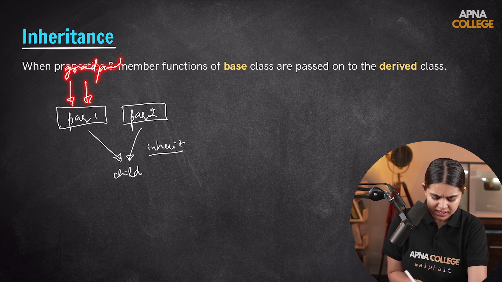

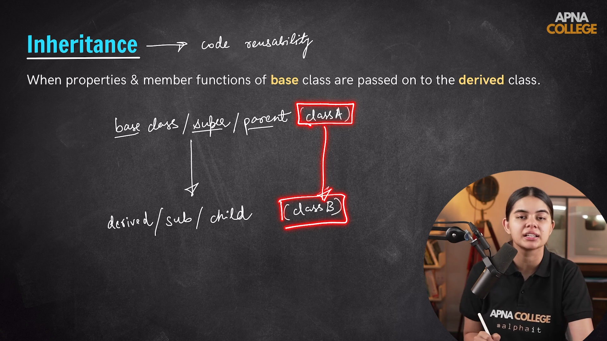

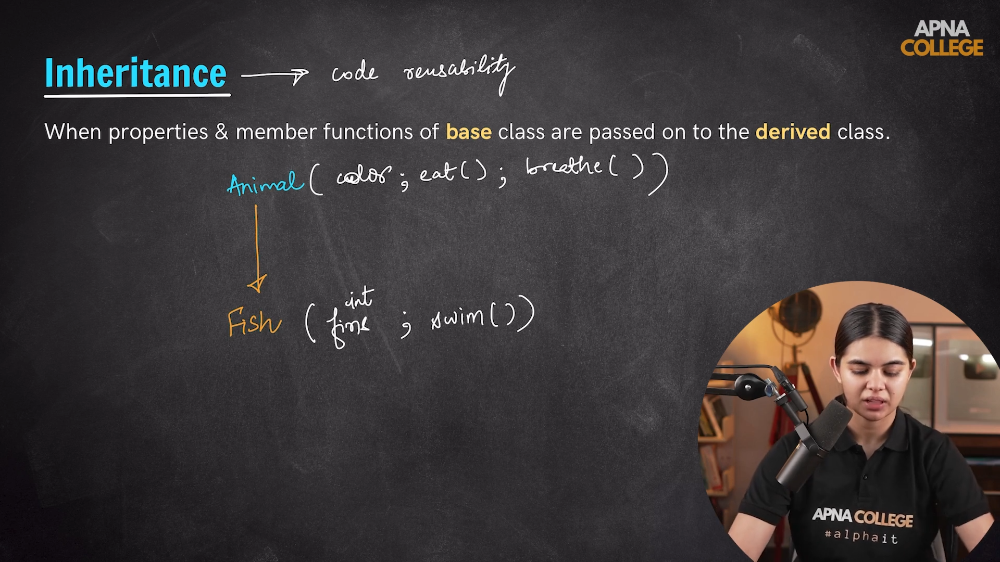

---

### Modes of Inheritance

- Anything being inherited in public mode will get the data as it is i.e the public data will be inherited publically and the protected data will be inherited protected whereas the private data won't be accessible.

- Anything being inherited in protected mode will inherit both the public and protected data in protected form whereas the private data still will be inaccessible here.

- Anything being inherited in Private mode will inherit both the public and protected data in the private form whereas the private data still will be inaccessible here.

- The only differance between the Private and Protected Access Modifier is Private data are only accessible inside there own class whereas the Protected ones can be used inside there own class as well as there derived class.

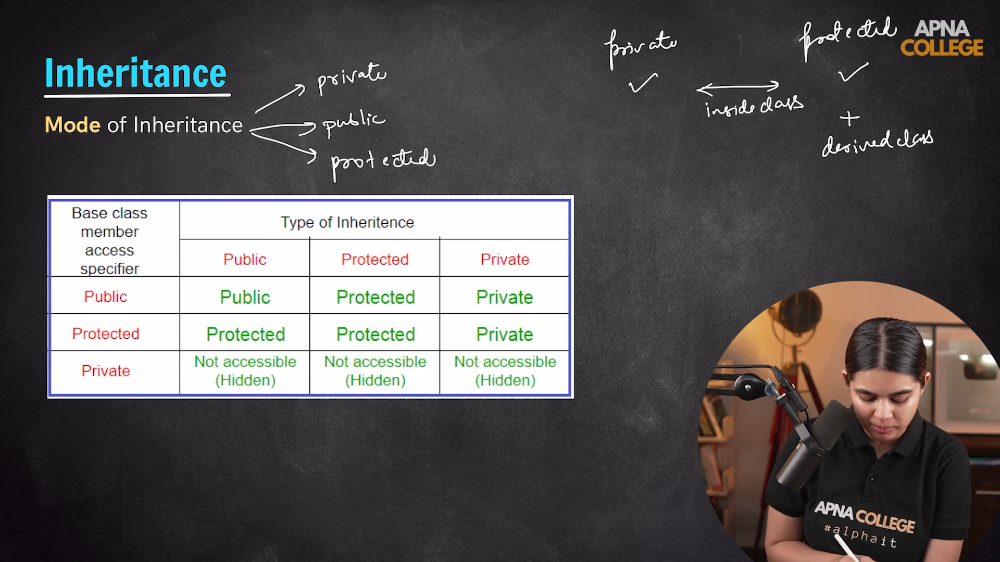

---

### Types of Inheritance

**1.) Single Inheritance**

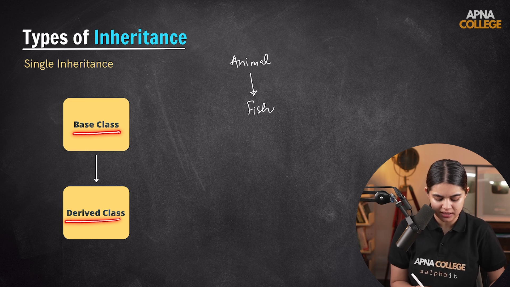

**2.) Multi-level Inheritance**

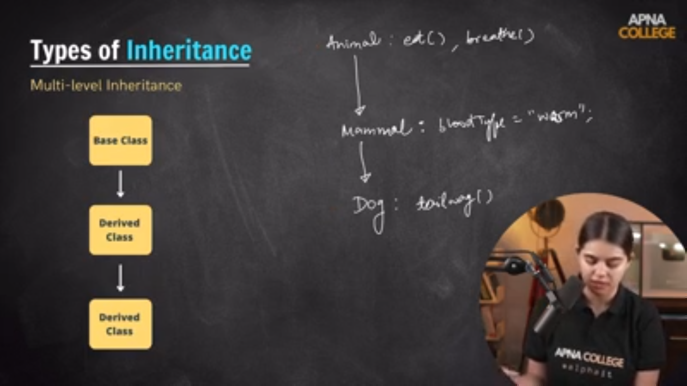

**3.) Multiple Inheritance**

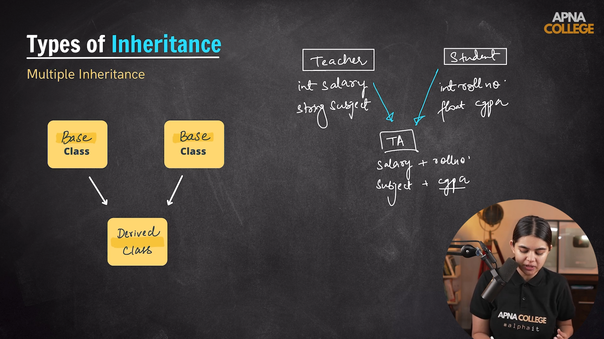

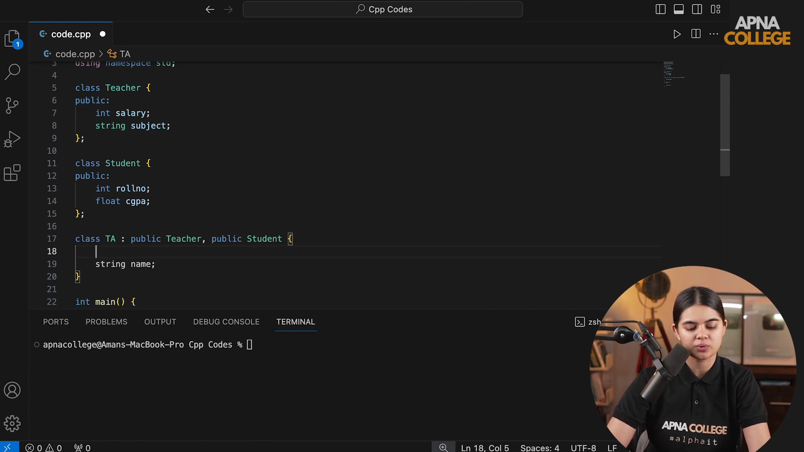

**4.) Hierarchical Inheritance**

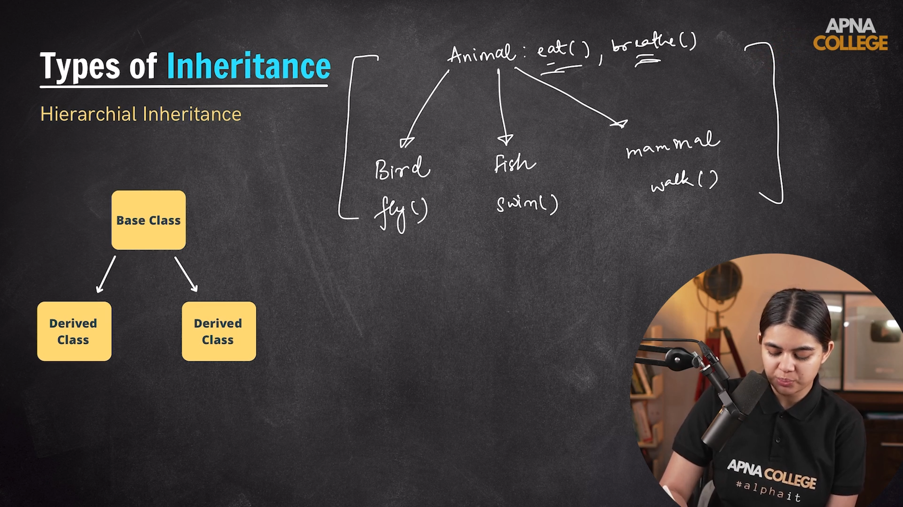

**5.) Hybrid Inheritance**

- Its a mix of different type of inheritances.

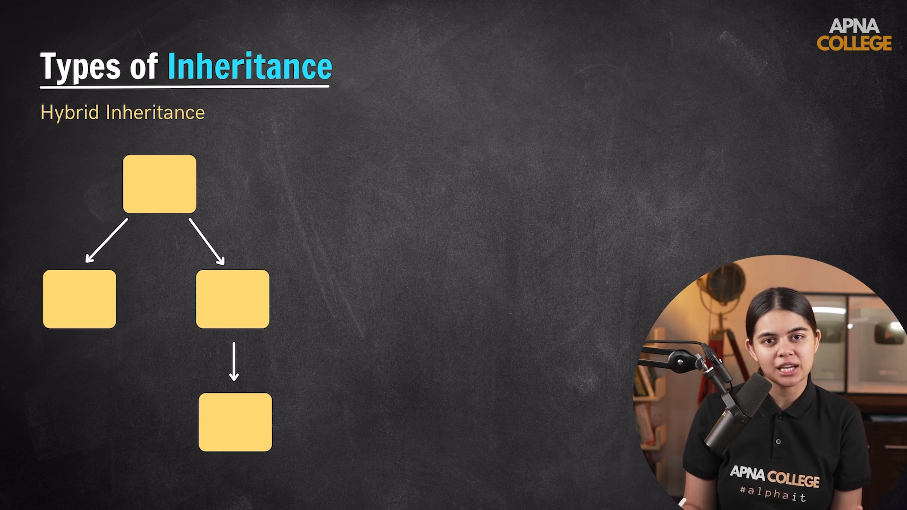