# Object Oriented Programming

- Oops is one of the Paradigm Programming language. Different types of Paradigm are as follow:- Functional Paradigm, Procedural Paradigm, Object Oriented Paradigm.

- Basically when we talk about the Oops concept then its a goody approach or style of writing a code.

- Till now what we were doing was Functional Programming we were using different functions for completeing a task. And if want to perform another task will create a new function.

- But this is not so in the case of Object oriented programming here we will use Classes and Objects to solve the problem.

- With the help of these classes and objects, we can make real world entites present in our code.

- We have Four Major Pillars in Object Oriented Programming they are as follow:-
    1. Encapsulation
    2. Inheritance
    3. Polymorphism
    4. Abstraction

---
  
---

## Classes and Objects

- `Class ->` Class is like a blueprint for the Objects. All the objects are made from the classes they are just the group of the entites or objects.

- `Objects ->` Objects are real-world entites. The actual thing which is present in this world like Aman. Objects have some properties(Attributes) and functions(Method/Member-functions) associated with them.

---
  
---

## Access Modifier

- Access Modifer helps us to tell that where we can use these properties and functions of the classes.

- We have three different types of Access Modifier they are as follow:- Private, Public, Protected.

- Protected access modifiers are used mostly in the cases of Inheritance and they are accessible inside the class and inside the friend functions.

---
  
---

## Getters and Setters

- They are basically a normal functions which are used for assigning and accessing the values of the Private or Protected modifier which are not accessible outside the class but due to this extra function we indirectly take the access of these not accessible properties.

- They getters and setters are under the Public access modifier.

---
  
---

# 1.) Encapsulation

- Its a method of wrapping up the data member or member function inside one single unit.

- So the classes which we were making our a type of Encapsulation where we wrap our data-members and data-function under the same class.

- All the class creation follows the Encapsulation Property.

- One more major property of encapsulation is Data Hiding. The data is hided in the class with the help of Access modifiers.

---
  
---

## Constructor

- Constructors are just special type of functions which are called only once at the time of Object creation.

- We personally don't need to call the constructor it is automatically called at the time of creation of object i.e at the time of object declaration.

- If we don't create any constructor in that case compiler will itself create a constructor and calls it but let say we have created one in that case our constructor will be called.

- Objects memory is allocated at the time of constructor invoke.

---
  
---

## this

- The this pointer points to the Object of the class.

---
  
---

## Types of Constructor

- We can write more than One constructor for our Class.

- There are different type of constructors. They are as follow:-

1.) `Non-parametrized Constructor ->` By `default` if we don't create a constructor then compiler creates a non-parametrized constructor. In which no parameter is passed.

2.) `Parametrized Constructor ->` Helps for Initalisation the properties i.e Data Members.

3.) `Copy Constructor ->` Its a Special type of Constructor which used for copying the properties of one Object into the other. It is By `Default` created for us in java it is not created by default but in C++ it is automatically created for us.

---

## Shallow Copy and Deep Copy

- This concept of shallow and deep copy work when we have data member(i.e properties) of Dynamically allocated memory.

- By default when we create our own copy constructor or the copy constructor which we get from the c++ compiler forms a shallow copy for the properties.

- Like the static variables gets created a new copy for the variables they work normally and creates a normal proper copy variable.

- But the problem araises for the heap memory variables or for the dynamically allocated variables like - pointers or array. where there address get stored when the copy constructor because if which they get a new alias object pointing to the same memory location.

- We need to create our own copy constructor for having deep copy where these dynamic variables too have different memory allocations.

        #include<iostream>
        using namespace std;

        class Car{
        public:
            string name;
            string color;
            int* milege;

            Car(string name, string color, int* milege){
                this->name = name;
                this->color = color;
                this->milege = new int; //Dynamic allocation
                this->milege = milege;
            }

            Car(Car &obj){ //Copy constructor
                this->name = obj.name;
                this->color = obj.color;
                this->milege = new int; //Inside the copy constructor too we have first tried to provide it different memory location.
                *(this->milege) = *(obj.milege); //And then stored a value in it.
            }
        };

        int main(){
            int milege = 12;
            Car c1("Scorpio S12", "White", &milege);
            Car c2(c1);

            cout<<*(c2.milege)<<endl;
            cout<<*(c1.milege)<<endl;
            *(c2.milege) = 10;
            cout<<*(c2.milege)<<endl;
            cout<<*(c1.milege)<<endl;

            return 0;
        }

---
  
---

## Destructor

- Destructor's are complete Opposite of the constructor. Constructors are used for allocating the memory to the object at the time of creation whereas the work of Destructor is too deallocate the memory given to the object.

- They are too called automatically at the end of the scope like if we have declared an Object inside the main then at the end of the main function it will get deallocated.

- But this works fine with the static memory allocation Once we have dynamic memory allocation in the heap through Pointers or array's or through any dynamic means by the new keyword in that case we manually have to dellocate the memoey once its work is done. Otherwise it can lead to the situation of the memory leak.

- So Destructor's are mainly used for the Dynamic memory deallocation.

---
  
---

# 2.) Inheritance

- Inheritance can be understood with the help of a family tree where the properties of parents are passed onto the child.

- The Child inherits few of the properties and features of the parent.

- In Inhertiance the Child class(or we can say Derived/Sub-class) inherits few of the properties from the Parent class(or we can say Super/Base class).

- We have this Inheritance Concept in Classes and Object for the code reuseability.

- If we don't pass any access modifier while inherting an class in that case it will inherit the properties privately.

- Private data of the class our never inherited in their derived/child class.

        Syntax-
            class <child-class> : <access-specifier> <parent-class>{
                .....
                .....
            };

---

### Modes of Inheritance

- Anything being inherited in public mode will get the data as it is i.e the public data will be inherited publically and the protected data will be inherited protected whereas the private data won't be accessible.

- Anything being inherited in protected mode will inherit both the public and protected data in protected form whereas the private data still will be inaccessible here.

- Anything being inherited in Private mode will inherit both the public and protected data in the private form whereas the private data still will be inaccessible here.

- The only differance between the Private and Protected Access Modifier is Private data are only accessible inside there own class whereas the Protected ones can be used inside there own class as well as there derived class.

---

### Types of Inheritance

**1.) Single Inheritance**

**2.) Multi-level Inheritance**

**3.) Multiple Inheritance**

**4.) Hierarchical Inheritance**

**5.) Hybrid Inheritance**

- Its a mix of different type of inheritances.

---
  
---

# 3.) Polymorphism

- The word Polymorphism is made up of `poly` - which means many and `morph` - which means form.

- Which indicates that polymorphism means any thing which has many forms.

- The smiliar function name with different parameters can come under Polymorphism.
    a real world example for it could be Right. The word right can have different meaning when used at different place. It can have one meaning as right of right and wrong and other could be right of left and right.

- We have two different type of Polymorphism as:-
    1. Compile-time Polymorphism (In this which function will be called will be evoked at compile time.)
    2. Run-time Polymorphism (In this which function will be evoked will be decided at run time.)

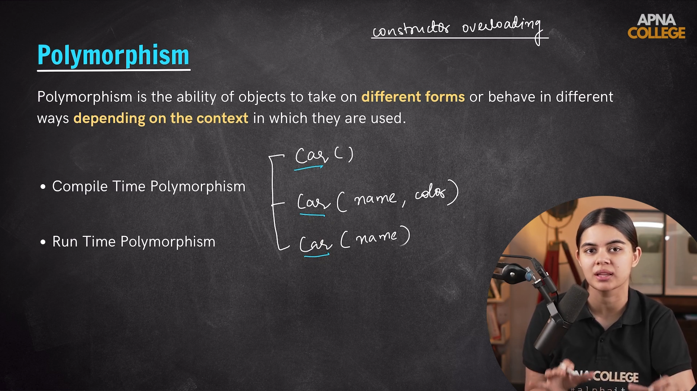

---

## Compile Time Polymorphism

- We have two different type of Compile time Polymorphism. They are as follow:-
    1. Function Overloading
    2. Operator Overloading

- `Overloading ->` In overloading we have same function name for more than one function but different count and type of parameters passed in it.

### Function Overloading

- `Function Overloading ->` In overloading we have same function name for more than one function but different count and type of parameters passed in it.

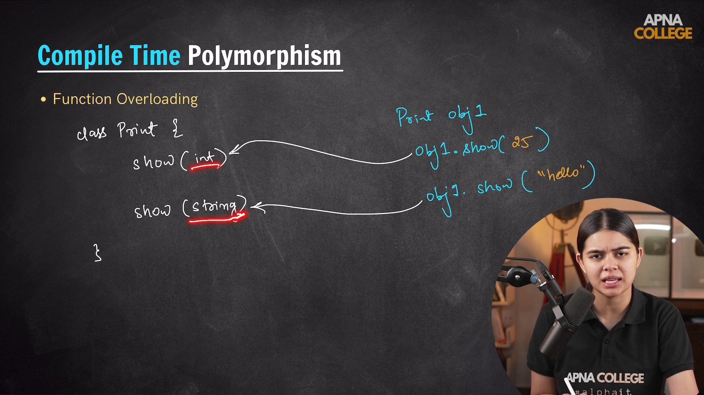
----

### Operator Overloading

- `Operator Overloading ->` In the operator overloading polymorphism the same operator used for doing some other function like the '+' Operator has its functionality defined for adding two integer or floating numbers in c++ even if we pass two string the '+' operator wil perform the concatenation operation.

- But there is no functionality defined for what to do when the '+' operation is done on some user defined class for that we make our own operator overloading function.

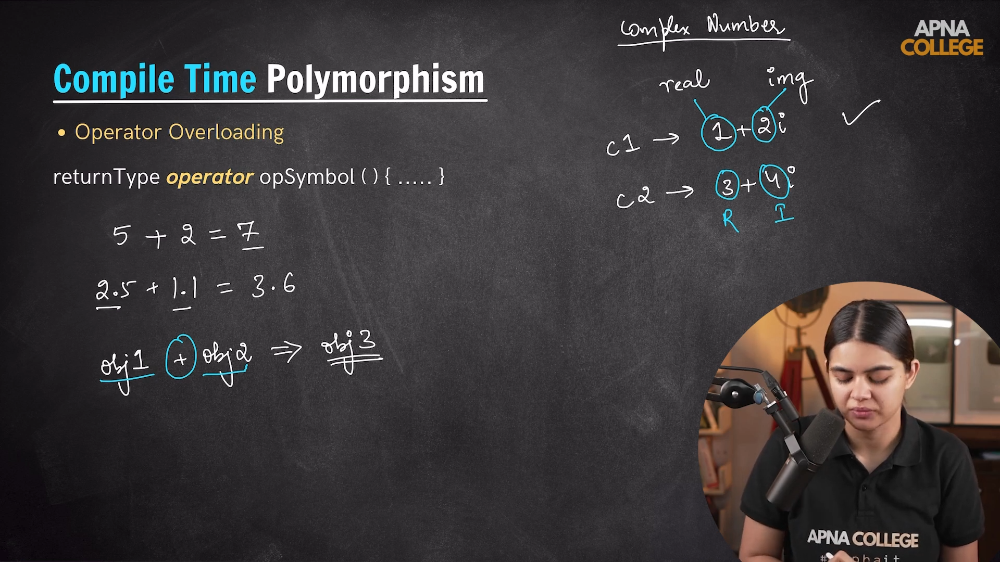

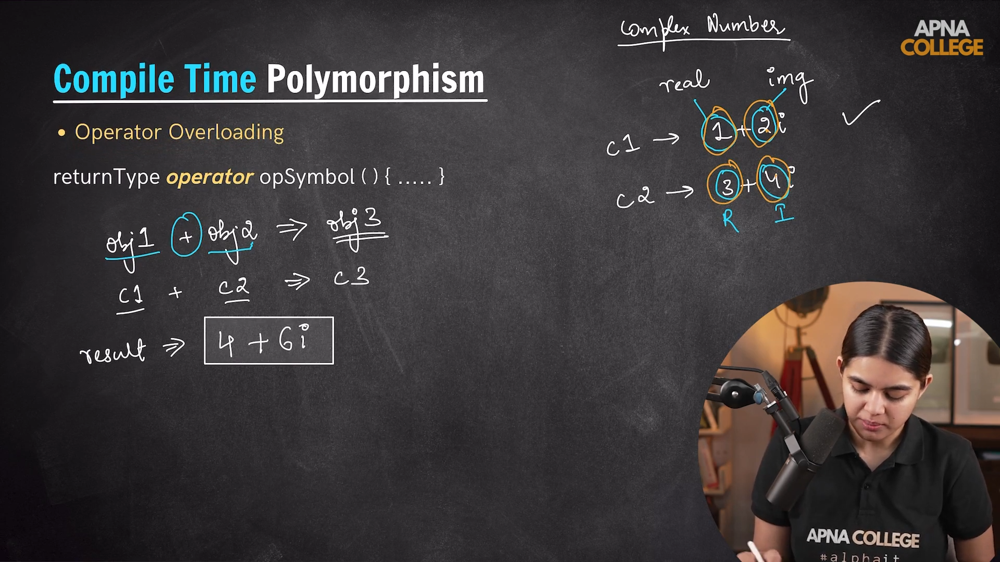

----

## Run Time Polymorphism

- We have two different type of Run time Polymorphism. They are as follow:-
    1. Function Overriding
    2. Virtual Function

### Function Overriding

- Inside function overriding if we have a child class and a parent class having a fucntion with the same name and the object is being created with the child class then child class function will override the parent class function and child class function will be used.

- Here the decision of which function will be runned is decisided at the run-time during copilation it has no idea of which function will run.

- Differences between the function Overloading and function overriding:-
    1. Function overloading comes under Compile time polymorphism
    whereas function overriding comes under Run time polymorphism

    2. Inside function overloading two functions with same name but different parameter type and count are there within the same class..
    whereas the function overrriding the inherit property is shown i.e, the same function name with different implementation are inside different classes one inside the parent class and other inside the child class.

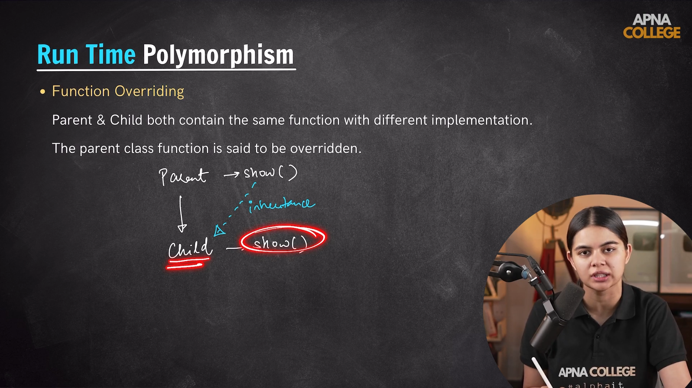
----

### Virtual Functions

- Virtual function are defined with the virtual keyword.

- They are just similar to the normal function overriden functions.

- Here what we have special is if a function in the base class(parent class) has a virtual function then it must be redefined inside our child class which is not so in the normal function.

- And the virtual function is always defined in the parent (base) class with the virtual keyword. Whereas the child class has redifnation of the virtual function without the virtual keyword just as normal function definition.

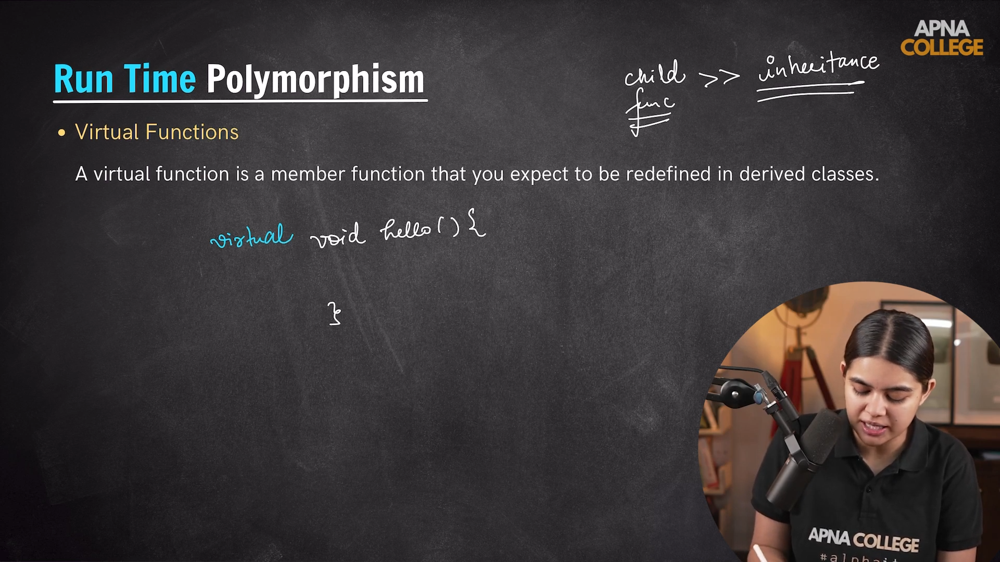

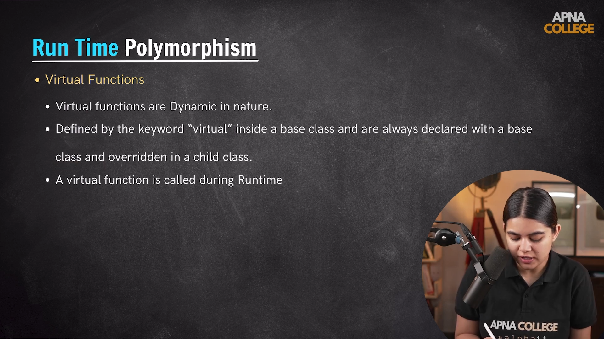

---
  
---

# 4.) Abstraction

- Abstraction is the concept which talks about hiding the unnecessary details and showing the important details.

- In a way by implementing the 'Access Specifier' we were alreading having the abstraction where we were hidding and protecting the data with private and protected keyword whereas with the public keyword making it available.

- `Difference between the Encapsulation and Abstraction:-`
    1. Inside Encapsulation we talk about the concept where we try to bind the data and its member functions and propertied into one thing which is Class and too talk about the concept of data hiding.
    Whereas in Abstraction we specifically talk about the concept of data hiding off some unnecessary details which is not useful to user and showing only those part of information which is relevant to our user.

- One of the way of implementing Abstraction is through the access specifier whereas the other method of implementing the concept of abstraction is through Abstract Classes and Pure Virtual Function

- The work of Abstract Class is only to provide a blueprint for our child class which tells us how our child class will look like and what all functions and properties it will have Basic Function of Abstract class is to make its properties be inherit in the child class it itself never creates or have any objects.

- Abstract class must have atleast one virtual function in it.

- Now Pure Virtual Functions are those which doesn't have any proper defination of what functionality they have to do they are actually meant for doing an incomplete information is there.

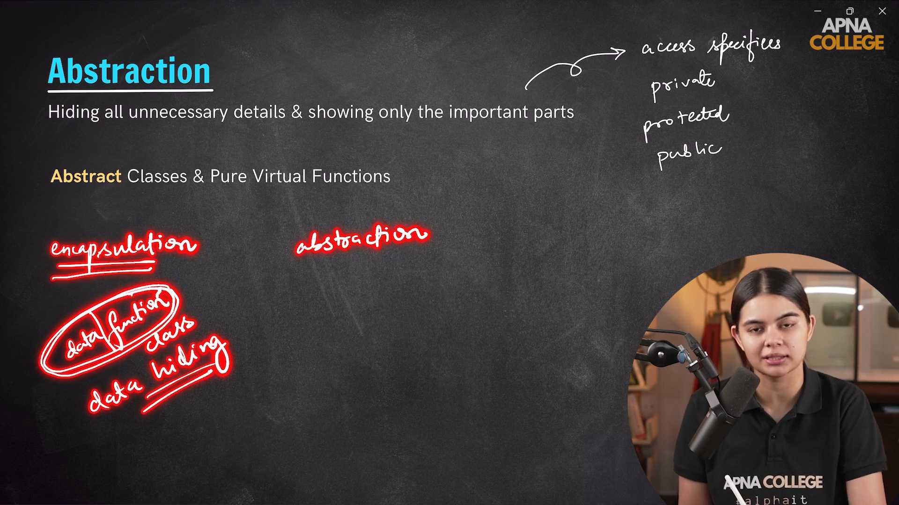

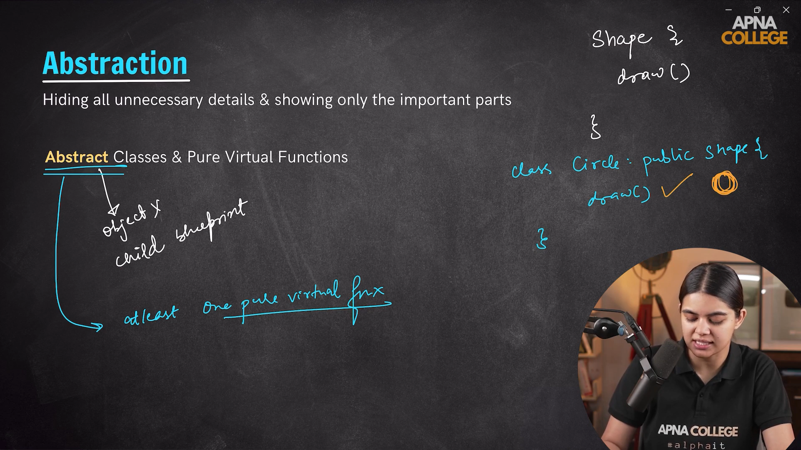

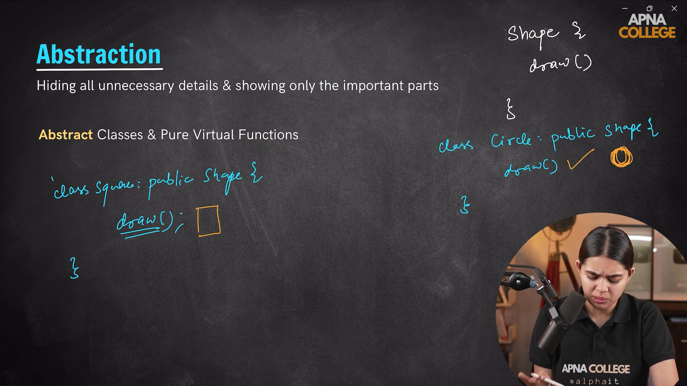

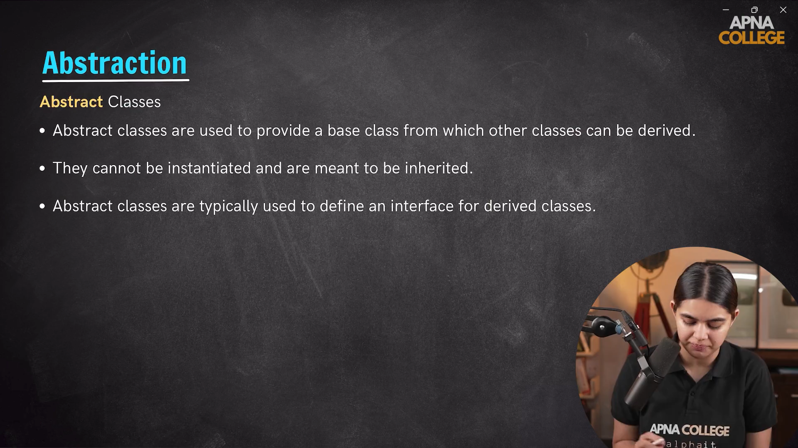

---

## Knowing About the Pure Virtual Function a little bit more

- A Pure Virtual Function has no Logic or defination defined for it and they are declared with a value Zero.

        Syntax -
            virtual void fun() = 0;

- The keyword Virtual made it a Virtual function and assigning a value Zero to it made it a Pure Virtual Function.

- A Pure Virtual Function When gets inherited and redefined it then gets a proper logic defination there.

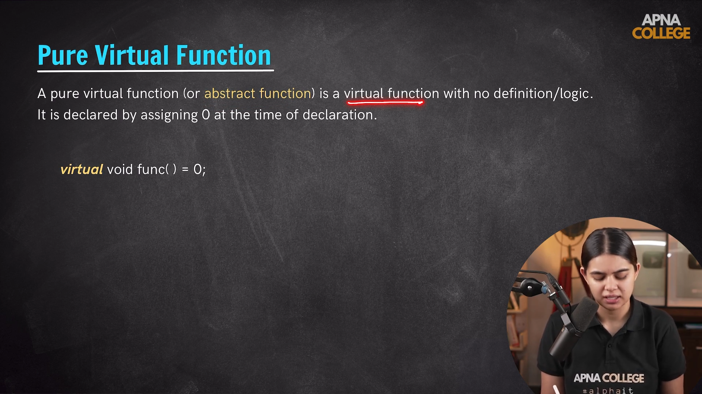

---
  
---

## Static Keyword

- A Static Keyword is similar to Global Keyword. The Only differance is Global Keyword is used for making the variables global by defining them outside the function or any block scope whereas Static helps us to make the variable Global just by using the Static keyword.

- A static keywords variables life is till the program ends.

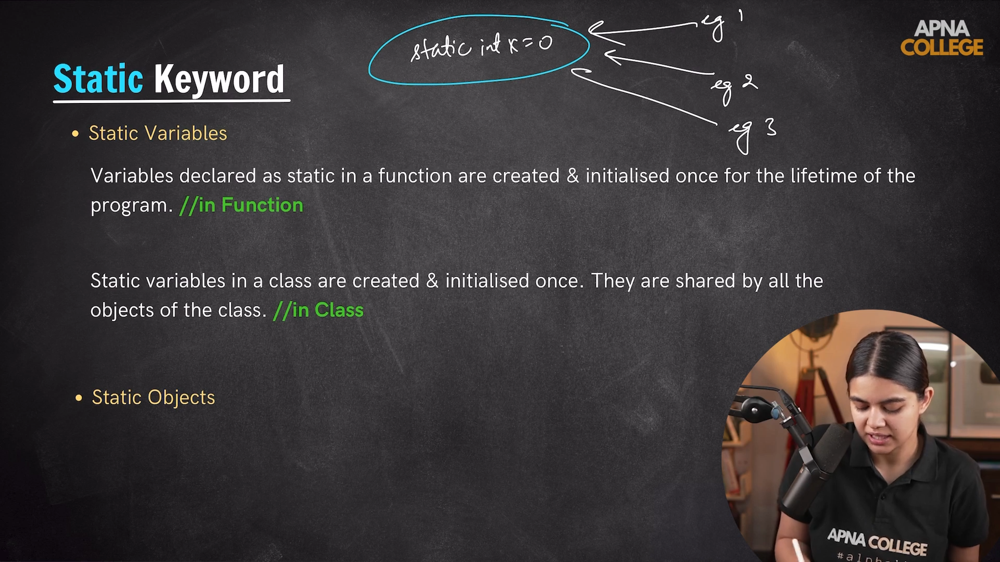

---
  
---

## Friend Function/Class

- A friend Function or a Friend Class is a function/class which can access the private and protected members of a class without inheriting them and its vice-versa is not true.

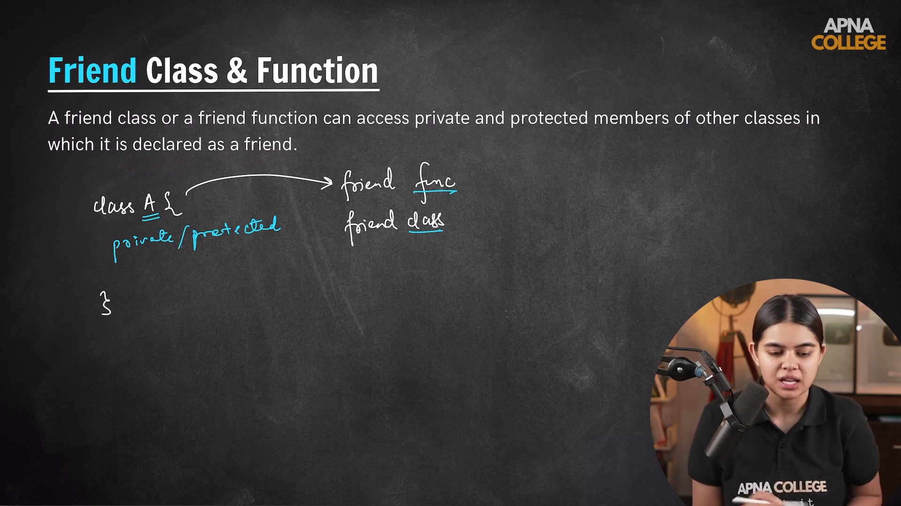
