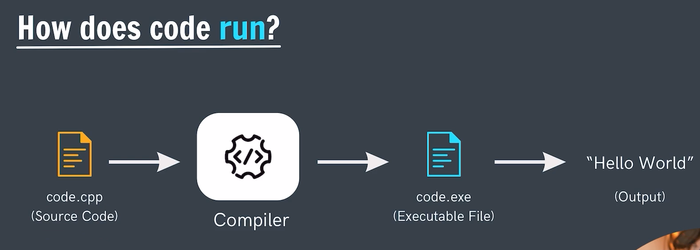

# How Does the Code Runs?
In cpp the code execution is done in several stages :-

## Points Program/Code Execution:-

**Point-1 :** *The main program file which we create with the .cpp extension is known as the `Source Code` file.*

**Point-2 :** *The `Compiler` know converts the souce code into .exe file i.e into a executable file format. Its the work of Compiler only to check the Syntax and Sematical Erros in our code.*

- `Compiler` is just a software unlike the other computer softwares and its work is to convert the source code file into a executable file moreover in simple words it converts the High level language code written by human which are human understandle code into machine understandable code i.e High level is converted into Low level. In the form of 0 & 1 as computers understand only binary format.

**Point-3 :** *Once the Source code is converted into `executable file(i.e .exe file)` on mac this execuatble file has extension as .out .*
- `.exe file`is machine code which could be understood by machines. As the codes which we write are high level code which are humans understandable which have english words but this is not understood by machines. As machine understand only low level language which is machine language (i.e binary format). They understand only 0 and 1's. 0 and 1 are the electrical signals for the computer where 0 indicates no current and 1 indicates current flow. These 0 and 1 are know as bits and whole of the code is converted into bits.

**Point-4 :** *From this executable file itself we recieve our `Output`. This output can be recieved either on the terminal or the output window.*

----

The Program Execxution is a Two-step process.
1. Compilation (Coverting of Source code -> to executabel file while checking the errors in it.)
2. Running the .exe/.out file to get the output on the output windows. 