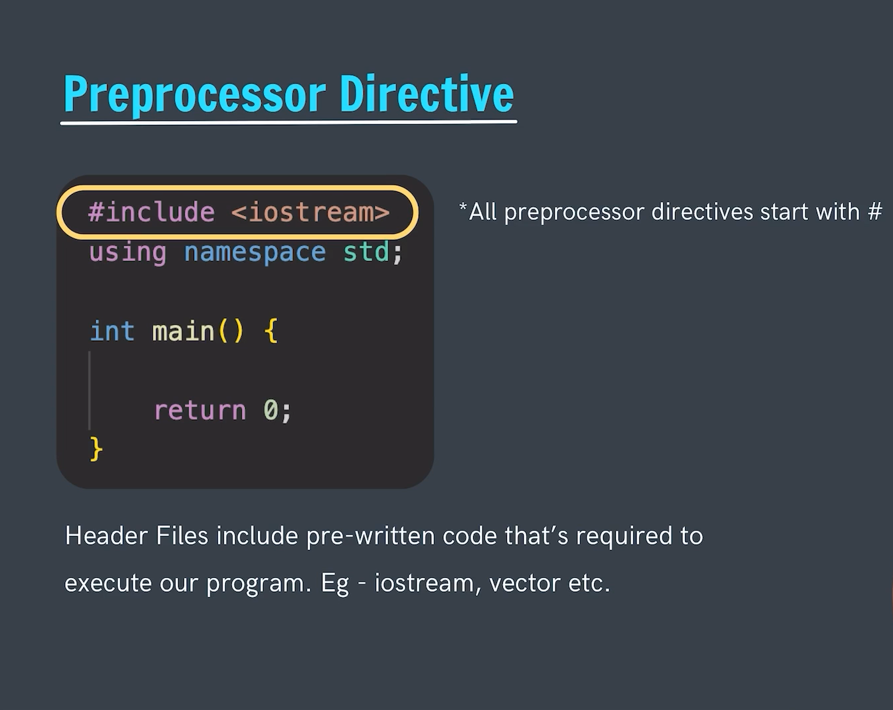
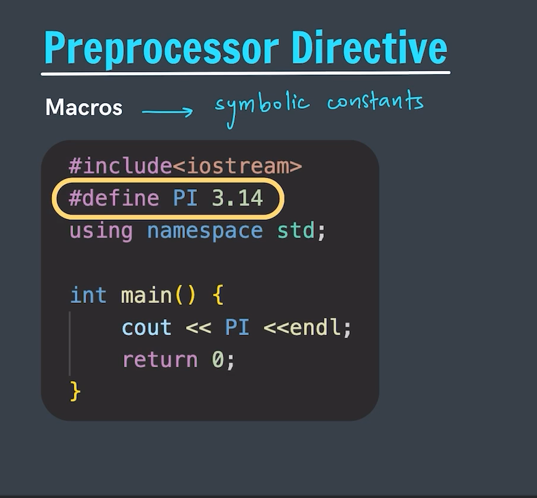

# Preprocessor Directive
From the word `Directive` it means a set of statements which needs to be execxuted it gives some instruction to the compiler.

Directive can tell the compiler to add(include) some file in our program it can too tell to change meaning of some symbol in your program.

Now onto `Preprocessor` we can understand it like a special type of directive whose work is to give the instruction to the compiler which work compiler has to do before the compilation of the program.

 

A *Preprocessor* always starts with with `#`.

And in this above the statement `#include <iostram> -` means the compiler need to include the iostream header file before the comiplation of the program.

**Header File ->** *These are like the library where few of the functions are already defined for us we just need to use it.*

----

## Macros in Preprocessor Directive
Macros are knows as Symbolic constants in Cpp. And Macros are too defined by the `#`.

Here where so ever we will use the term PI will get replaced by the constant value 3.14.