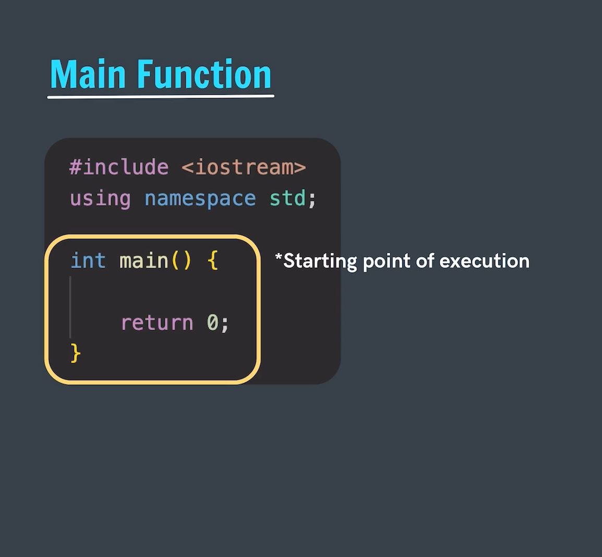

# Main function
- In every program the main function is written only once.
- Main function is starting point of program execution.
- During the program compilation the first function which compiler searches for is the main function.
- We can create the main funtion with the int or void return type and based on this only we provide our return statement too.
- While solving the DSA problem we generally don't pass any arguments in the main function but it is possible to pass the arguments if we are creating few Command line or gaming programs.
- Every function is given with a parentheses symbol and the braces indicates the starting and ending of the funcction i.e the block of the function.
- Main is `not a keyword` it is a pre-defined identifier.

