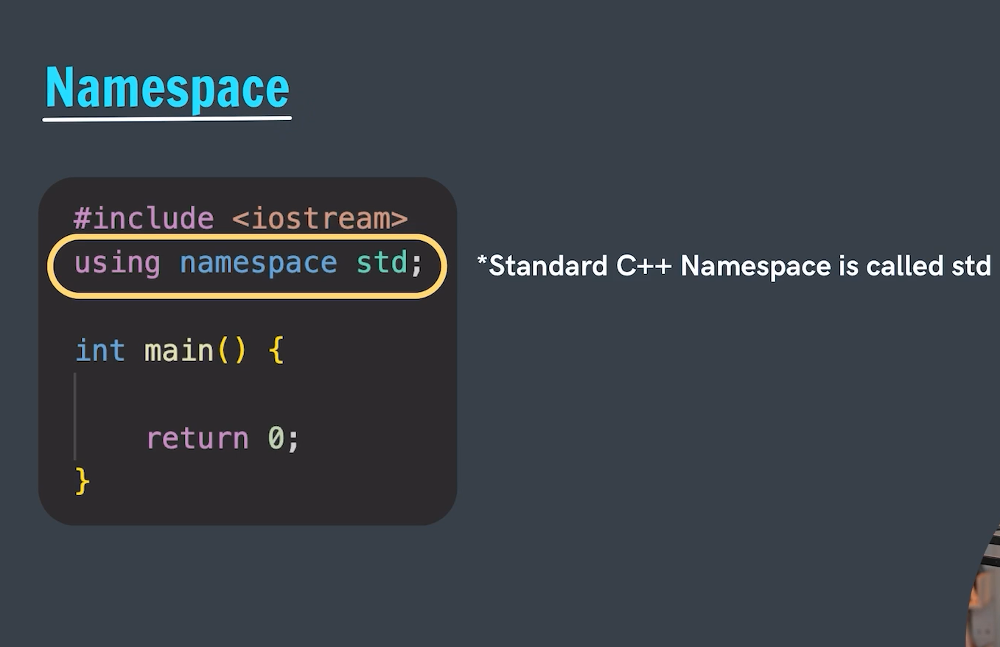

# What is Namespace?
Namespace in cpp is used for avoiding the naming conflicts in the cpp program. Let's say we have created a program where we are using three libraries say

A B and C

Where A and B both have a similar type of function defined as draw.

Say Draw of A -> Draw's a circle and
Say Draw of B -> Draw's a Rectangle

Then during the program execution if we have called draw function then there is chances of conflicts that which draw to be called.

Therefore to avoid such coflict we have namespace.

----

**Example ->** Lets try to understand this with the help of an example let's say there is a Piece of land.

Now a Piece of land is a physical entity that really exists but government doesn't know which flat belong to whom so they maintain a registry for registering that which plot or farm belongs to whom.

Like somewhat same scenario we have cout which is defined inside the iostream header file but its name is declared inside the std namespace.

    Usually we need to write cout as:
    std :: cout<<"Aman" 
    To tell to which namespace it belong or to which namespace it has been registred to.

The statement `using namespace std` indicates that in this program we are going to use the namespace as std.

- **Define->** Detail description of how the things actually works like cout is defined inside the iostream header file whereas,
- **Declare->** Where we just initialize it, like the cout is registred or initialized inside the namespace std.