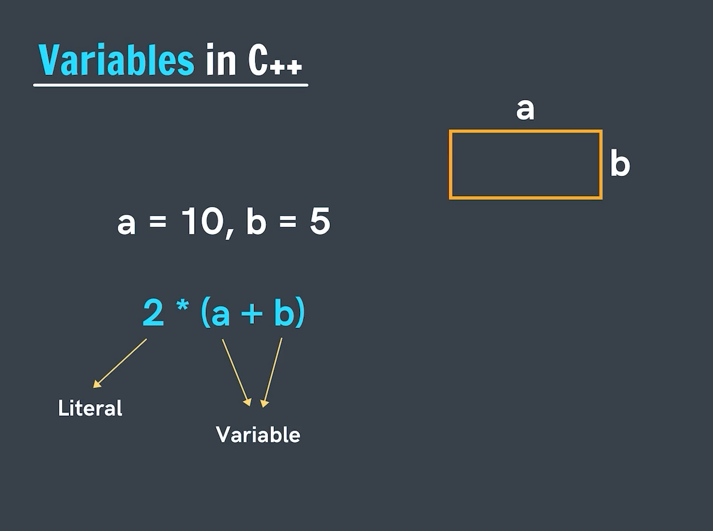
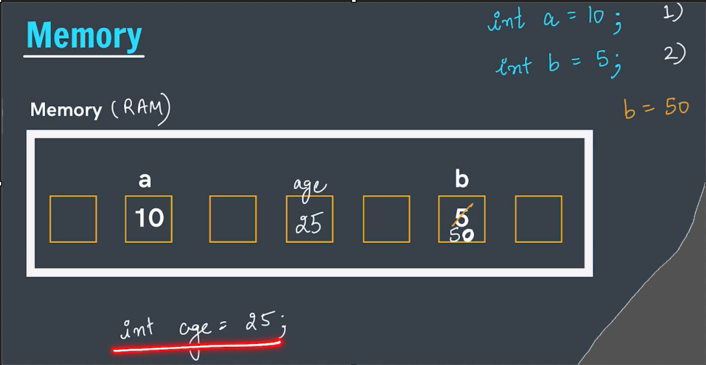
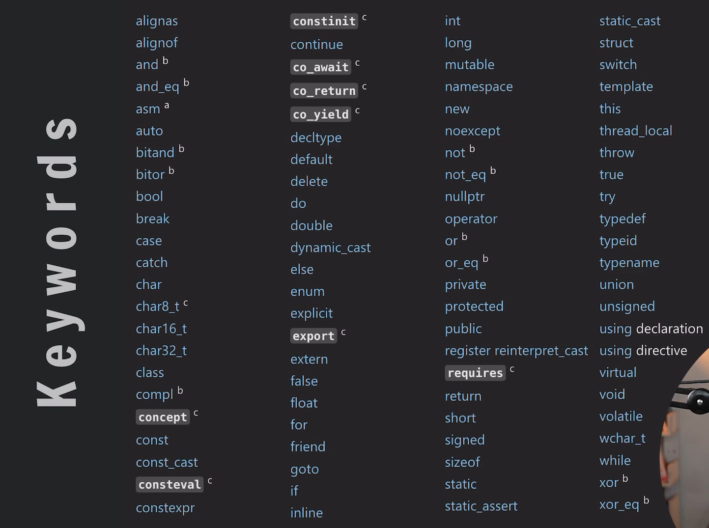

# Variables
- Variables are used for storing the values.
- They can be imaged as the box or the container.
- They are actually the named labels for the value.
- From the name variable only it is understood that, variables are those which can vary there value throughout the program execution.
- The difference between the variable and literals is that Literals have a fixed value associated to them but this is not so in the case of the variables.
- Variables too can be known as identifiers.
- Variables named are said to have a meaningful names.

 

## Variables being stored in the Memory:-
- Variables in the memory are stored in the RAM inside the CPU.

- These memory block are given the name like age,a,name - these are only varibales.

- `Assignment operator (=)` -> is used for assigning the values.
    If we do something like a=b then in mathematics this means a is equal to but in the programming it means b's value is being assigned to a.
- We can too declare some values as **int a;** this is too a valid way but in this case till the time any value is passed to it till that time it will be assigned or initialized with a garbage value in it.
    

----

# Naming Conventions of Variables:
1. The name should start with an underscore(_) or letter.
2. The name can only contain uppercase and loweercase letter, digits from 0 to 9 and underscore.
3. The name cannot start with numbers although they can have numbers.
4. The name cannot be a keyword words. Because keywords have special meaning to the compiler.
5. The name cannot have special characters like @!#...etc Except the underscore(_).

## Keywords list:-

 

### Valid Varibales:
name, _age, Abd123, gh_12abc 

These all are valid variable names.

### Invalid varibales:
1name, @ge, name@, Avg Score, full&namex

All of these are some invalid format of writing the variables.

----

