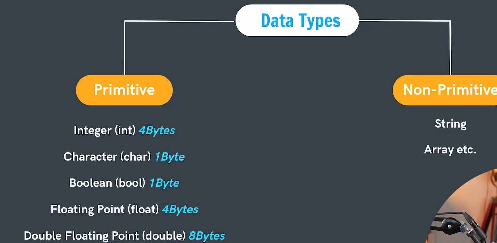
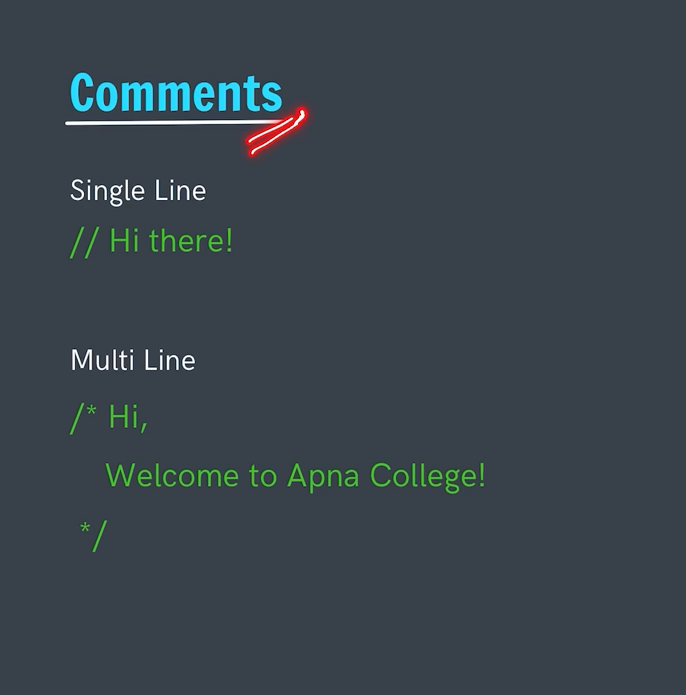

# Data Types
Data Types are very important part of the programming as they tell us what type of data actually we will be going to store in that variable

---

   

# Comments
- Additional line used for explaining the program intend. 
- They are not executed and ignored by the compiler.

