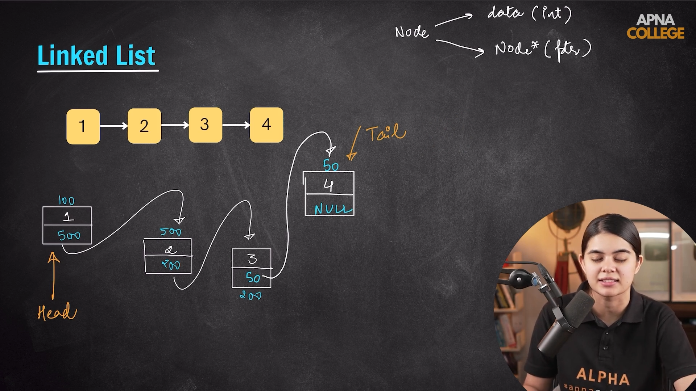
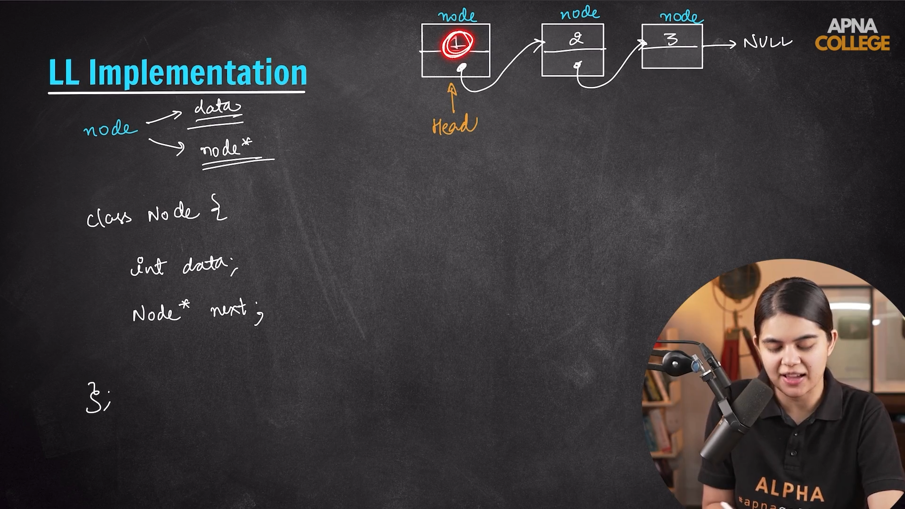
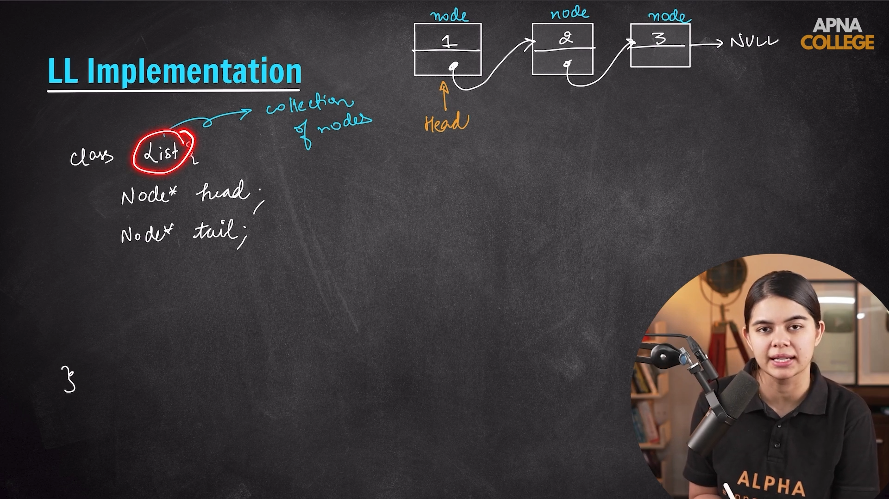

# Linked List

## Introduction

## Implementation

## Few of the internal function 

### Push_front or Insert at head.

### Push_back or Insert at tail.

### Print the linked list.

### Insertion at kth position in linked list.

### Pop_front or Remove from head.

### Pop_back or Remove from tail.

### Search the key by Iterative approach.

### Search the key by Recursive approach.

### Reverse the linked list without any extra space.

### Delete the nth node from End of the list.