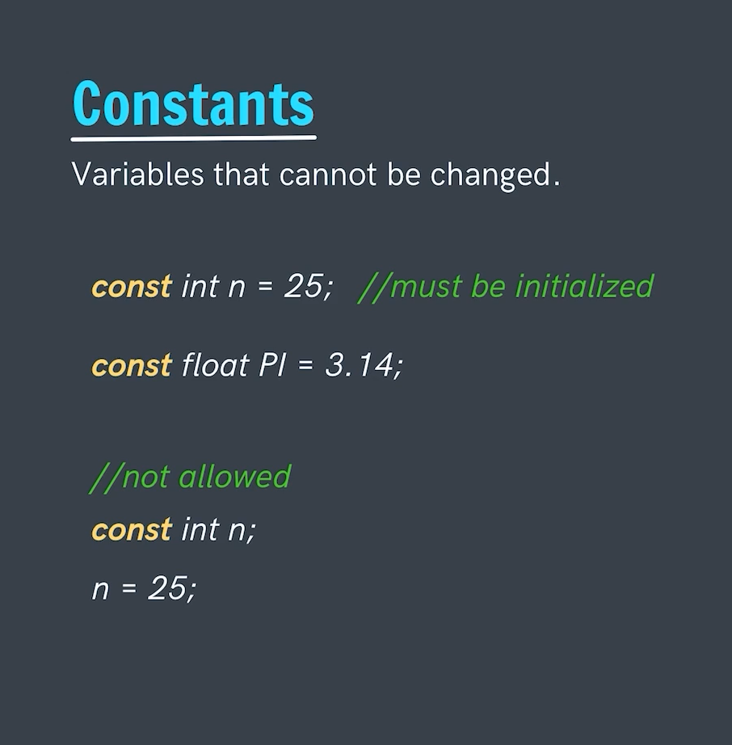
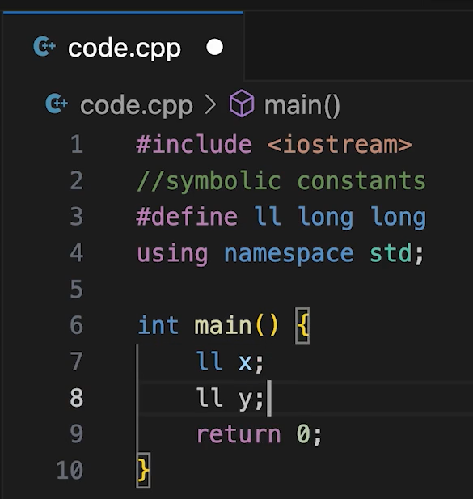

# Constants
Constnats are the special type of variables whose value remains fix throughout the program execution and doesn't changes.

Usually variables vary their value in program execution but this is not so in the case of constants.

Constants are fixed.

- Constant is declared with the `const` keyword.
- Re-initalization of constant is not possible.
- We need to initialize the value of the constant at the time of declaration itself.

---

# Difference between the Constant and Macros:
1. When we define a constant then unlike any other variable it will too occpuy some space in the memory.
2. But in Macro it is a symbolic constant. They aren't given as such space in memory infact they are replaced with the variable at the run-time itself.
3. Whereas the constant during the execution there value is being fetched from the memory space.

