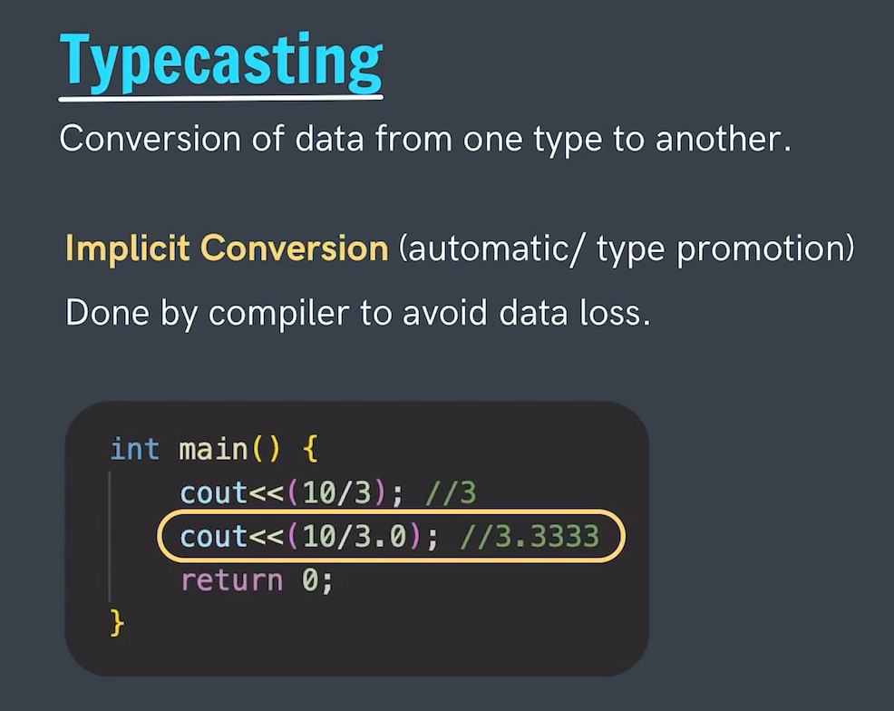
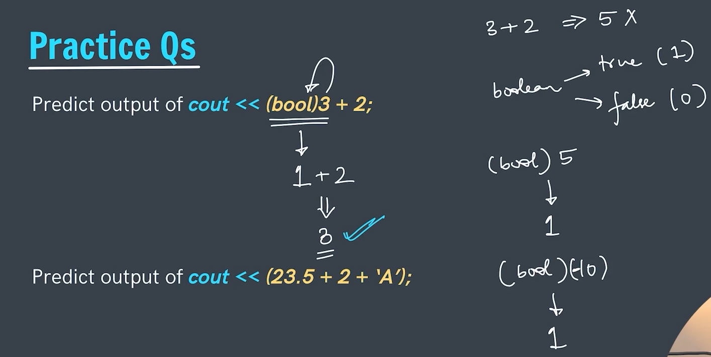

# Typecasting
Typecasting is defined as the conversion of data from one type to other like from int to float.

They are broadly classified into two type as:-
1. Implicit Type Conversion
2. Explicit Type Conversion

---

## Implicit Type Conversion
- The typecasting which is done by the compiler itself and there is no intervision of User or we can say there is no interuption of User is such type of typecasting.
- Implicity type conversion is too sometime known as Automatic/Type promoted conversion.
- These type of type conversion is done (by compiler) to ensure that there isn't any data loss.
- Usually the Type conversion from the Lower data type to Larger data type is seen here
    Like we try to move from the Smaller size data type to Larger size data type. 
    E.g -> Int (4 Bytes) -> Float (4 Bytes) 
    Char(1 Bytes) -> Int (4 Bytes) 
    Int (4 Bytes) -> Double (8 Bytes) 
    Here we are moving from Smaller to Bigger.

---

## Explicit Type Conversion
- The type conversion which needs the Users intervision or interruption for Typecasting.
- These Type of Type conversion are frocefull Type conversion done by the User.
- And have data loss will typecasting.
- In this type of type casting we usually try to typecaste the value from Larger data type towards the smaller data type.
    This itself shows that if we will move from larger side which has capability of storing some smaller side which has less storage spce then there would be some loss of the data.
     In this coversion we explicitly mention to which data type we need to move.

        E.g ->
        float Pi = 3.14
        cout<<(int)(Pi)<<endl;
        cout<<(char)('A' + 1)<<endl;

        Output:-
        3 
        B
        As we have explicitly mentioned to have a floating value to the int.
        ('A' + 1) gives us an interger value (65 + 1) = 66. And then we have exxplicitly converted into char so 66 will be converted to charcter which is B.

---

## Practice Question

