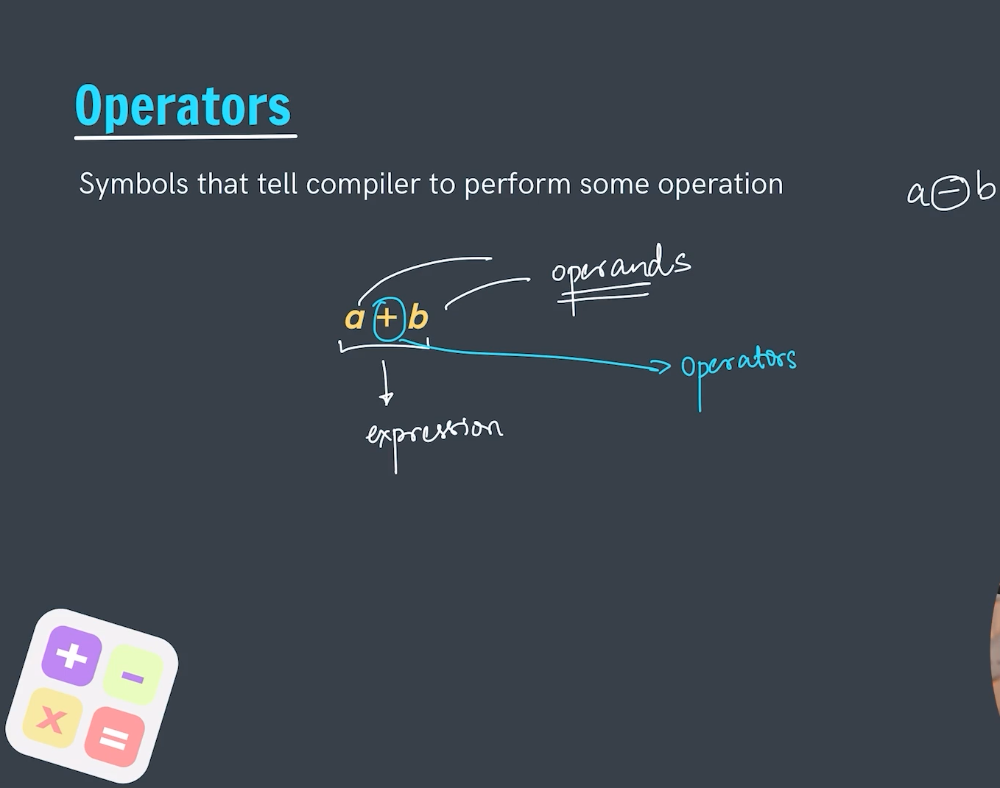
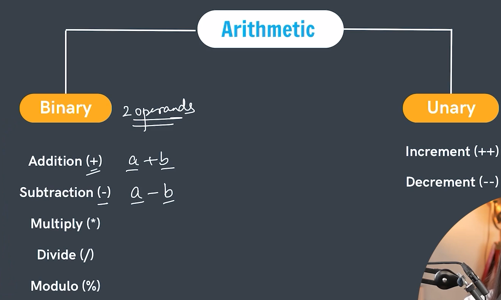
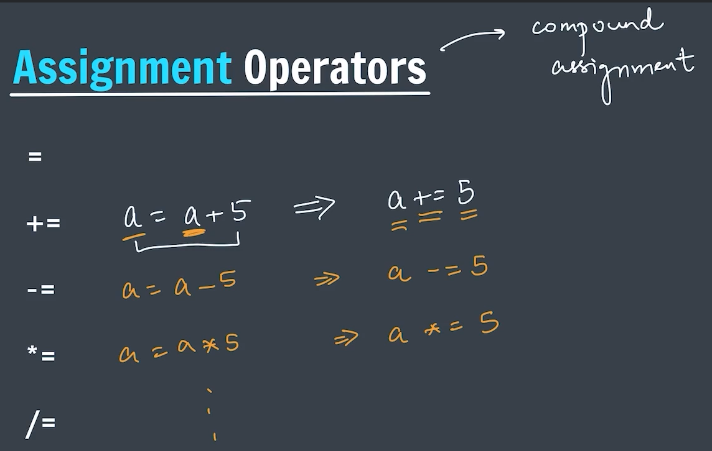
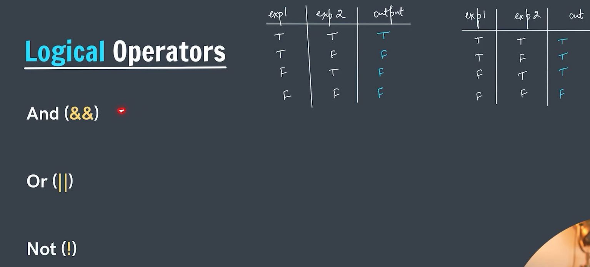
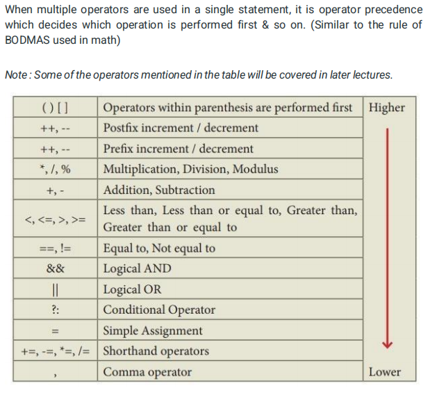

# Operators
Operators are token that triggers some computation and calculation between the two operands or variables. 
Operators are symbol that tells complier to perform some operation.

---

## Types of Operators
1. Arithmetic Operators
2. Assignment Operators
3. Relational Operators
4. Logical Operators
5. Bitwise Operators

---

## 1.) Arithmetic Operators:
- They are used for Performing the mathematical Operations like Addition(+), Subtraction(-),
    multiplication(*) etc...
- Arithmetic Operators are classified into two categories as:-
1. Binary Operator
2. Unary Operator

**Binary Operator ->** *Binary Operator are those which uses two operands to perform the operation.* 
Further Operator classification:
- Addition (+)
- Subtraction (-)
- Multiplication (*)
- Division (/)
- Modulo (%)

**Unary Operator ->** *Unary Operator are those which uses one operand to perform the operation.* 
Further Operator classification:
- Increment
- Decrement

1. `Increment ->` They are used for increasing the value of the operand by 1. And more important they use a single operand.

        E.g - If we do something like
        a = a + 1 (Then it means increasing the value of a by 1)
        The same thing we can too write as
        a++ -> This too means increasing the value by 1. And is Equivalent of writing like a = a + 1. 
    They are too divided into two following sub-categories.
    - **Post Increment ->** Inside the Post increment we use the value first and then increment. 

            E.g :- 
            a = 5
            b = a++

            Output:-
            a = 6
            b = 5 (Here use the value first and then increment it.)

    - **Pre Increment ->** Inside the Pre increment we increment the value first and then use the value. 

            E.g :- 
            a = 5
            b = ++a

            Output:-
            a = 6
            b = 6 (Here increment the value first and then use it)

2. `Decrement ->` They are used for decreasing the value of the operand by 1. And more important they use a single operand.

        E.g - If we do something like
        a = a - 1 (Then it means decreasing the value of a by 1)
        The same thing we can too write as
        a-- -> This too means decreasing the value by 1. And is Equivalent of writing like a = a - 1. 
    They are too divided into two following sub-categories.
    - **Post Decrement ->** Inside the Post decrement we use the value first and then decrease it. 

            E.g :- 
            a = 5
            b = a--

            Output:-
            a = 4
            b = 5 (Here use the value first and then increment it.)

    - **Pre Increment ->** Inside the Pre decrement we decrease the value first and then use it. 

            E.g :- 
            a = 5
            b = --a

            Output:-
            a = 4
            b = 4 (Here increment the value first and then use it)

---

## 2.) Assignment Operators:
In the assignment Operator the value is assigned to the variable. 
Values from the right operand goes to the left operand. 
Like if we do something a = b 
Here this means that the value of b (which is in the right value) will be assigned in the a (which is in the left side).

---

## 3.) Relational Operators:
Relational Operators in cpp are used for defining the relationship between the two operands in the Expression or operation. 
We have different type of Relational Operators as:
- '>'
- '<'
- '>='
- '<='
- '==' (For checking the equal to -> Equality operand)
- '!=' (For checking not equal to)

---

## 4.) Logical Operators: 

---

## Operator Precedence
