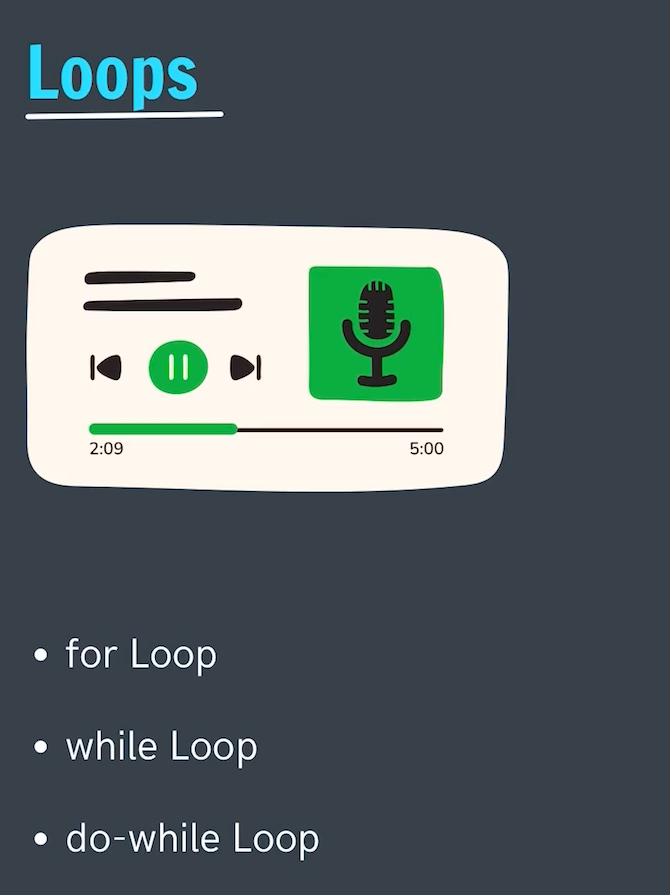
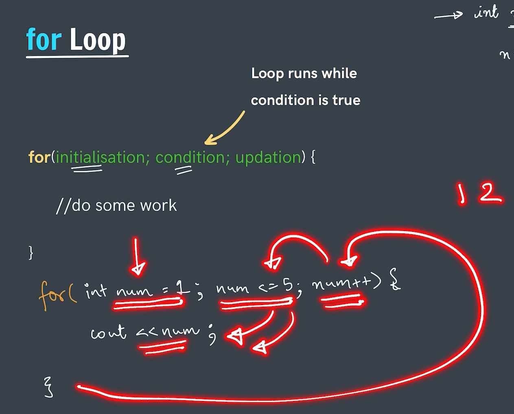
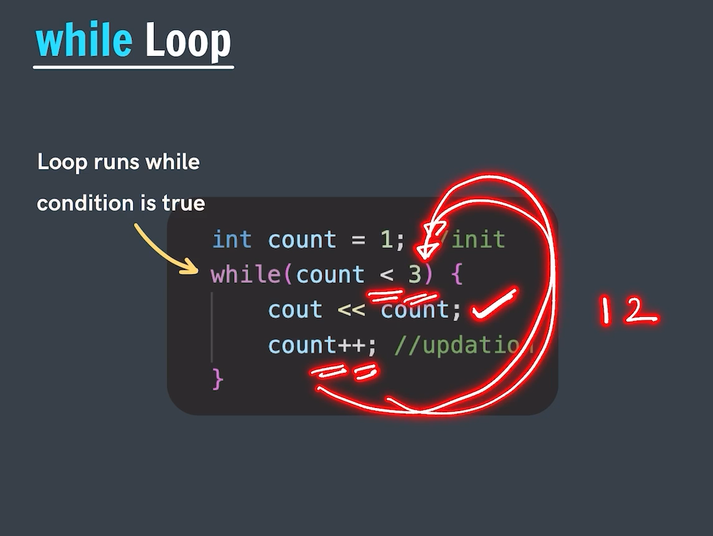
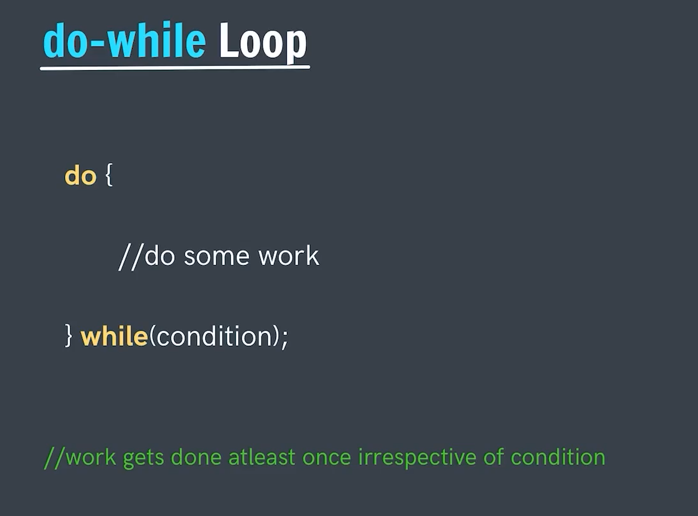
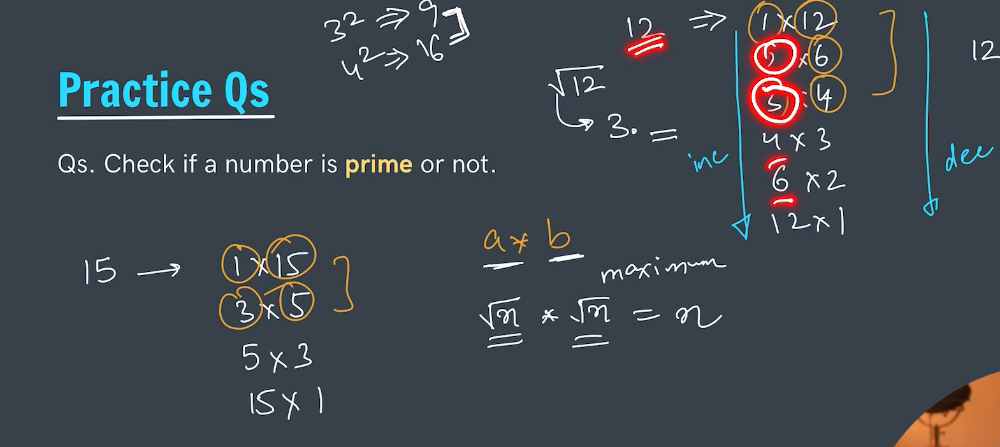
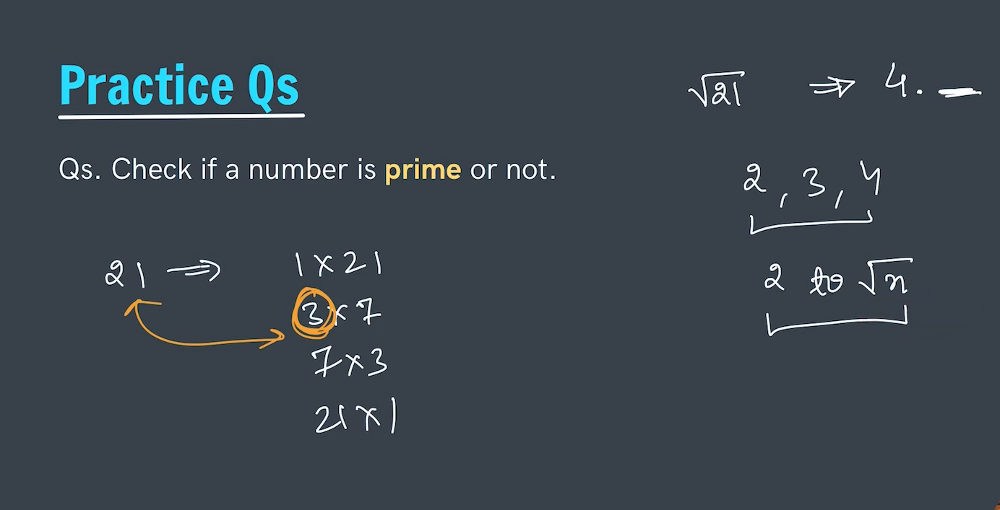

# Looping Statement
Loops are used for repeating the set of statements or a task n times in the code or program
### Terminologies in loop
- `Infinite Loop ->`Inside loops we have something like infinite loop when the loops run infinitely without terminating;. Infinite loop can be made by never ending conditions.

- `Iterate ->` Run
- `Iteration ->` Single Run
- `Iterator ->` Loop variable(or counter variable)

### We have basically there differnt types of loops in c++.
1. For loop
2. While loop
3. Do-while loop

---
 

## 1.) For Loops (also known as numbering loop)
- for loop are used for repeating the statements n number of times.
- When we have to repeat a loop for say a number of times. Say it be 10 times or 15 times where we have the idea that how many times a loop will run in that case we use the for loop statement.

---
 

## 2.) While Loops (also known as conditional loops)
- while loop are used for repeating the statements n number of times.
- when we don't have any idea that how many times a loop will run but have an idea at what scenario (condition) our loop will end in that case we use the while loop.

---
 

## 3.) Do-while loop

---
 

## Break Statement
- Used for coming out of the loop or simple to break the loop.

## Continue Statement
- Used for skiping the particular iteration and starting the next iteration.

---

## Prime number Optimization

