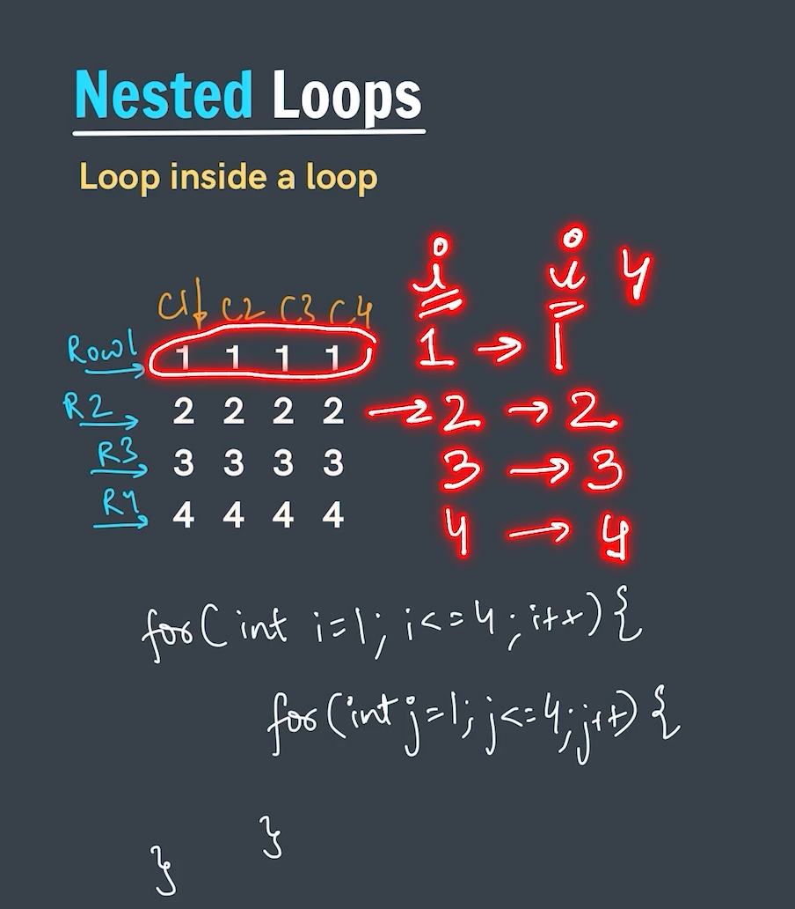
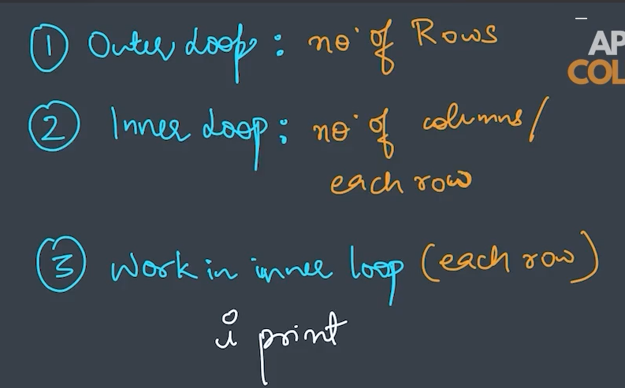
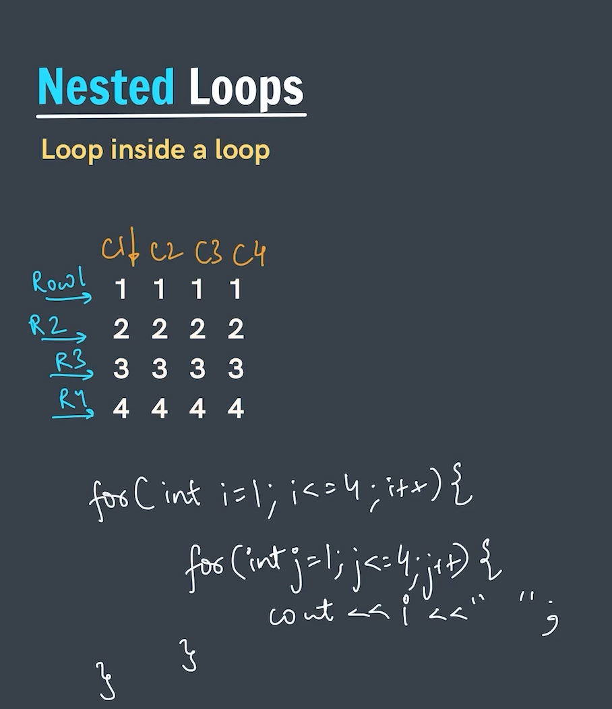
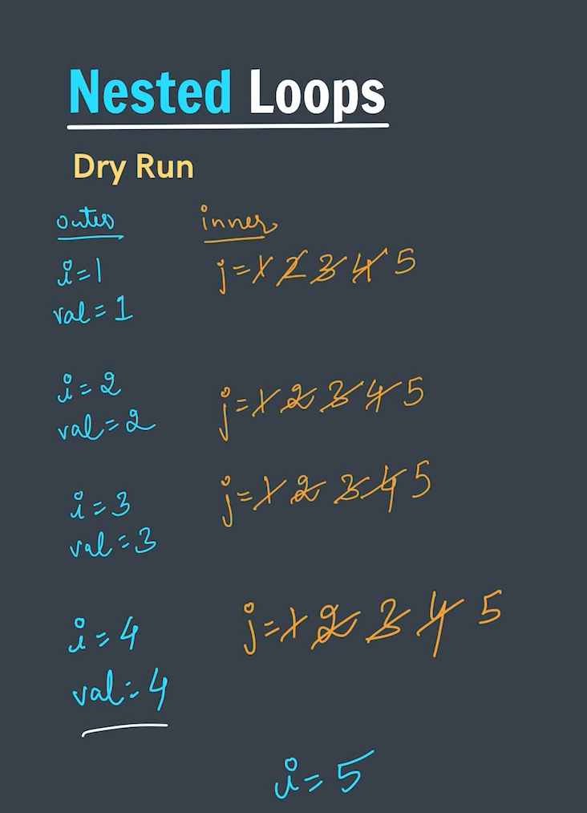
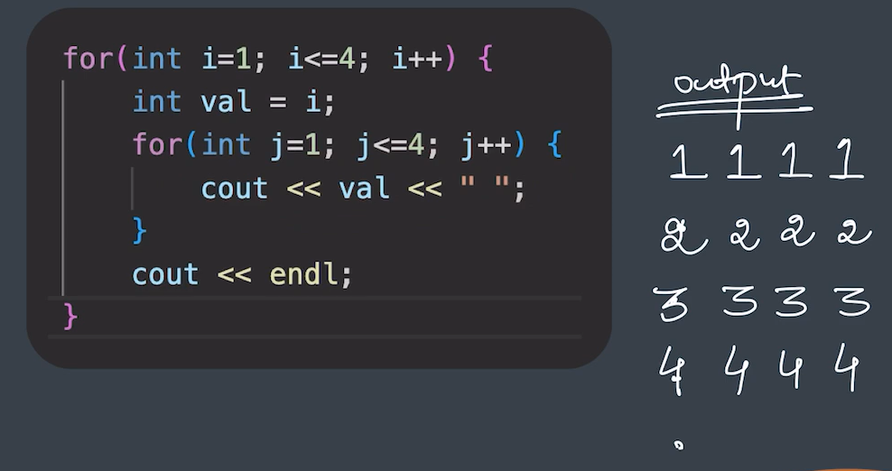
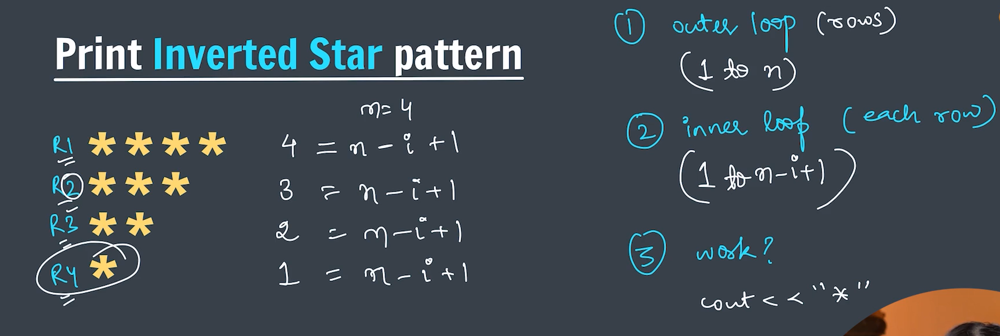
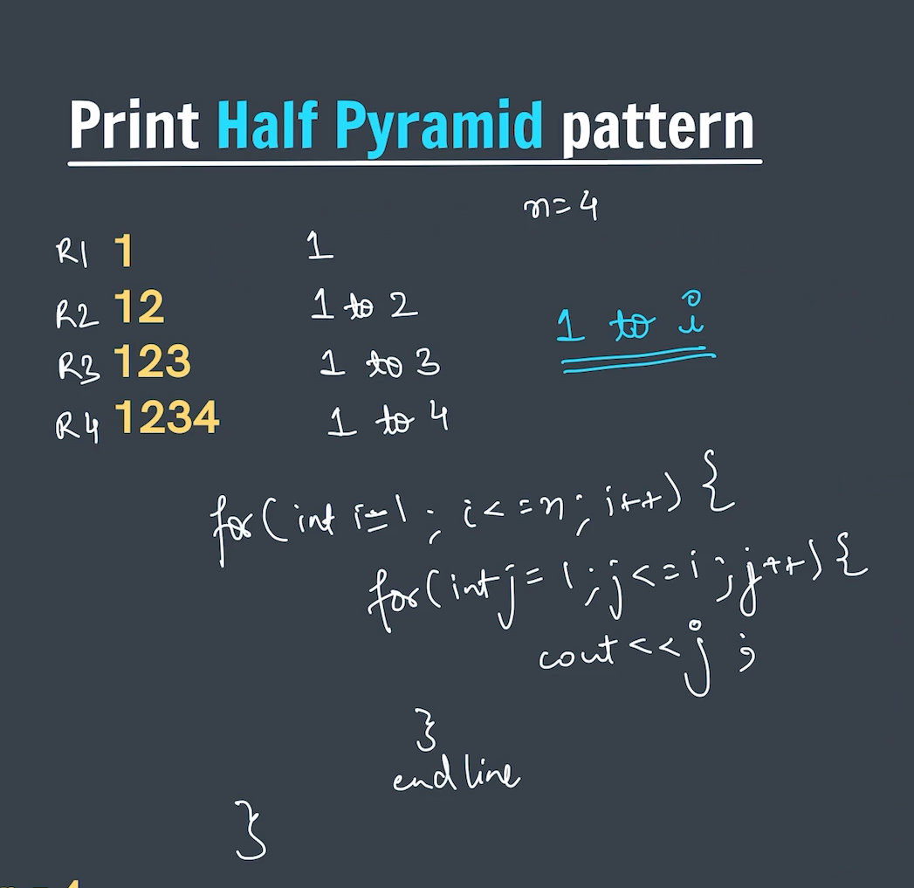
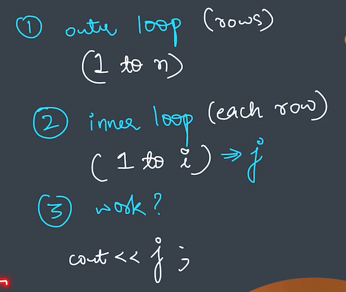

# Nested Loops
Inside the nested loop there are few points which we need to understand as:-
1. The number of rows we have in the pattern.
2. The number of columns we have in the pattern.
3. What we actually need to print.

### Inverted Star Pattern.

### Half Pyramid Pattern.

