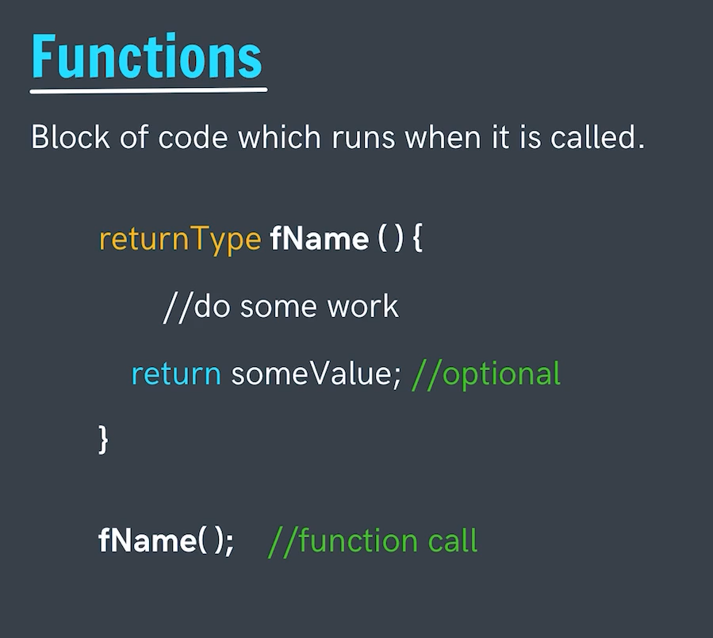
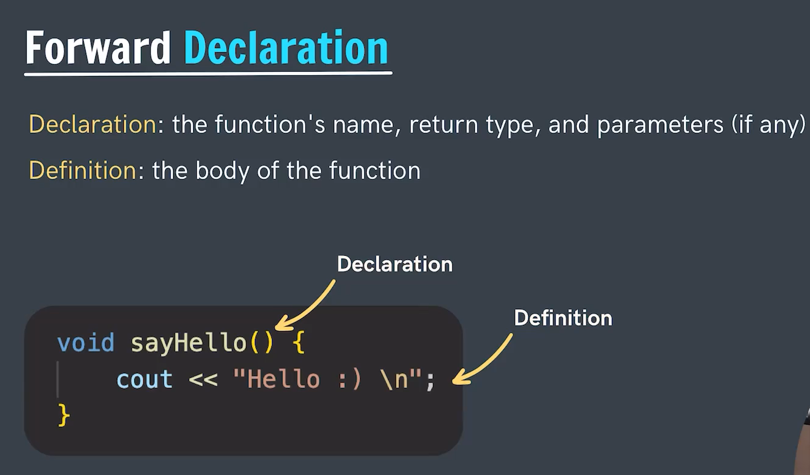
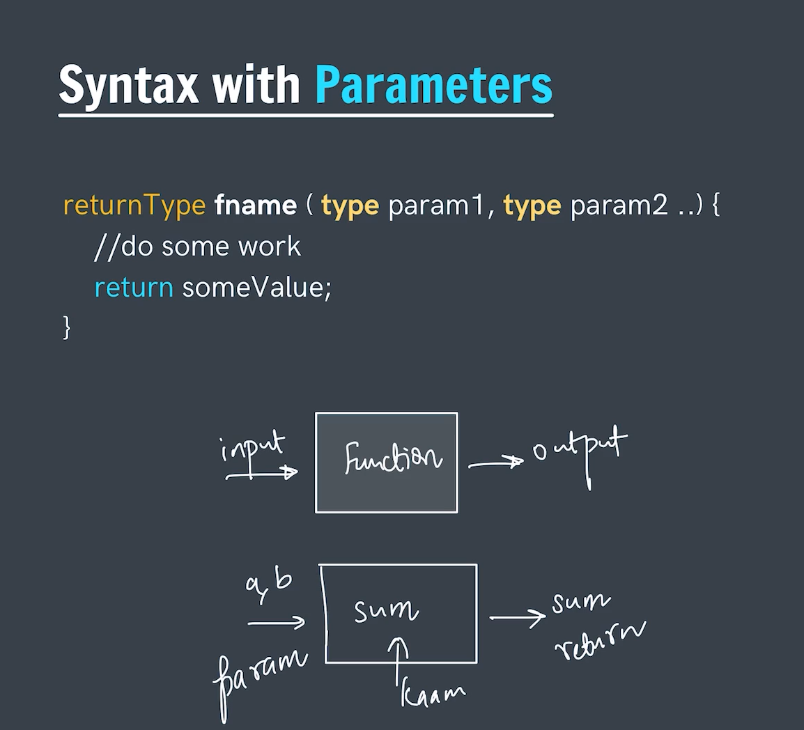

# *Functions*
- They are chunk or piece of code that is used for performing repetative task.
- Makes the code lighter as we don't have to repeat ourself again and again with same set of statement, can simple call the fuction and it will do the work.
- We can call a function n number of times in a program.
- A function can be called inside another function in simple words we can have the nexting of the functions.
- main function is the starting function for a program as the execution of the program starts from the main itself.

---
 

## *Forward Declaration*

    Syntax ->
        #include<iostream>
        using namespace std;

        void printHello(); //This is the declaration of the function

        int main(){
            printHello();
            return 0;
        }

        void printHello(){ //This is the definition of the function
            cout<<"Hello";
            return;
        }

    If we won't have given the function declaration before the function use then it would throw an error as compiler complies the code from the top to down therefore things coming down won't be known by complier. Hence need of a forward declaration is there.
---
 

## *Parameters in Functions*
- Parameters are the values passed inside the function that can be treated as the variables for the function.
- There might be some values needed by the program for execution then that values are passed with the help of parameters.
- Parameters are defined in a similar way as of the variable declaration.
- When we declare or define a function at that time we pass the parameters to the function.
- But at the calling time the passed variables or values are termed as the arguments.

- `Note->` Parameters are the values/variables that can hold any values in it. Whereas Arguments are the values/variables that holds the fixed value in it. 

### *Default Parameter* ->
- Default Parameter are those whose values are assigned by default if no value is passed to that parameter.
- (i.e), if a parameter is not passed with a value and has a default value then the defalut value will be used in that case.
- The default values are given from the right to left.
- Before assigning a defalut value to any parameter must check if it all the right side parameter must have a default value otherwise would thorw an error.

**Lets go through few of the examples:-**

    Example 1 ->
    #include<iostream>
    using namespace std;

    int sum(int a, int b){ //Normal function with two parameters passed
        return (a+b);
    }

    int main(){
        cout<<sum(2,4); //Calling of the function and two arguments passed.
        return 0;
    }

    OUTPUT:-
    6
---

    Example 2 ->
    #include<iostream>
    using namespace std;

    int sum(int a, int b=1){ //One default value passed
        return (a+b);
    }

    int main(){
        cout<<sum(2); //A single argument passed a will  be assigned 2 and since no argument for b it will have its default value as 1.
        return 0;
    }

    OUTPUT:-
    3
---

    Example 2 ->
    #include<iostream>
    using namespace std;

    int sum(int a=1, int b){ //One default value passed
        return (a+b);
    }

    int main(){
        cout<<sum(2); //A single argument passed a will  be assigned 2 and since no argument for b is present it will throw an error.
        return 0;
    }

    OUTPUT:-
    Error - To few arguments as won't get assigned aby value.
    That's why it is said to assign the default values from right to left.