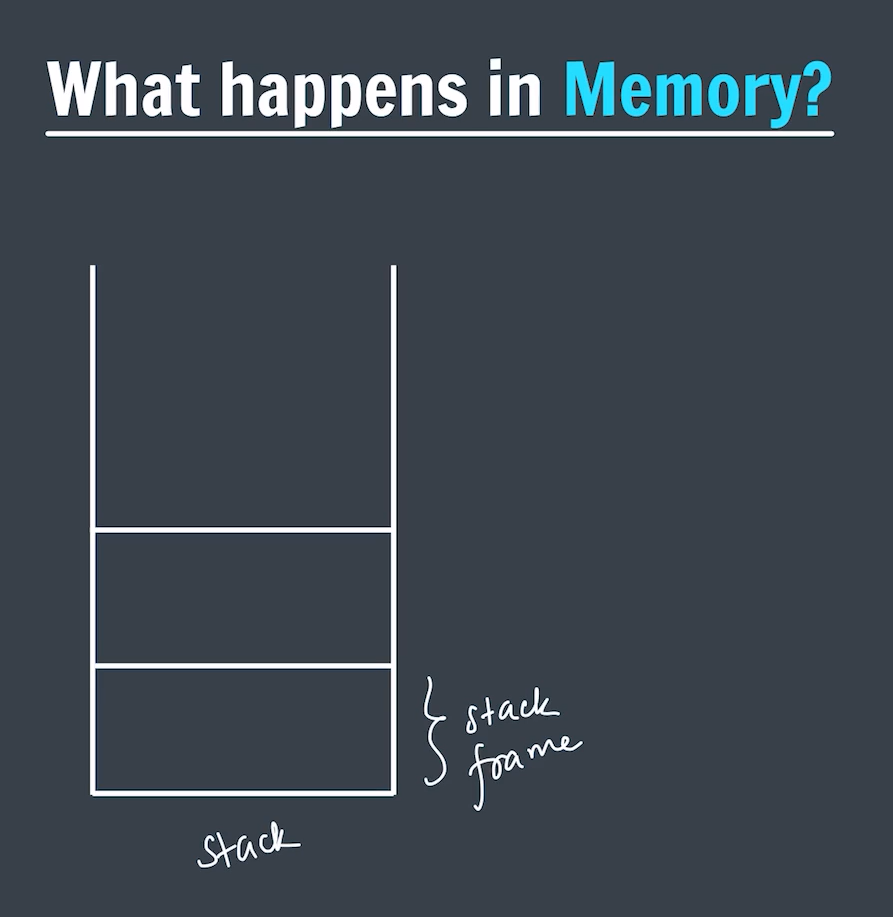
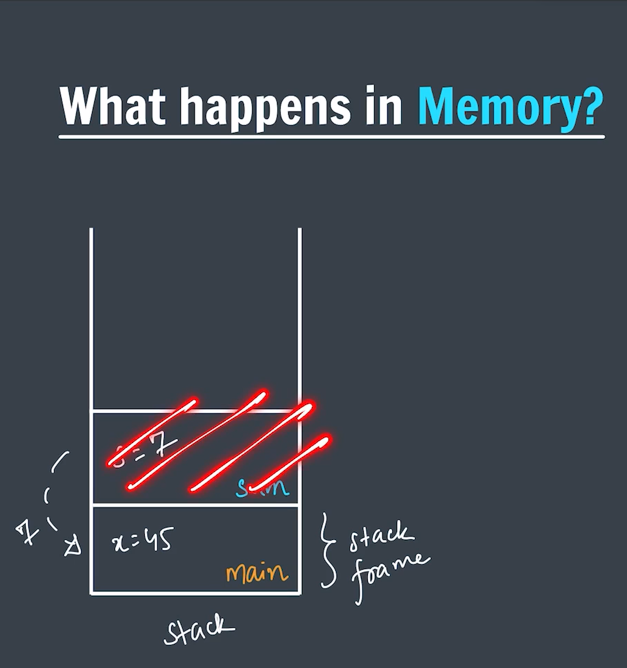
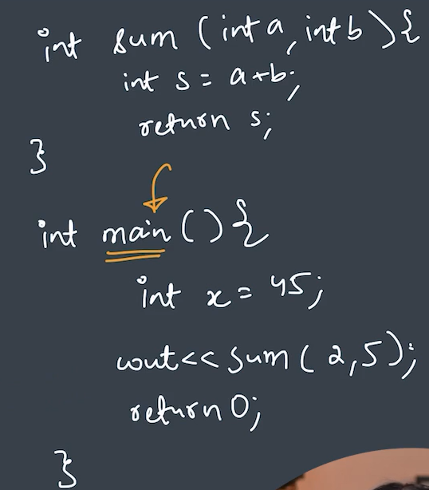

# *What happens in memory?*
- As soon as we call a function in the program it gets a block of memory inside the stack.
- Since functions are static and stack is used for static memory allocation. We have Dynamic memory allocation as well which is done with the help of Heap.
- Everything associated to that function it's variable and all the other sort of things each of them gets a memory allocation there in the stack frame.
- Whereas as soon as the `return` statement of the function is hit that function gets deleted from the stack frame or we can say that space is freed from the memory stack.
- Current executing function is at the top of stack frame.

