# *Binary Number System*
- Eventually in maths or in day to day life the number system which we use is the `Decimal number system`. Where Dec means 10 and we have digits in it from 0 to 9 which is ten.
- But in `Binary Number System` we have only two digits 0 and 1 where 1 states the flow of current and 0 represents the no current and evrything in the computer is done in the form of bits.
- That is computers understand eventually 0 and 1 only even all the characters and symbols everything is given stored in the form of 0 and 1 only.

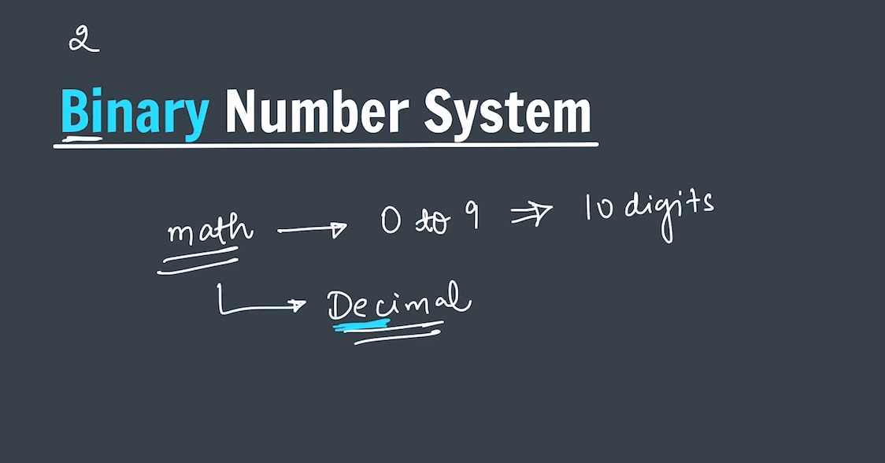

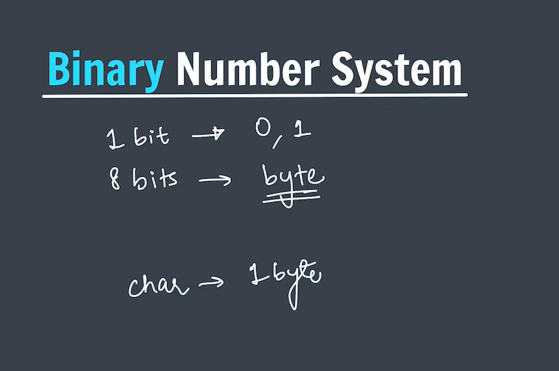
---
 

## *Binary to Decimal Conversion*
- To have a binary to decimal conversion we multiply the binary digits with 2.

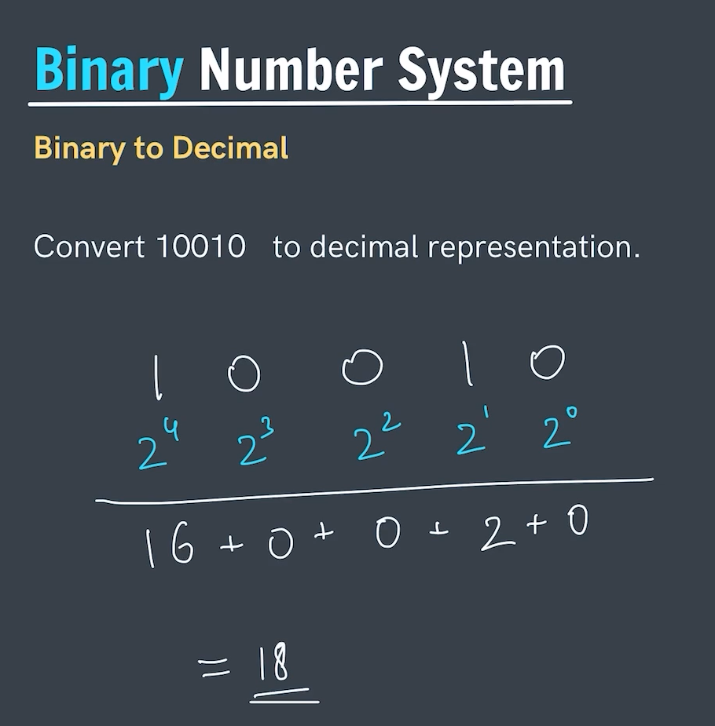

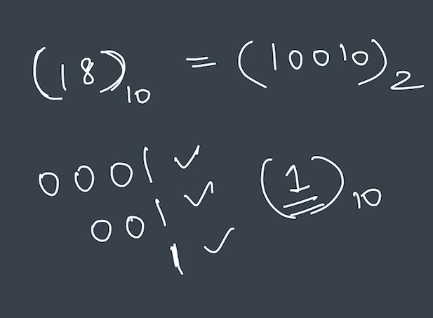

---
 

## *Decimal to Binary Conversion*
- To have a decimal to binary conversion we divide the decimal part with 2 and write its remainder from down to up approach.

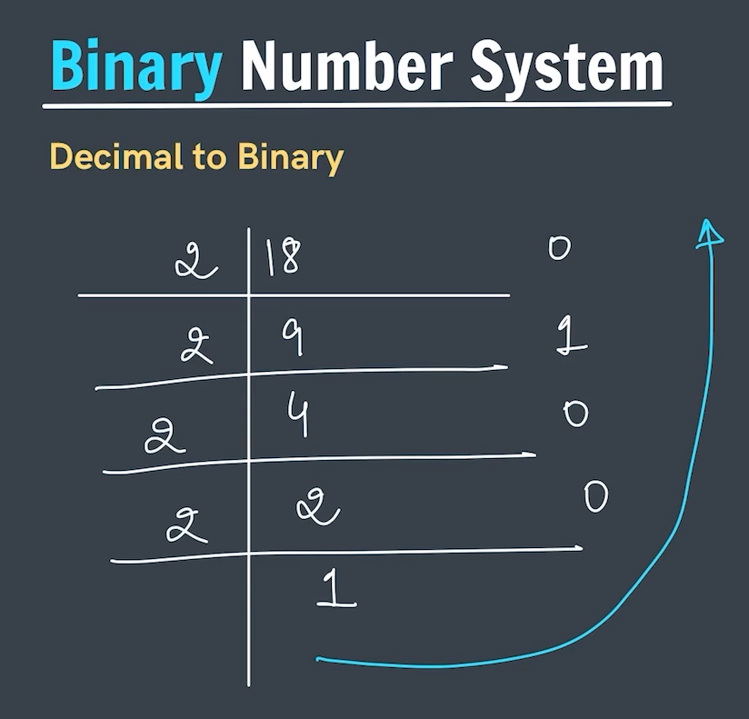

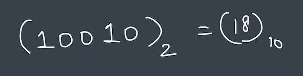

**Few More Example:-**

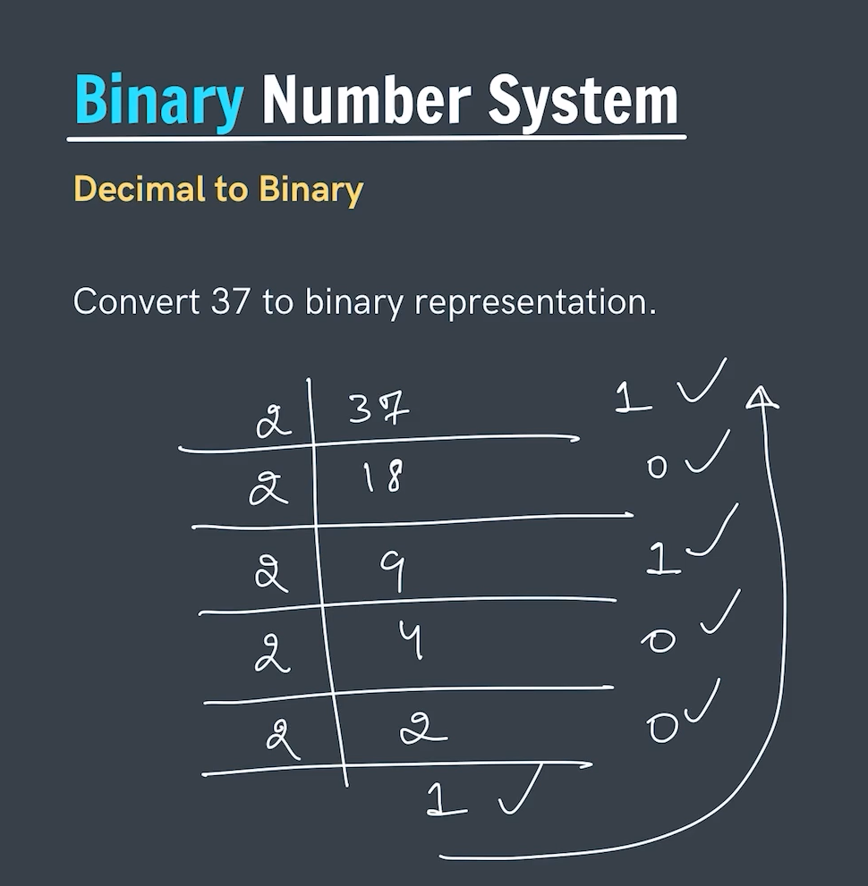

**Shortcut for decimal to binary conversion**
- If its a odd number then 20 bit will have 1.
- Whereas if its a even number then 20 bit will be 0.
- In simple word the last bit or we can say the first bit in other way round in odd case gives its contribution in making a decimal number whereas an even number doesn't.
- We just have to find the 2pow such that either it is equal to it or nearest small and then go on adding and forming other power if makes a valid contribution add it otherwise remove it.
- Examples ->

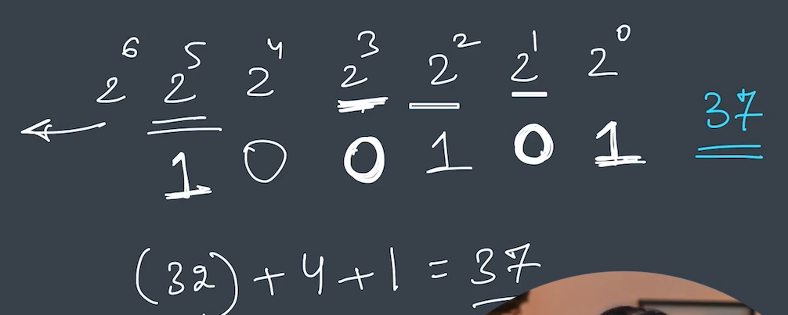

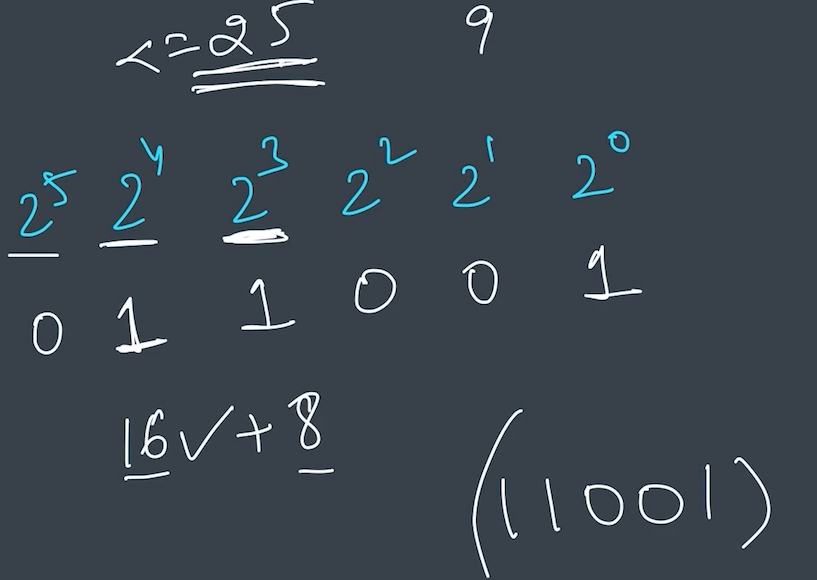
---

### Decimal conversion from 0 10 16 (they are some common ones).

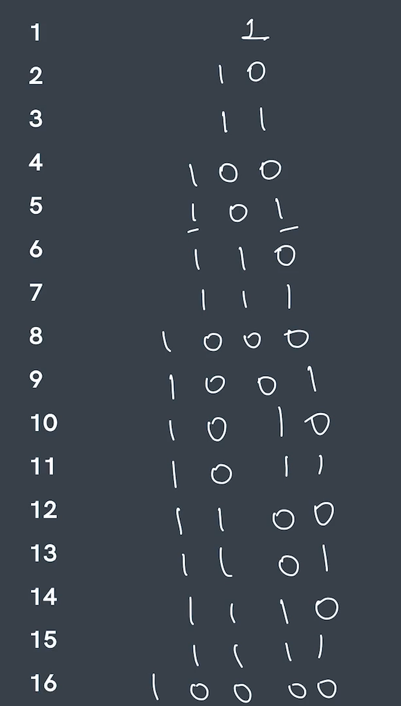

### Data Type and range cocepts

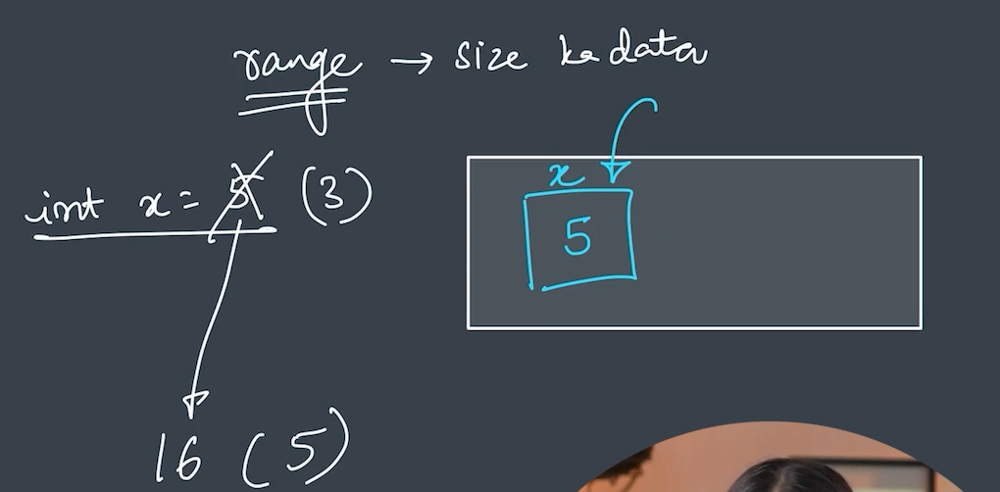
- The reason we put the data type with the varibale name is that these data type helps to assign some size to the variable and this size is quite bigger.
    Like int has 4 byte of size.
    whereas range tells us the limit till where it can hold a value.
