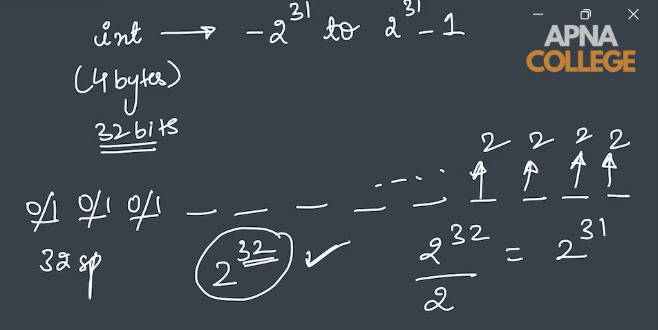
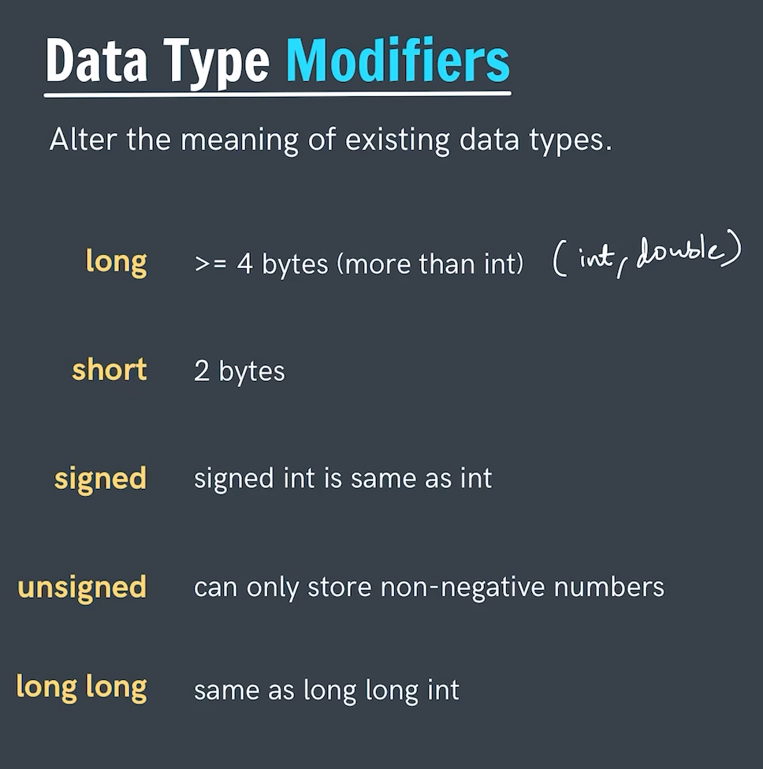
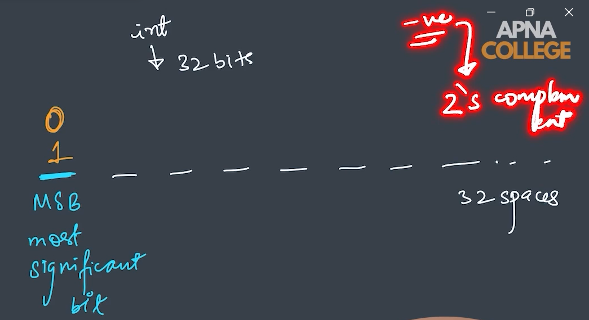

# *Data Type Modifiers*
- The data type modifier is used for modifying the existing data type by changing its range of the value it can hold.
- The int data type has a size of 4 Byte (i.e 32 Bits) -> 
    Here in the int we hold the   range of value from -231 to 231 - 1.
     
    **You would be wandering how this range come out** 
    So, we have 32 Bits in the int and each bit can hold either of the two values 0 or 1.
    which states that we have 232 choices in which we have to store both negative and positive values.
    So dividing 232 by 2 will give 231.
    Therefore we have values ranging in negative from 231 to positive value 231 and in positive value we have 0 as well therefore reducing(Subtracting) 0 from it.
- By default all the value of int are signed that is they will have both the negative and positive.
- Whereas when we store int in the form of unsigned int then simple the range of value gets increased as we are storing only positive value in this case it becomes - 232.

---
 

## Note
- The MSB(most significant bit) is used for distingushing the positive or negative number as in the bits the positive numbers can easily be stored by storing there actual values whereas in the negative case the MSB is used for storing the negative number while storing the negative number we do 2's complement.
- 0 at the MSB indicates a Positive number.
- 1 at the MSB indicates a Negative number.
- In the case of unsigned this extra MSB is released for storing the range of the number.

