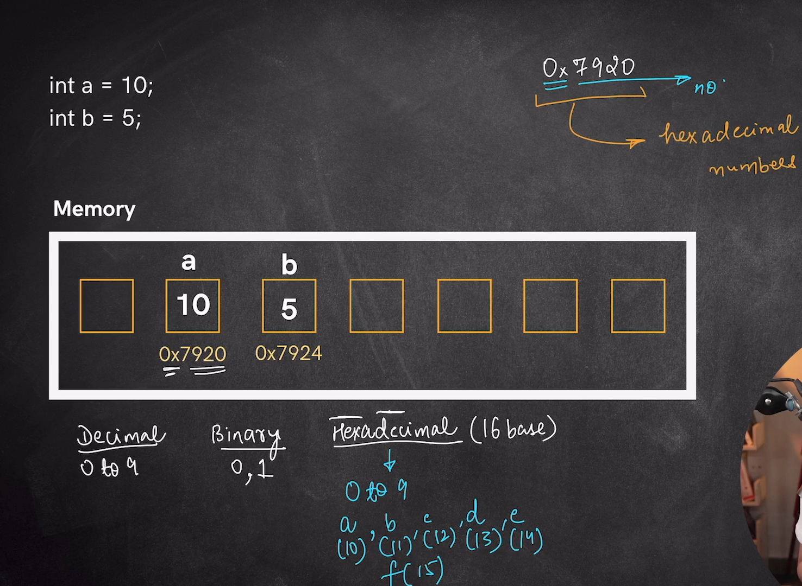
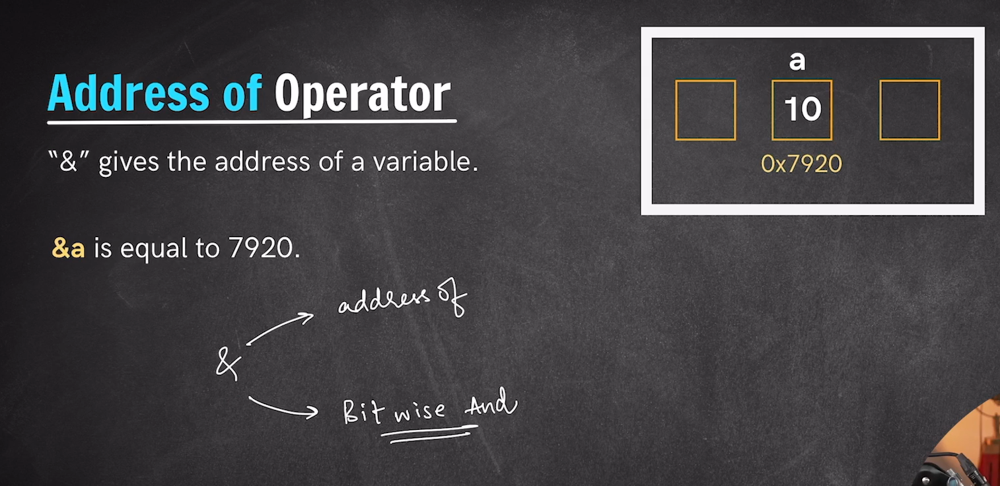

# *Basic Concept of Memory in C++*
In C++ we have a concept called `Pointers` which is only present in the c++ and the work of pointer is to deal with the memory address. 
This concept of Pointer is not present in other languages like Java, Javascript or Python since c++ helps us to deal with memory with the help of pointers therefore this concept in itself makes c++ more powerful and fast.

**Going With Pointers we should first of all clear few points regarding the Memory:-**
- When we declare a variable in the c++ it is allocated some space i.e some memory portion to that variable is provided of some fixed size according to the Data Type of variable and we can store any value in it.
- A memory block for that variable gets reserved in the memory. For e.g- for int it gets 4 Byte of memory.
- Each of this memory block gets a Unique address and this Address is in the form of hexa-decimal(Ox).

---
 

## *Address Of Operator*
- Address of Operator is used for returning the memory address of the variable.
- Symbol of Address of Operator is -> `&`
- The same symbol can serve many purpose or can have different meaning in the code depending on the situation where we have used it and how we have used it i.e its syntax part. 
    The same  & -> 
    1. Used as Address of Operator.
    2. Can be used as Bitwise AND Operation.
    3. Also Used for giving referenece i.e alias name to the variable. 
    
    In somewhat similar way we have * which has multiple works as->
    1. Used for Arithmetic Operation(multiplication).
    2. Used for declaring a Pointer.
    3. Used for dereference.

