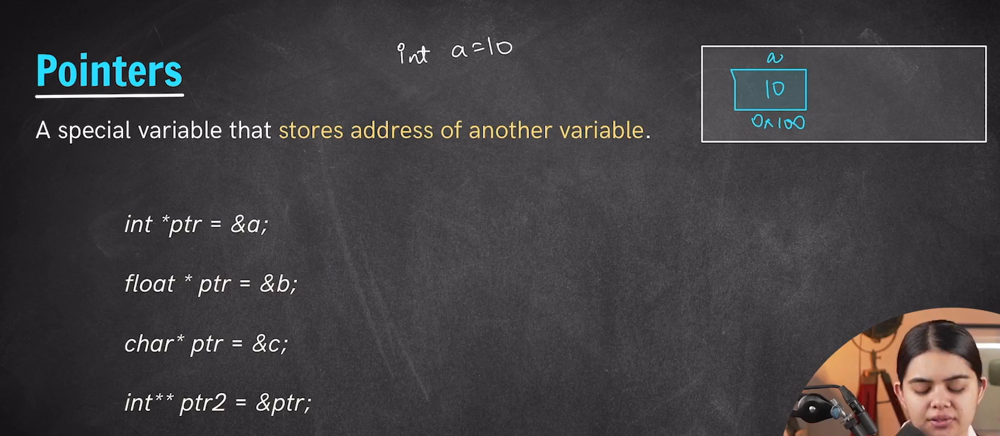
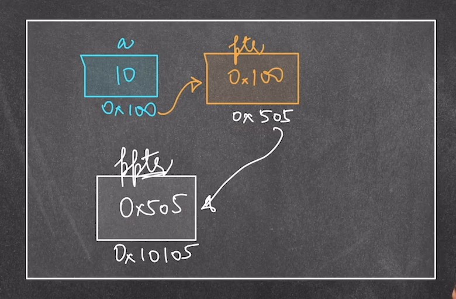

# *Pointers*
They are special type of variable that are used for `storing the address of another variable`. Pointers are geberally denoted by `*` or we can say we can declare a pointer variable with the help of *.

- We only need to use the * sign at the time of declaration after that just use the variable name.
- Pointers Occupy 8 Bytes of memory in the program.

    Syntax ->
        int *ptr;

        Here *ptr -> Is a Pointer variabel.(Where * indicates that its a pointer).
        int -> Denotes that this pointer ptr can store the address of an integer variable.
        Pointer cannot accomate any other values other than address.
---

    Example 1 ->
        int num = 12;
        int *ptr = &num; (valid form)
---

    Example 2 ->
        int num = 12;
        int *ptr = 12; (*ptr cannot have a integer value will give ERROR!)
---
    Example 3 ->
        int num = 12;
        float *ptr = &num; (A float type pointer cannot hold the address of an interger value will give ERROR!) [It can only hold the value of a float varibael and same goes with other data type too.]

---
 

## *Pointer to Pointer Variable*
- Pointer to Pointer variable is used for storing the address of the pointer variable itself.
- And it is declared as int **ptr ( ** asterik here shows its a poniter to pointer variable)
    i.e this variable is a special type of pointer variable which is used for storing the address of the another pointer variable.

