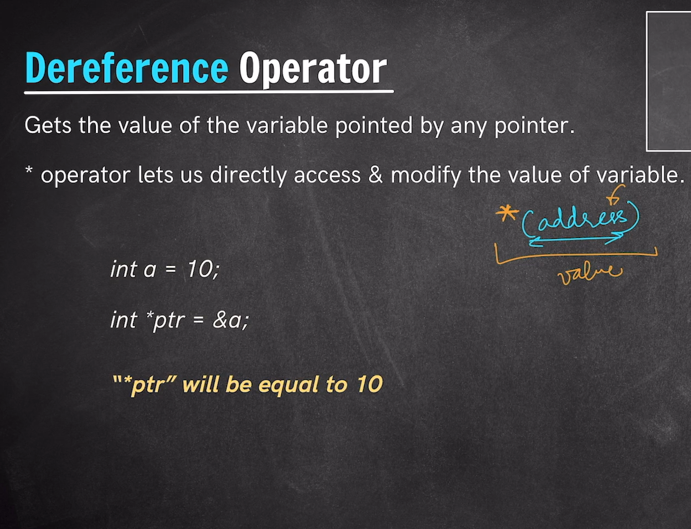
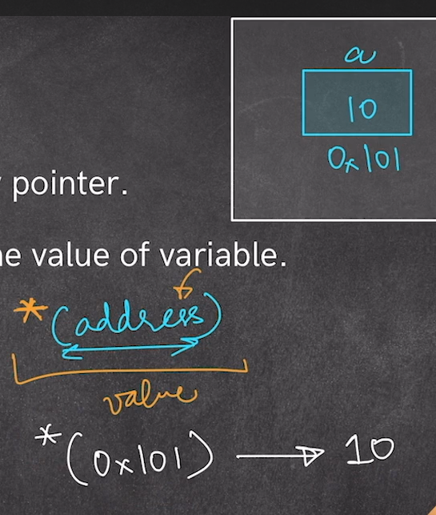
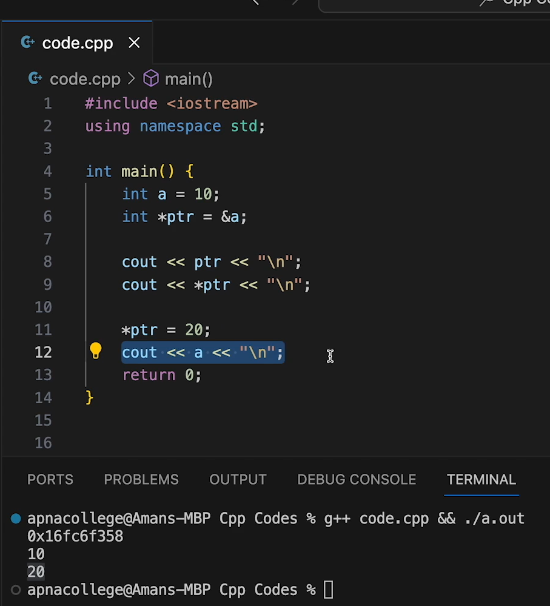

# *Dereference Operator in Pointers*
Dereference Operator in the Pointers are used for pointing to the value that address holds we can not only access to the value of the variable with the dereference operator but can too modify the value present at that memory address.
- The symbol of Dereference operator is `*`.

## When `*` is used as Dereference operator:-
1. The First time when we use * with return type at that time it is used for declaring a pointer. Where so ever after that we use it it is used as a `Dereference Operator`.
2. The * used at the right side is for pointer and at the left side used as dereference.

