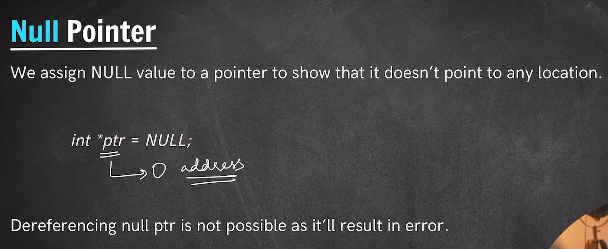

# *Null Pointer*
- When we declare a pointer and currentlly don't want to store any address in it. Then automatically it gets a Garbage memory location which is random and can create a problem.
Such type of pointer we say as Wild Pointer.
- So as a Programmer its our duty to make sure if we are creating a pointer and not initialized by any address then it must be pointed to NULL or must be stored with NULL value in it. And such type of pointers are called as Null Pointer.
- Null Pointer or NULL indicates that this pointer doesn't points to any valid address or doesn't hold any valid address in it.
- NULL ~ 0.
- Since NUll pointer doesn't points to any valid memory address therefore it is not possible to dereference the null pointer. And Gives a special type of error known as Segmentation faults.

