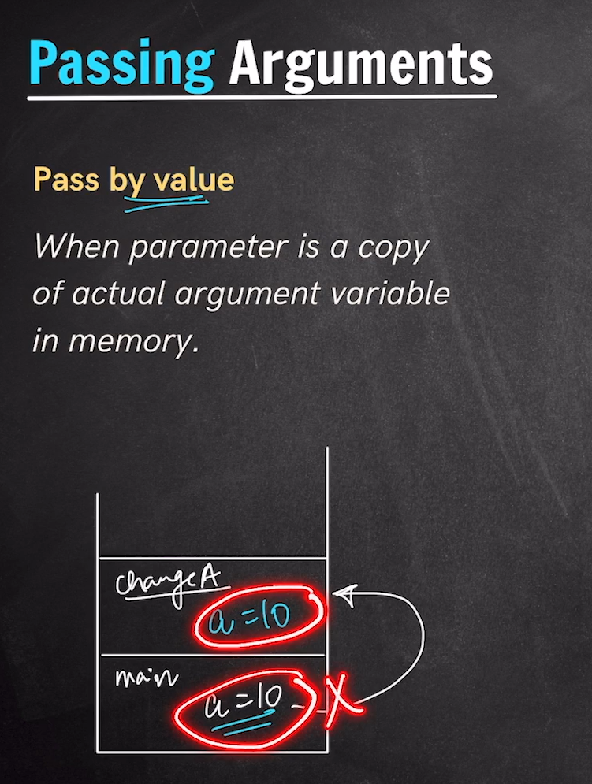
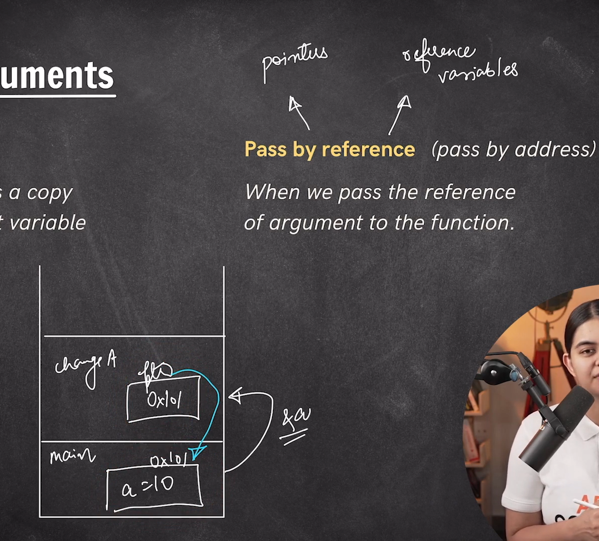
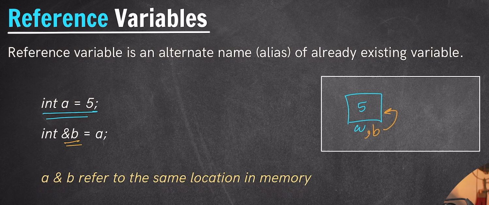
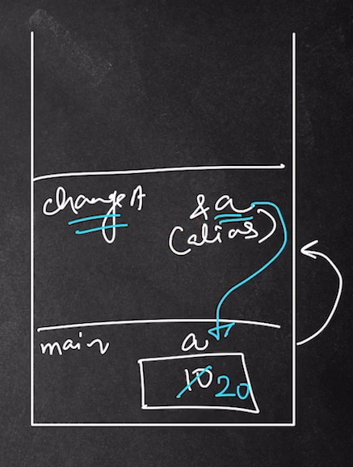

# *Different ways of passing Arguments inside a function*
- So Basically we have two different ways in which we can pass our arguments inside the functions. They are as follow:-
1. Passing By Value
2. Passing By Reference

## *1. Pass By value:-*
- Inside the pass by value the function creates a copy of the passed variables or parameter.
- That is the function recieves a copy of the passed variable and any change on these passed variable inside the function won't be reflected back to the original variable. They remain unaffected.

---
 

## *2. Pass By Reference:-*
- Here we don't pass the copy of the variable infact we send the address of the actual variable on we have to perform the operation.
- Here the changes made in the functions variable is too reflected back into the original variable as we have passed the actual address of the variable so any change doing at the address position will have the change on the original variable too.
- Basically we have two methods of Passing a Value By Reference:-
1. By Pointers
2. By Reference Variables

**By Pointers:**
- Here we have passed the reference and access of the originalvariable with the help of pointers and address.

---
 

**By Reference Variable**
- Reference variables are like alias name provided to the original variable. This is similar to providing the original variable with the two variable name and calling the same variable with other name.
- `Without initialising a reference variable we cann't create it.`

